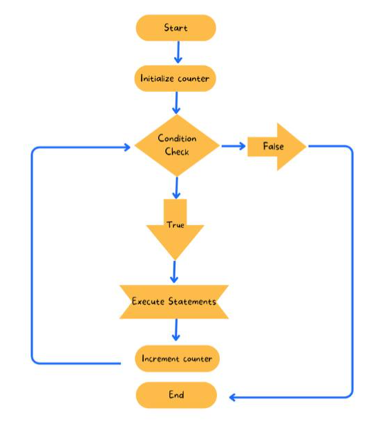
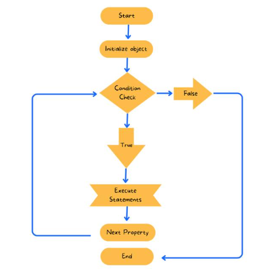
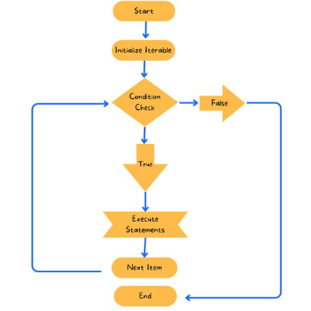
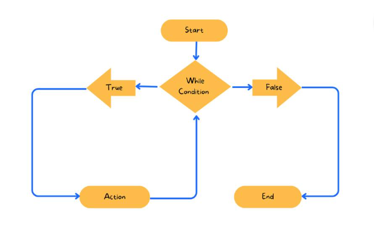

## 1st chapter
## Agenda

* JS refresher
* TypeOf Operator
* Objects and JSON
* JS Code Execution - Hoisting and Execution Context
* Hoisting
* Execution Context
* let, var, and const:
* Shadowing: legal and illegal


---


JavaScript is a dynamically typed, high-level programming language commonly used in web development. It employs the V8 engine, written in C++, for high-performance execution. Despite its name, JavaScript is distinct from Java. Its dynamic nature allows variables to change types during runtime, offering flexibility in coding.
## Datatypes in JS
Certainly, here's the information about JavaScript data types:

**Primitive Data Types:**
1. Number
2. String
3. Null
4. Undefined
5. Boolean

**New Primitive Types:**
1. BigInt
2. Symbol

**Non-Primitive Types (Reference Types):**
1. Object
2. Functions
3. Arrays

**New Non-Primitive Types:**
1. Map
2. Set
3. WeakMap
4. WeakSet

Sure, here are the code snippets with explanations and their respective outputs:

1. **Numbers:**
   ```javascript
   console.log(5 / 2); // Output: 2.5
   ```
   Explanation: JavaScript performs the division operation, and the result is `2.5`, which is a floating-point number.

2. **Strings:**
   ```javascript
   let age = 25;
   let str1 = 'I am ' + age + " years old ";
   console.log(str1); // Output: I am 25 years old

   let templateString = `I am ${age} years old`;
   console.log(templateString); // Output: I am 25 years old
   ```
   Explanation: In the first part, string concatenation is used to create `str1`. In the second part, a template string with variable interpolation is used to create `templateString`, both resulting in the same output.

3. **Null and Undefined:**
   ```javascript
   let myNull = null;
   let myUndefined;
   
   console.log(myNull); // Output: null
   console.log(myUndefined); // Output: undefined
   ```
   Explanation: `myNull` is explicitly set to `null`, while `myUndefined` is declared but not assigned a value, resulting in `undefined`.

4. **typeof Operator:**
   ```javascript
   var a = 10;
   console.log(typeof a); // Output: number
   a = "string";
   console.log(typeof a); // Output: string
   a = { "name": "Jasbir" };
   console.log(typeof a); // Output: object
   ```
   Explanation: The `typeof` operator is used to determine the data type of the variable `a`. It returns `"number"`, `"string"`, and `"object"` based on the assigned value.

5. **typeof null and Array Check:**
   ```javascript
   console.log(typeof null); // Output: object

   let arr = [1, 2, 3, 4];
   console.log(Array.isArray(arr)); // Output: true
   ```
   Explanation: `typeof null` returns `"object"` (historical quirk), and `Array.isArray()` accurately checks whether `arr` is an array and returns `true`.

These code snippets demonstrate JavaScript's handling of data types and the use of the `typeof` operator and `Array.isArray()` to determine types and check arrays.


---
 ## Non Primitive 
 ### function

Certainly, here's the code snippet related to functions and a brief explanation:

```javascript
// Function Definition
function fn(param1) {
    console.log("Hello world!", param1);
    return "Returned value";
}

// Function Call
let rVal = fn();

console.log("Return value:", rVal);
```

**Explanation:**
1. `function fn(param1)`: This is a function definition named `fn` that takes one parameter `param1`. Inside the function, it logs "Hello world!" along with the value of `param1` and then returns the string "Returned value."

2. `let rVal = fn();`: This line calls the `fn` function without passing any arguments. Since the function expects a parameter, `param1` inside the function will be `undefined`. It also captures the return value of the function in the variable `rVal`.

3. `console.log("Return value:", rVal);`: Finally, it logs the string "Return value:" along with the value of `rVal`, which is "Returned value."

Please note that calling `fn` without passing a value for `param1` will not result in an error, but `param1` will be `undefined` inside the function. If you want to pass a value when calling the function, you should do so like this: `fn("SomeValue");`.

### Objects and JSON

Here's the code snippet related to JavaScript objects and a brief explanation:

```javascript
// Object Definition
let cap = {
    name: "Steve",
    age: 34,
    isAvenger: true,
    key: "hello"
}

// Loop through Object Properties
for (let key in cap) {
    console.log(key, " ", cap[key], " ", cap.key);
}
```

**Explanation:**
1. An object in JavaScript is a collection of key-value pairs where the key can be a number or a string, and the value can be any valid JavaScript data type.

2. `cap` is an object that represents an entity, possibly a character named "Steve." It contains properties like `name`, `age`, `isAvenger`, and `key`.

3. The `for...in` loop is used to iterate through the properties of the `cap` object. Inside the loop, `key` represents each property name, and `cap[key]` retrieves the value associated with that property.

4. The `console.log` statement within the loop logs the `key`, the corresponding value accessed using `cap[key]`, and `cap.key`. However, note that `cap.key` accesses the property named "key" specifically, whereas `cap[key]` dynamically accesses the property corresponding to the current `key` in the loop.

5. In JavaScript, you can access object properties using the dot notation (e.g., `cap.name`) or square brackets (e.g., `cap['last Name']`).

6. JSON (JavaScript Object Notation) is a widely used data interchange format that is based on the structure of JavaScript objects. JSON uses a similar syntax for key-value pairs but is typically used for data communication between systems.

This code snippet demonstrates the creation of a JavaScript object, accessing its properties using a loop and dot notation, and the dynamic nature of accessing properties using square brackets.


---
## JS Code Execution

### Call Stack:
The call stack is a data structure used in JavaScript to keep track of the currently executing function(s). It follows the Last-In-First-Out (LIFO) principle, which means that the most recently called function is the first one to complete. As functions are called, they are added to the stack, and as they complete, they are removed from the stack.

### Execution Context:
An execution context is a conceptual container that holds all the information related to the execution of a piece of code. Each function call creates a new execution context, which includes information like the function's variables, parameters, references to outer scopes, the value of `this`, and other internal details.

### Global Area:
The global area, also known as the global scope, is where global variables and functions are defined. It's the outermost scope in JavaScript. Code outside of any function is executed in the global scope. The global area has its own execution context.

### Breakdown of Code Execution:

Certainly, here's the code snippet you provided along with an explanation of the code's execution and expected output:

```javascript
let a = 10;

function fn() {
    console.log("I am fn");

    function inner() {
        console.log("I am inner");
    }

    inner();
}

fn();
```

**Explanation:**
1. `let a = 10;`: This declares a variable `a` and assigns it the value `10`.

2. `function fn() { ... }`: This defines a function named `fn`. Inside `fn`, there's another function definition named `inner`.

3. `console.log("I am fn");`: When the `fn` function is called, it logs "I am fn" to the console.

4. `function inner() { ... }`: This defines an inner function named `inner` within the `fn` function.

5. `inner();`: Inside the `fn` function, `inner()` is called. This means the "I am inner" message will be logged to the console.

6. `fn();`: Finally, the `fn` function is called, which in turn calls `inner()`. So, both "I am fn" and "I am inner" messages will be logged to the console.

**Expected Output:**
```
I am fn
I am inner
```

This code demonstrates the concept of nested functions. The `fn` function contains an inner function `inner`, and when `fn` is called, it executes both its own code and the code within `inner`, resulting in both log messages being displayed in the console.


---
### JS Code Execution Quiz


Consider the following JavaScript code:

```javascript
function real() {
    console.log("I am real. Always run me");
}
function real() {
    console.log("No I am real one ");
}
real();
function real() {
    console.log("You both are wasted");
}
```

What will be the output when the code is executed?

- [ ] "No I am real one"  
- [x] "You both are wasted"  
- [ ] Error  

### Explanation
In JavaScript, when you declare multiple functions with the same name, only the last one defined will be retained due to hoisting. Therefore, in this code:

1. The first two function declarations are overwritten by the last one.
1. The real() function is called, and the last version of the function's body is executed, which logs "You both are wasted" to the console.
Hence, the correct answer is B) "You both are wasted".

---
## Execution of the code in JS


It seems like you're describing the code execution process in JavaScript and how execution contexts (EC) work. Here's a breakdown of your explanation:

1. **Code Execution Process:**
   - Code in JavaScript is executed within execution contexts (ECs).

2. **Global Code Execution (GEC):**
   - The global code is executed in the Global Execution Context (GEC). It's the top-level context where the entire script starts.

3. **Inside a Function (Function Execution Context):**
   - When a function is called, its code is executed within its own Function Execution Context.

4. **Execution Context Creation (EC Creation):**
   - During EC creation, JavaScript performs hoisting, which involves memory allocation for variables (initialized with `undefined`) and function declarations (fully allocated).
   - It also sets up the outer scope (if any) and determines the value of the `this` keyword.

5. **Global Object (Browser/Node.js):**
   - In a browser environment, the global object is `window`. In Node.js, it's `global`. These objects contain global variables and functions.

6. **Outer Scope:**
   - Each execution context has access to variables and functions in its outer (enclosing) scope.

7. **`this` Keyword:**
   - The `this` keyword is determined based on the context in which a function is executed. Its value varies depending on how the function is called.

8. **Execution of Code:**
   - After EC creation, the code within the context is executed. Variables and functions are accessible, and the program flows according to the code logic.

This explanation outlines the sequence of events when JavaScript code is executed, starting with EC creation, hoisting, and variable/function allocation, and then proceeding with the actual code execution. Understanding execution contexts is essential to grasp how JavaScript manages variable scope and function execution.

**Code Snippet 1:**

```javascript
var a=10;
real();
function real() { console.log("I am real. Always run me"); }
```

**Explanation:**
1. `var a=10;`: Declares a variable `a` and assigns it the value `10`.

2. `real();`: Calls the function `real()`.

3. `function real() { console.log("I am real. Always run me"); }`: Defines a function `real()` that logs a message to the console.

**Expected Output:**
```
I am real. Always run me
```

In this case, the function `real()` is defined before it is called, so it executes without any issues.

**Code Snippet 2:**

```javascript
let a = 10;
function fn() {
    console.log("a", a);
}
fn();
```

**Explanation:**
1. `let a = 10;`: Declares a variable `a` using `let` and assigns it the value `10`. This variable is in the outer/global scope.

2. `function fn() { console.log("a", a); }`: Defines a function `fn()` that logs the value of `a` to the console. It captures the value of `a` from its outer scope.

3. `fn();`: Calls the function `fn()`.

**Expected Output:**
```
a 10
```

In this case, `fn()` accesses the variable `a` from its outer scope (the global scope) and logs its value, which is `10`.

---
## Let, Var and Const

Certainly, let's break down the provided code snippet step by step and explain the output:

```javascript
let a = 10;
console.log("line number 2", a);

function fn() {
    let a = 20;
    console.log("line number 4", a);
    a++;
    console.log("line number 7", a);
    if (a) {
        let a = 30;
        a++;
        console.log("line number 11", a);
    }
    console.log("line number 13", a);
}

fn();
console.log("line number 16", a);
```

**Explanation:**

1. `let a = 10;`: Declares a variable `a` in the outer/global scope and assigns it the value `10`.

2. `console.log("line number 2", a);`: Logs the value of `a` in the global scope, which is `10`.

3. `function fn() { ... }`: Defines a function named `fn()`.

4. Inside the `fn` function:
   - `let a = 20;`: Declares a new variable `a` in the function scope (local to the function) and assigns it the value `20`.
   - `console.log("line number 4", a);`: Logs the value of the local `a`, which is `20`.
   - `a++;`: Increments the local `a` to `21`.
   - `console.log("line number 7", a);`: Logs the updated local `a`, which is `21`.

5. Inside the `if` block:
   - `let a = 30;`: Declares a new variable `a` with block scope (inside the `if` block) and assigns it the value `30`.
   - `a++;`: Increments the block-scoped `a` to `31`.
   - `console.log("line number 11", a);`: Logs the block-scoped `a`, which is `31`.

6. After the `if` block, but still within the function:
   - `console.log("line number 13", a);`: Logs the function-scoped `a`, which is `21`.

7. `fn();`: Calls the `fn()` function.

8. `console.log("line number 16", a);`: Logs the global `a` value, which is `10`.

**Expected Output:**
```
line number 2 10
line number 4 20
line number 7 21
line number 11 31
line number 13 21
line number 16 10
```


This code demonstrates variable scoping in JavaScript, including global, function, and block scope. Variables with the same name declared in different scopes do not interfere with each other. Block-scoped `let` variables are confined to the block in which they are declared, and the variable declared inside the `if` block doesn't affect the function-scoped or global `a`.


---

## Shadowing
**Variable Shadowing** occurs when a variable declared within a certain scope has the same name as a variable declared in an outer scope. This can lead to confusion and unexpected behavior, especially when accessing or modifying the variables. Let's explore legal and illegal cases of variable shadowing in more detail.

Let's go through the provided code snippets step by step and explain the output for each one:

**Code Snippet 1:**
```javascript
let fruits = "apple";
console.log(fruits); // apple

{
    console.log(fruits); // ReferenceError: Cannot access 'fruits' before initialization (Temporal Dead Zone - TDZ)
    let fruits; 
    console.log(fruits); // undefined
    fruits = "orange";
    {
        console.log(fruits); // orange
    }
    console.log(fruits); // orange
}

console.log(fruits); // apple
```

**Explanation:**
1. A variable `fruits` is declared and initialized with the value `"apple"` in the global scope.

2. Inside a block, a `console.log(fruits)` statement attempts to log the value of `fruits` before it's declared within that block. This results in a `ReferenceError` because of the Temporal Dead Zone (TDZ) for `let` variables.

3. A new `let` variable named `fruits` is declared within the block. It's initially in the TDZ, so `console.log(fruits)` logs `undefined`.

4. `fruits` is assigned the value `"orange"`.

5. Inside a nested block, `console.log(fruits)` logs `"orange"` because it refers to the block-scoped `fruits`.

6. Outside the innermost block, `console.log(fruits)` still logs `"orange"` because it refers to the most recent block-scoped `fruits`.

7. Finally, outside the block, `console.log(fruits)` logs the global `fruits` value, which is `"apple"`.

**Expected Output:**
```
apple
ReferenceError: Cannot access 'fruits' before initialization (Temporal Dead Zone - TDZ)
undefined
orange
orange
apple
```

**Code Snippet 2:**
```javascript
var fruits = "apple";
console.log("21", fruits); // apple

{ 
    let fruits;
    fruits = "orange";
    console.log("25", fruits); // orange
    {
        let fruits;
        console.log("28", fruits); // undefined
    }
    console.log(fruits); // orange
}
console.log(fruits); // apple
```

**Explanation:**
1. A variable `fruits` is declared and initialized with the value `"apple"` using `var` in the global scope.

2. Inside a block, a new `let` variable named `fruits` is declared, shadowing the global `fruits`. It is assigned the value `"orange"` within this block.

3. Inside a nested block, another `let` variable named `fruits` is declared. This variable shadows the outer block-scoped `fruits`. It is not initialized within this block, so it logs `undefined`.

4. Outside the innermost block, `console.log(fruits)` logs the block-scoped `fruits`, which is `"orange"`.

5. Finally, outside the block, `console.log(fruits)` logs the global `fruits`, which is `"apple"`.

**Expected Output:**
```
21 apple
25 orange
28 undefined
orange
apple
```

In this code, variable shadowing occurs when a variable with the same name is declared inside a nested block, shadowing variables from outer scopes. The behavior differs between `var` and `let` declarations, as demonstrated in the code snippets.

---

## 2nd chapter

# Agenda
- Host and Native Object
- How this behaves in JS
- Chaining in JS
- JS inheritance and prototype
- bind, call and apply in JS
- use-case of call bind apply
- polyfills of call bind apply


---

# Host objects
Objects that are provided by the environment are known as host objects. Examples of host objects in the browser are window, document, local storage, etc. Examples of host objects in nodejs are global, os, process, etc. Host objects are dependent on the environment.

# Native objects
Objects that are provided by the language are known as host objects. Examples of native objects are date, JSON, etc.


---

# Example Code

Let us take an example of another small code:
```javascript
let firstVar = "created using let";
var secondVar = "created using var";
console.log("hello from", this);
```

- This code lies in the global section, as there is no function, so firstly execution context is created. 
- First hosting(allocation of memory for function and variables) happens, then gets a global object, in our case it is a window then next this is calculated. 
- For this execution context then we have the execution phase.

So let us assume we have a call stack.


We have firstVar(FV) and secondVar(SV)
, and both are undefined initially.


And we will get a window object. As for the global execution context, this will be equal to the window.


Again for this, we will get a window.


Now next phase is code execution. firstVar(FV) and secondVar(SV) will be replaced by its value.


Now output for log `this` is a window, as for global execution `this` is a window.

## Difference in the allocation of memory of let and var in the global execution context
In the global execution context, var will go to the global object. And let will go script object.
So for displaying secondVar we can write,
```javascript
console.log(secondVar)
```
OR
```javascript
console.log(window.secondVar)
```

In our case, the global object is a **window**.


## Javascript Code
```javascript
let cap = {
    // property
    firstName : "Steve",
    // method
    sayHi : function(){
        console.log("hi from", this.firstName);
    }
}
cap.sayHi();
let sayHiAdd = cap.sayHi;
sayHiAdd();
```

### Explanation
First of all, let us create a call stack:


Inside the call stack, we have variables with undefined values.


Now code execution phase, the first line is `cap.sayHi()`,  execution context for sayHi() will be created. Whenever the execution context is created we will get a window and now we have to determine this for it. And again here cap will be undefined.


Now cap will get memory in the heap let us suppose it is 20k.


**Whenever a method is invoked with an object like `cap.sayHi()`, then that object becomes this.**

So inside sayHi() when `cap.sayHi()` calls sayHi(), the value of this is `cap`.


So the execution of `cap.sayHi()`, simply prints **hi from Steve**.

Now when the `let sayHiAdd = cap.sayHi;`  statement is executed then we are calling `cap.sayHi` and storing it into `sayHiAdd`. So `sayHiAdd` will be having the address of `sayHi`.


After that `sayHiAdd()` statement is executed which will again create the execution context and it will get a window object and now we have to determine this for it.


**For normal function call, means function call without object this will be equal to the window object.**


Now this will again be a window object.


So now when `sayHiAdd()` is executed then this will be a window and when `console.log("hi from ",this.firstName);` is executed, then the window.firstName is required to be displayed but it is undefined. 
So will get **hi from undefined.**

### Output
hi from Steve
hi from undefined.

## Another Javascript Code
```javascript
let cap = {
    // property
    firstName : "Steve",
    // method
    sayHi : function(){
        console.log("hi from", this.firstName);
    }
}
cap.sayHi();
var firstName = "Loki"
let sayHiAdd = cap.sayHi;
sayHiAdd();
```


### Output
hi from Steve
hi from Loki.
**Explanation:**
As we have defined firstName as var and var will default goto window.

---
# Rules for this
- For Global Execution context this will be a window object.
- For Execution context created with method call(calling with object), this will be that object.
- For Execution context created with a function call(calling without object), this will be that window.


---

# Question
Output of following javascript code:
```javascript
let cap = {
    firstName : "Steve",
    sayHi : function(){
        console.log("53", this.firstName);
        const iAmInner = function(){
            console.log("55",this.firstName);
        }
        iAmInner();
    }
}
cap.sayHi();
```


## Question Explanation
- When `cap.sayHi()` calls `sayHi()`, then this will be a cap, as it is a method call(means calling a method with an object). So it will print **53 Steve**. 
- Now inside this when `iAmInner()` is called. Then this will be a window object as it is a function call. 
- Then it will be print **55 undefined.** As we don't have firstName in the window object.

### Output
53 Steve
55 undefined


---

# Question
Output of following javascript code:
```javascript
let cap = {
    firstName : "Steve",
    sayHi : function(){
        console.log("53", this.firstName);
        const iAmInner = () => {
            console.log("55",this.firstName);
        }
        iAmInner();
    }
}
cap.sayHi();
```


## Question Explanation
- When `cap.sayHi()` calls `sayHi()`, then this will be a cap, as it is a method call(means calling a method with an object). So it will print **53 Steve**. 
- Arrow function does not have its own this. And arrow function uses this from outside. 
- **Arrow function does not follow these rules, it takes this from outside:**
    - GEC -> this -> window object
    - EC is created with -> method call -> this will be that object
    - EC is created with -> function call -> this will be that window.

So when `iAmInner()` is called, as it is an arrow function it will take from outside so then this becomes `cap`, that's why **55 Steve** will be printed.

### Output
53 Steve
55 Steve


---
# Question
Output of following javascript code:
```javascript
var firstName = "Loki"
let cap = {
    firstName : "Steve",
    sayHi : () => {
        console.log("53", this.firstName);
        const iAmInner = () => {
            console.log("55", this.firstName);
        }
        iAmInner();
    }
}
cap.sayHi();
```


## Question Explanation
- `iAmInner()` does not have its own this. So it will go to `sayHi()` to get their this, and `sayHi()` is also an arrow function so it will also not have its own this.
-  So then it will go to the global execution context, GEC has a window object which has `window.firstName="Loki"`, so this will become a window for both `sayHi()` and `iAmInner()`.

We have hierarchy
```javascript
gec has a windows object
gec{
    sayHi => (){
        iAmInner => (){
            
        }
    }
}
```

### Output
53 Loki
55 Loki


---


# Question
Output of following javascript code:
```javascript
var firstName = "Loki"
let cap = {
    firstName : "Steve",
    sayHi : function(){
        console.log("53", this.firstName);
        const subInner = () => {
            console.log("54", this.firstName);
            const iAmInner = ()=> {
                console.log("55", this.firstName);
            }
            iAmInner();
        }
        subInner();
    }
}
cap.sayHi();
```


## Question Explanation
- `cap.sayHi()` is executed, it has a cap as this, now it will print **53 Steve**, inside this `subInner()` is called, but it is an arrow function so it doesn't have its own this so it will take cap as this, so it will also print **53 Steve**, now again inside this `iAmInner()` is called, now again it is an arrow function so it doesn't have its own this. 
- So it will `subInner()` for this, but it is also an arrow function so it will also not have its own this, so it will go to `sayHi()`, it has `cap` as this, so `iAmInner()` take `cap` as this and it will also print **53 Steve**.


### Output
53 Steve
53 Steve
53 Steve

---
# Behaviour of this
|                |      non-strict       |        strict         |
|:--------------:|:---------------------:|:---------------------:|
|      GEC       |     Window Object     |        window         |
| Function call  |     Window Object     |       undefined       |
|  Method call   |    Current object     |    current object     |
| Arrow function | this from outer scope | this from outer scope |

In **strict mode**, we can not use any variable without declaration.

```javascript
"use strict";
let cap = {
    // property
    firstName: "Steve",
    // method
    sayHi : function(){
        console.log("hi from", this.firstName);
    }
}
cap.sayHi();
var firstName = "Loki"
let sayHiAdd = cap.sayHi;
sayHiAdd();
```

This code will first print **hi from Steve**, as in case of the method call in strict mode this will be a current object, but when `sayHiAdd()` is executed then it will give an error, as in this case **this is undefined** in strict mode, so it will not able to read properties of this.


---


# Output of javascript code
```javascript
let ladder = {
    stop:0,
    up(){
        this.stop ++ ;
    },
    down(){
        this.stop -- ;
    }
    showStep: function(){
        console.log(this.stop);
    }
}
ladder.up();
ladder.up();
ladder.up();
ladder.down();
ladder.showStep();
```

## Output
2


## Explanation
We are calling `up()`, `down()` and `showStep()` on ladder object.

Now in place of
```javascript
ladder.up();
ladder.up();
ladder.up();
ladder.down();
ladder.showStep();
```
we want to write like this`ladder.up().up().up().down().showStep()`, So for that, we need to return an object of the ladder from every function, we will return this. So we will need to write the below code.

```javascript
let ladder = {
    stop:0,
    up(){
        this.stop ++ ;
        return this;
    },
    down(){
        this.stop -- ;
        return this;
    }
    showStep: function(){
        console.log(this.stop);
        return this;
    }
}
ladder.up().up().up().down().showStep()
```

**Output:**
2

---


# Inheritance : High Level Intro
- Inheritance is related to OOPS. All OOPS languages are Java-based.
- Because we need a class to create an object just like for creating a house we need the architecture of the house.
- Suppose we have architecture having 1 door and 2 rooms. Now we want to create a new house with this architecture along with it we also want a swimming pool.
- So we will inherit all the properties of the old architecture and add a swimming pool to it.
- Then we will create a house with that new architecture.


---
title: Prototypal OOPS
description: 
duration: 300
card_type: cue_card
---

# Prototypal OOPS
- We have a base object and let us take an example we have a base model of a Tata company that works as a prototype.
- Now a child object inherits properties from a base object just like the mescom car is made by inheriting properties from Tata company with one new feature.
- Now another object is created by inheriting properties from the child object which becomes the grandchildren of the base object, just like safari is made by inheriting properties from mexcom by adding a new feature of 8 seater.

Prototypal OOPS is we will create a base object, and directly inherit properties from it to create a new object.

But in Java, we have to make a class then another class inherit the properties of that class, and then we will create an object but in Prototypal OOPS we will directly inherit from the object.


---

# OOPS followed by JS
JS follows prototypal OOPS. 
- We have a parent object from which we can create a child object.

```javascript
let arr = [1, 2, 3, 4];
console.log(typeof arr); //print object
```

- As the type of arr is an object, it has some parent object also. 
- arr has parent Array.
-  Array has all the methods required by every array. Parent of Array of Object.


So everything starts from an Object, and it has children like `Array` which will inherit all the properties of `Object`, and it can have its property. Now when we create an array `[]`, then it has all the properties of its parent i.e. `Array` and grandparent i.e. `Object`. To verify it will try to access any method of `Object` i.e. grandparent by array. We have a `toString()` method of object class.

```javascript
let arr = [1, 2, 3, 4];
console.log(arr.toString()); // prints 1,2,3,4
```

---

# Advantages of Inheritance
- Reuse of code
- Multiple child objects can access the single method of parent.
- Save memory space


If we want to add any method in the object that will be available for children, then we use `prototype` to add it:
```javascript
Array.prototype.sum =  function(){
    let sum = 0;
    for(let i = 0; i < this.length ; i ++ ){
        sum = sum + this[i];
    }
    console.log(sum);
}

arr = [1, 2, 3, 4]
arr2 = [3, 4, 1, 8, 9]
arr.sum()
arr2.sum()
```

Now we have added a method in the parent object using `prototype`, so it can accessed by both children.


---

# Bind call and apply

## call 
Borrowing a function from the object and can be used for another object without actually adding to it. 
```javascript
let cap = {
    name: "Steve",
    team: "cap",
    petersTeam: function(mem1, mem2){
        console.log(`Hey ${this.name} am your neighborhood spiderman and I belong to ${this.team}'s team`);
        console.log(`I am working with ${mem1} & ${mem2} `);
    }
}
let ironMan = {
    name: "Tony", 
    team: "iron man"
}

//  borrowing a function and can use it for another object without actually adding into it. 
//We can also pass parameters for that function.
cap.petersTeam.call(ironMan, "natasha", "war machine");


```

## apply
- Apply is used to borrow function for n number of parameters.
- The only difference between call and apply is that we will pass parameters in the form of an array in apply.
- When we are not aware of a number of parameters then we use `apply`.
```javascript
let cap = {
    name: "Steve",
    team:"cap",
    petersTeam: function(mem1, mem2, ...otherMan){
        console.log(`Hey ${this.name} am your neighborhood spiderman and I belong to ${this.team}'s team`);
        console.log(`I am working with ${mem1} & ${mem2} with ${otherMan}`);
    }
}
let ironMan = {
    name: "Tony", 
    team: "iron man"
}

// apply
cap.petersTeam.apply(ironMan, ["natasha", "war machine", "doctor strange", "loki"])
```


## bind
- Copies the function that you call later with the same this.
- When we want to use the method multiple times.
```javascript
let cap = {
    name: "Steve",
    team: "cap",
    petersTeam: function(mem1, mem2, ...otherMan){
        console.log(`Hey ${this.name} am your neighborhood spiderman and I belong to ${this.team}'s team`);
        console.log(`I am working with ${mem1} & ${mem2} with ${otherMan}`);
    }
}
let ironMan = {
    name: "Tony", 
    team: "iron man"
}


// bind
let ironManStolenMan =  cap.petersTeam.bind(ironMan);
ironManStolenMan("natasha", "war machine", "doctor strange")
ironManStolenMan("natasha", "war machine")
```

# Use case of bind, apply and call
- Borrow features.

## call
We use `call` when we want to borrow a method only once with a defined number of parameters.

**Example:**
```javascript
let cap = {
    name: "Steve",
    team: "cap",
    petersTeam: function(mem1, mem2){
        console.log(`Hey ${this.name} am your neighborhood spiderman and I belong to ${this.team}'s team with members ${mem1} and ${mem2}`);
    }
}
let ironMan = {
    name: "Tony", 
    team: "iron man"
}

cap.petersTeam.call(ironMan, "thor", "loki");
```

## apply
We use `apply` when we want to borrow a method only once with n number of parameters.

**Example:**
```javascript
cap.petersTeam.apply(ironMan, ["thor", "loki"]);
```

## bind
We use `bind` when we want to use a method multiple times and we want to make a permanent copy of that method.

**Example:**
```javascript
const boundFn = cap.petersTeam.bind(ironMan);
boundFn("thor", "loki");
boundFn("cap", "war machines");
```

---

# Polyfills of bind, apply and call
- Every array is built using `Array`.
- Every object is built using `Object`.
- Every function has a parent `Function`.

`cap.petersTeam.call()`, here `call` is on function.
- `call`, `bind`, and `apply` is on function.
- `this` in `call`, `bind`, and `apply` is a function.
- `call`, `bind`, and `apply` receive an object on which this function is to be called.

## Polyfills of call

- `call` is used to call a function as a part of the object that was defined in another object.
- We will receive a function to be invoked as `this`.
- The object on which the function is to be invoked is received as a parameter.

**Example:**
```javascript
let cap = {
    name: "Steve",
    team: "cap",
    petersTeam: function(mem1, mem2){
        console.log(`Hey ${this.name} am your neighborhood spiderman and I belong to ${this.team}'s team with members ${mem1} and ${mem2}`);
    }
}
let ironMan = {
    name: "Tony", 
    team: "iron man"
}
// building a polyfill of call
//Here we will receive an object as a parameter on which function to be called
function.prototype.myCall = function(objOnWhichReqFnToBeInvoked){
    //Here this is cap.petersTeam
    // console.log("value of this:", this);
    // required function to be invoked is in this
    let requiredFn = this;
    // adding requiredFn(cap.petersTeam) in the object(ironMan) on which we want to call the requiredFn(cap.petersTeam)
    objOnWhichReqFnToBeInvoked.requiredFn = requiredFn;
    // calling function with that object ironMan
    objOnWhichReqFnToBeInvoked.requiredFn();
    // deleted added function from the object ironMan
    delete objOnWhichReqFnToBeInvoked.requiredFn;
}
cap.petersTeam.myCall(ironMan);
```

**If we want to pass parameters to the function to be called**
Then simply we need to pass it as a rest parameter in `myCall` so that it can accept n number of parameters.

**Example:**
```javascript
let cap = {
    name: "Steve",
    team: "cap",
    petersTeam: function(mem1, mem2){
        console.log(`Hey ${this.name} am your neighborhood spiderman and I belong to ${this.team}'s team with members ${mem1} and ${mem2}`);
    }
}
let ironMan = {
    name: "Tony", 
    team: "iron man"
}
// building a polyfill of call
//Here we will receive an object as a parameter on which function to be called
function.prototype.myCall = function(objOnWhichReqFnToBeInvoked, ...args){
    //Here this is cap.petersTeam
    // console.log("value of this:", this);
    // required function to be invoked is in this
    let requiredFn = this;
    // adding requiredFn(cap.petersTeam) in the object(ironMan) on which we want to call the requiredFn(cap.petersTeam)
    objOnWhichReqFnToBeInvoked.requiredFn = requiredFn;
    // calling a function with that object ironMan
    objOnWhichReqFnToBeInvoked.requiredFn(...args);
    // deleted added function from the object ironMan
    delete objOnWhichReqFnToBeInvoked.requiredFn;
}
cap.petersTeam.myCall(ironMan, "loki", "thor");
```


## Polyfills of apply

- Polyfills of `apply` is created similar to `call`, we will array as a single argument.
- And then spread it while calling the function

**Example:**
```javascript
let cap = {
    name: "Steve",
    team: "cap",
    petersTeam: function(mem1, mem2){
        console.log(`Hey ${this.name} am your neighborhood spiderman and I belong to ${this.team}'s team with members ${mem1} and ${mem2}`);
    }
}
let ironMan = {
    name: "Tony", 
    team: "iron man"
}
// building a polyfill of apply
function.prototype.myApply = function(objOnWhichReqFnToBeInvoked, args){
     let requiredFn = this;
    objOnWhichReqFnToBeInvoked.requiredFn = requiredFn;
    objOnWhichReqFnToBeInvoked.requiredFn(...args);
    
    delete objOnWhichReqFnToBeInvoked.requiredFn;
}
cap.petersTeam.myApply(ironMan,["Loki", "Thor"]);
```


## Polyfills of bind

- Polyfills of `bind` can be easily built using `call` or `apply`.

**Example:**
```javascript
let cap = {
    name: "Steve",
    team: "cap",
    petersTeam: function(mem1, mem2){
        console.log(`Hey ${this.name} am your neighborhood spiderman and I belong to ${this.team}'s team with members ${mem1} and ${mem2}`);
    }
}
let ironMan = {
    name: "Tony", 
    team: "iron man"
}

//Building a polyfill of bind
function.prototype.myBind = function(objOnWhichReqFnToBeInvoked){
    const requiredFn = this;
    return function(...args){
        requiredFn.call(objOnWhichReqFnToBeInvoked,...args);
    }
    
}
const boundFn = cap.petersTeam.myBind(ironMan);
boundFn("loki", "thor");
```

---


## 3rd chapter

# Agenda
- spread, rest and default parameter
- call by ref and call by value
- copy in JS : Assignment
- Shallow Copy in JavaScript
    - Shallow Copy an object in JavaScript using spread operator
- Deep Copy in JavaScript
- Polyfill of DeepCopy
- How to Flatten An Array

---
# Example
```javascript
function fn(param1, param2, param3){
    console.log("hi params are ", param1, param2, param3);
}
fn("hi", "hello", "hola");
fn("hi", "hello");
```

**Output:**
hi params are  hi hello hola
hi params are  hi hello undefined

**Explanation:**
We can see that if we are not passing parameters then its value becomes undefined.

# Default parameter
We can assign a default value to the parameters, that value will be assigned to the parameter if we do not pass any value for that parameter during function call.
```javascript
function fn(param1, param2, param3 = "defaultValue"){
    console.log("hi params are ", param1, param2, param3);
}
fn("hi", "hello", "hola");
fn("hi", "hello");
```

**Output:**
hi params are  hi hello hola
hi params are  hi hello defaultValue

**Explanation:**
Now as in the second function calling we have not passed any value to the param3, so it assigns a default value to it.

# spread operator

Let us take an example of an array, And assign that array to another array, then both the arrays have the same reference.
```javascript
let arr = [1, 2, 3, 4, 5];
let arr2 = arr;
arr2.pop();
arr2.push(100);
arr2[2] = 200;
console.log("arr", arr);
```

**Output:**
[1, 2, 200, 4, 100]

Here we can see that both arrays have the same reference, As we have performed operations on `arr2`, but all the operations are reflected in `arr` also.

**With assignment operator reference remains the same.**

## Spread Operator
**To overcome this problem we use the spread operator.**
The spread operator copies all the values from one array to another array on only the first level.

### Example
```javascript
let arr = [1, 2, 3, 4, 5];
// assigning one array to another using spread operator
let arr2 = [...arr];
arr2.pop();
arr2.push(100);
arr2[2] = 200;
console.log("arr", arr);
```

**Output:**
[1, 2, 3, 4, 5]

Now we can see that the original array has not changed.

**Array Inside Array:**
```javascript
let arr = [1, 2, [3, 4], 4, 5];
// assigning one array to another using spread operator
let arr2 = [...arr];
arr2.pop();
arr2.push(100);
arr2[2][0] = 200;
console.log("arr", arr);
```

**Output:**
[1, 2, [200, 4], 4, 5]

Now we can see that the original array is also changed.
**So in spread changes at the top level in the new array are not reflected in the original array, but if we make any changes at the next level, then it will also reflected in the original array.**
# rest
rest is used to collect n number of params. Syntax of rest and spread are the same, but the places where it was used are different. rest is used while accepting parameters in a function.
- Rest is used to collect the remaining parameters.
- It is used as a parameter of function.

## Example
```javascript
function fn(param1, ...param2){
    console.log("params are ", param1);
    console.log("rest params ", param2);
}
fn("hi", "hello", "hola");
fn("hi", "hello");
```

**Output:**
params are hi
rest params ["hello", "hola"]
params are hi
rest params ["hello"]

---


#  Call by reference and call by value

**Example**
```javascript
let arr = [1, 2, 3, 4, 5];
let arr2 = arr;
arr2.pop();
arr2 = 10;
console.log(arr);
```

We have a stack and heap, we have arr and arr2 in the stack, and arr is stored at 10k in the heap, and in arr2 we are storing the address of arr.


- Now when we do arr2.pop(), as it has 10k address, so it will pop element 5.


- Now when we update arr2, then it has value arr2 = 10.


- So `console.log(arr)` will print [1, 2, 3, 4]

**Example**
```javascript
function modifer(a, b){
    console.log("1", a, b)
    a = 10
    b = 20
    console.log("2", a, b)
}
let p = [4, 7, 9]
let q = [3, 6, 8]
console.log("3", p, q);
modifier(p, q)
console.log("4", p, q);
```
In the above program, we are not using any pointer/reference.
**Output**
3 [ 4, 7, 9 ] [ 3, 6, 8 ]
1 [ 4, 7, 9 ] [ 3, 6, 8 ]
2 10 20
4 [ 4, 7, 9 ] [ 3, 6, 8 ]
## References
It is an address or a pointer. 

**So in javascript everything is call by sharing.**

- For primitive we have the actual value
- For non-primitive, we are passing the value of the reference.

---
##  How Copy works in general in JS

It is important to understand how copy work in different JavaScript data types before we move on to shallow and deep copy values.

In programming, variables serve as data containers and data storage. Eight data types are defined in the latest version of ECMAScript,

Primitive data types include:

- Boolean
- null
- undefined
- Number
- BigInt 
- String 
- Symbol

JavaScript has only one non-primitive/composite data type:

- Object 

When we copy primitive data types, it will be a values are copied.

Example:

```javascript
let a = 15;
let b = a; // this is a copy
a = 20;
console.log(a) //Output: 20
console.log(b)//Output : 15
```
As b is a copy of a, changes made to a will not affect b.

If the same applies to non-primitive types, then changes in the source object will affect the cloned object values. It's because types refer to addresses rather than values in memory.

```javascript
eg. let object = {
    a : 20
}
let clonedObject = object // this is a copy
object.a = 30;
console.log(object.a); // Output : 30
console.log(clonedObject.a) // Output : 30
```

ClonedObject is the duplicate of object, changing object would affect clonedObject's properties.

---

---

##  Shallow Copy in JavaScript

* Shallow Copy refers to the process of transferring a bit-by-bit copy of an object to a specified object.
* In shallow copying, an exact copy of an object is pasted into another object.
* Generally, it is used for copying one-dimensional array elements, which include only the first level elements.
* There is only a copy of the reference addresses.

### 2.1 Shallow Copy an object in JavaScript using spread operator

It is possible to shallow copy an object using the "spread" operator. It is represented by three consecutive dots "...".

**Syntax:**

`let objectVariable= {...objectValue};`

Here, the spread operator will copy the key-value pair of “objectVariable” to “objectValue”.

**Example: Copying an object shallowly in JavaScript using the spread operator**

Let's start by creating an object called "student" that has two key-value pairs:

```javascript
let arr = [1, 2, 3, 4, [10, 12], 5, 6];
// spreadArray now contains the same elements as arr, but it's a new array with a separate reference.
let spreadArray = [...arr];
spreadArray[2] = 100;
spreadArray[4] = 200;
spreadArray[4][1] = 300;
console.log("outputs ", spreadArray, arr); 
// Ouput:
// outputs  [
//     1, 2, 100, 4,
//   200, 5,   6
// ] [ 1, 2, 3, 4, [ 10, 12 ], 5, 6 ]
```

**Explanation:**

* The modification spreadArray[2] = 100; only affects spreadArray, so the third element in spreadArray is changed to 100 while leaving arr unchanged.
* Similarly, spreadArray[4] = 200; affects spreadArray but does not impact arr. So, the fifth element in spreadArray becomes 200, but arr remains the same.
* The modification spreadArray[4][1] = 300; changes the second element of the subarray within the fifth element of spreadArray. This also indirectly modifies the corresponding subarray in arr because both arrays share the same subarray reference. So, the second element of the subarray within the fifth element in arr becomes 300 as well.
* In summary, spreading an array creates a new array with the same elements but a separate reference.

### `Ask a question`:  why does shallow copy exist not deep copy ?
Answer : We can have array and object that can have n level if nesting an there size is only limited by js heap so for performance point of view it good to have shallow copy

---

---
##  Shallow Copy in JavaScript using Object.assign() method

JavaScript's "Object.assign()" method shallow copies the "key-value" pair of an already created object into another one. By using the object.assign() method, you will not alter the original object.

**Syntax:**

`Object.assign(target, source)`

In this case, "target" represents the JavaScript object whose key-value pair will be copied, and "source" represents the object into which the copied key-value pair will be pasted.

**Example: JavaScript shallow copy using Object.assign()**

By invoking "Object.assign()", we will shallow copy the "student" object to “studentCopy”:

```javascript
let person = {
     firstName: 'John',
     lastName: 'Doe',
     address: {
         street: 'North 1st street',
         city: 'San Jose',
         state: 'CA',
         country: 'USA'
    },
};
let copiedObject = Object.assign({}, person);
copiedObject.lastName = "Odinson";
copiedObject.address.street = "south 1st street";
console.log("person", person); 
// Output:
// person {
//   firstName: 'John',
//   lastName: 'Doe',
//   address: {
//     street: 'south 1st street',
//     city: 'San Jose',
//     state: 'CA',
//     country: 'USA'
//   }
// }
console.log("copiedObject", copiedObject);
// Output:
// copiedObject {
//   firstName: 'John',
//   lastName: 'Odinson',
//   address: {
//     street: 'south 1st street',
//     city: 'San Jose',
//     state: 'CA',
//     country: 'USA'
//   }
// }
```

**Explanation:**

* Object.assign({}, person) is used to create a shallow copy of the person object. Object.assign() is a method that takes one or more source objects and copies their properties into a target object (in this case, {} which creates an empty object). 
* This results in the creation of a new object called copiedObject that initially has the same properties and values as the person object.
* The code creates a shallow copy of the person object using Object.assign(), which means that primitive properties are copied, but nested objects (like address) are still shared between the original and copied objects. 
* Changes made to the nested objects in copiedObject will also affect the nested objects in the person object.

---


---

##  Deep Copy in JavaScript

JSON.stringify() and JSON.parse() are methods that are used for deep copying a JavaScript object.

**Syntax:**

`let object= JSON.parse(JSON.stringify(objectCopy));`

Stringify() converts JavaScript "object" into a string, and then parse() performs the parsing operation and returns which will be stored in "objectCopy”.

**Example: Deep copying a JavaScript object using JSON.stringify() and JSON.parse()**

This example uses the stringify() and parse() methods to copy "student" to "studentCopy". Using "JSON.stringify()" the "employee" object will be converted into a "string" and parsed with "JSON.parse()" to return a JavaScript object:

Only downside is : JSON.parse requires regex matching that ie very slow so we usually avoid it whereever possible

```javascript
let person = {
     firstName: 'John',
     lastName: 'Doe',
     address: {
         street: 'North 1st street',
         city: 'San Jose',
         state: 'CA',
         country: 'USA'
     },
};
// convert obj to string 
let stringSyntaxOfobject = JSON.stringify(person);
console.log(typeof stringSyntaxOfobject,stringSyntaxOfobject)
// Output:
// string {"firstName":"John","lastName":"Doe","address":{"street":"North 1st street","city":"San Jose","state":"CA","country":"USA"}}
// /**deep copy -> object like string*/
let deepClonedObj = JSON.parse(stringSyntaxOfobject);

deepClonedObj.lastName = "Odinson";
deepClonedObj.address.street = "south 1st street";
console.log("person", person);
// Output:
// person {
//   firstName: 'John',
//   lastName: 'Doe',
//   address: {
//     street: 'North 1st street',
//     city: 'San Jose',
//     state: 'CA',
//     country: 'USA'
//   }
// }
console.log("copiedObject", deepClonedObj);
// Output:
// copiedObject {
//   firstName: 'John',
//   lastName: 'Odinson',
//   address: {
//     street: 'south 1st street',
//     city: 'San Jose',
//     state: 'CA',
//     country: 'USA'
//   }
// }
```

**Explanation:**

* The JSON.stringify() method is used to convert the person object into a JSON-formatted string.
* The typeof operator is used to check the data type of stringSyntaxOfobject, and the result is logged to the console.
* JSON.parse() creates a deep copy of the person object. The deep cloned object is assigned to the deepClonedObj variable.
* This code creates a deep clone of the person object using JSON serialization and deserialization and allows you to make changes to the clone without affecting the original object, demonstrating the concept of deep copying.

**Example: Deep copying a JavaScript Array using JSON.stringify() and JSON.parse()**

```javascript
let arr = [1, 2, 3, 4, [10, 12], 5, 6];
let stringArr = JSON.stringify(arr);
const deepArr = JSON.parse(stringArr);
deepArr[2] = 100;
deepArr[4][1] = 300;
console.log("outputs ", deepArr, arr);
// Ouput:
// outputs  [ 1, 2, 100, 4, [ 10, 300 ], 5, 6 ] [ 1, 2, 3, 4, [ 10, 12 ], 5, 6 ]
```
**Explanation:**

* JSON.stringify is used to convert the arr array into a JSON-formatted string. 
* After converting arr to a string, the code then uses JSON.parse to convert that string back into a JavaScript array. This effectively creates a new array, deepArr, with the same values as arr. 
* However, it's important to note that this new array is a deep copy of the original array, meaning it contains entirely new instances of the nested array and its elements.
* The changes we made only affects deepArr and does not impact the original arr
* This code demonstrates how to create a deep copy of a nested array and make changes to the copied array without affecting the original array.

---

---

## Polyfill of DeepCopy

An example of how to perform ployfil of DeepCopy is shown below

```javascript
let person = {
    firstName: 'John',
    lastName: 'Doe',
    address: {
        street: 'North 1st street',
        city: 'San Jose',
        state: 'CA',
        country: 'USA'
    },
    friends: ["Steve", "Nikola", "Ray", { name: "Jai", lastName: "Roy" }]
};

let superClone = (object) => {
    let isArr = Array.isArray(object);
    let cloning = isArr ? [] : {};
    for (let prop in object) {
        if (Array.isArray(object[prop])) {
            cloning[prop] = [...object[prop]];
            for (let i = 0; i < cloning[prop].length; i++) {
                if (cloning[prop][i] == "object") {
                    cloning[prop][i] = superClone(object[prop][i]);
                }
            }
        } else if (typeof object[prop] === "object") {
            cloning[prop] = superClone(object[prop]);
        } else {
            cloning[prop] = object[prop];
        }
    }
    return cloning;
};

let deeplyClonedObj = superClone(person);
deeplyClonedObj.lastName = "Odinson";
deeplyClonedObj.address.street = "south 1st street";
console.log("person", person);
// Output:
// person {
//   firstName: 'John',
//   lastName: 'Doe',
//   address: {
//     street: 'North 1st street',
//     city: 'San Jose',
//     state: 'CA',
//     country: 'USA'
//   },
//   friends: [ 'Steve', 'Nikola', 'Ray', { name: 'Jai', lastName: 'Roy' } ]
// }
console.log("copiedObject", deeplyClonedObj);
// Output:
// copiedObject {
//   firstName: 'John',
//   lastName: 'Odinson',
//   address: {
//     street: 'south 1st street',
//     city: 'San Jose',
//     state: 'CA',
//     country: 'USA'
//   },
//   friends: {
//     '0': 'Steve',
//     '1': 'Nikola',
//     '2': 'Ray',
//     '3': { name: 'Jai', lastName: 'Roy' }
//   }

```

**Explanation**

* The  above JavaScript code defines an object person representing information about an individual, and it includes nested objects and arrays. 
* A function called superClone is defined to create a deep copy of any object, including nested objects and arrays. 
* Finally, it demonstrates how to use the superClone function to create a deeply cloned copy of the person object.
* The key takeaway here is that the superClone function clones an object deep, so that any changes you make to it won't affect the original.

---
---
##  How to Flatten An Array

The below code defines a JavaScript function called flatten that takes a nested array as input and transforms it into a single-level array containing all the numbers from the input array


**Example:**

```javascript
// input  -> nested array
let input = [1, 2, 3, [4, 5], [6, 7, 8, [9, 10, 11]]];
// output -> single level of array with num 
// [1, 2, 3, 4, 5, 6, 7, 8, 9, 10, 11];

// [4, 5] -> [4,5]
// [6, 7, 8, [9, 10, 11]] -> [6, 7, 8, 9, 10, 11]

function flatten(srcArr) {
    let newArr = [];
    for (let i = 0; i < srcArr.length; i++) {
        // check if elemnt -> array -> 
        let elem = srcArr[i];
        let isElemArr = Array.isArray(elem);
        if (isElemArr) {
            // flatten it again
            let smalleFlattenArr = flatten(elem);
            newArr.push(...smalleFlattenArr);
        } else {
            //push it to newArr;
            newArr.push(elem);
        }
    }
    return newArr;
}
let flattenedArr = flatten(input);
console.log(flattenedArr);
// Output:
// [
//    1, 2, 3, 4,  5,
//    6, 7, 8, 9, 10,
//   11
// ]

```

**Note:** The question that will be asked in interviews is how does Array.prototype.flat() method works. We would be asked to write a code to create a method over Array object so that every array would get their own flatten function that has the option of levels also

Answer: It works the same way as the flatten function with one difference which is we can pass the levels inside it  like 1,2. If we pass 1 as parameter it would remove the first layer and when we provide 2 it would remove 2 layers it is ideak to use Infinity when we want to remove all the layers. An example is shown below

**Example:**

```javascript
let input = [1, 2, 3, [4, 5], [6, 7, 8, [9, 10, 11]]];

let flattenOutput = input.flat(Infinity);
console.log(flattenOutput); 
// Ouput:
// [
//    1, 2, 3, 4,  5,
//    6, 7, 8, 9, 10,
//   11
// ]
```
Questions which can be asked based on this flatten a array are 

 * simple deep clone/copy
 * deep copy /clone with nested objects and array HW
 * flatten an array 
 * Array.prototype.flat() HW
 * flatten an object 

**Give Array.prototype.flat method() which and deep clone with nested object and properties as homework**

**Object before flattening**

```
let person = {
    firstName: 'John',
    lastName: 'Doe',
    address: {
        street: 'North 1st street',
        city: 'San Jose',
        state: 'CA',
        country: 'USA',
        postCodes: {
            firstBlock: 10,
            secondBlock: 12
        }
    }
}
```

**Object after flatening**

```
person = {
    firstName: 'John',
    lastName: 'Doe',
    "address.street": 'North 1st street',
    "address.city": 'San Jose',
    "address.state": 'CA',
    "address.country": 'USA',
    "address.postCodes.firstBlock": 10,
    "address.postCodes.secondBlock": 12
}
```


---

## 4th chapter

## Agenda
- Arrays and its use cases
    - splice
    - slice
    - concat
    - split
    - join
    - trim
-  **Arrays** are object disguised as an array
- Functions and it's significance
     - Function Definition
     - Function Behaving Like Objects
     - Significance of Function
     - Functions can be assigned to variables
     - Passing a paramater to a function
     - Passing a function as a parameter to another function
     - Function returning another function
- Problem Explanation
- Intro to Call Back Function and Higher Order Functions
- Higher Order Function Methods
    - The .forEach() Method
    - The .map() Method
        - Polyfill of Map
    - The .filter() Method
    - The .reduce() Method
        - Polyfill of Reduce
    - The Sort method()

---

## 1. Arrays and its use cases

JavaScript arrays are ordered lists of values. Each value is called an element based on its index:

### 1.1 Array Methods

#### 1.1.1 splice()

With the splice() method, you can modify an array (add, remove, and replace elements).

**Syntax:**

`array.splice(start,deleteCount, item1, ..., itemN)`

**Example:**

```javascript
let arr = [1, 2, 3, 4, 5, 6, 7, 8];
let splicedArr = arr.splice(2, 3);
console.log("splicedArr: ", arr,splicedArr); // Output: splicedArr:  [ 1, 2, 6, 7, 8 ] [ 3, 4, 5 ]
```
#### 1.1.2 slice()

slice() returns a new array object containing a shallow copy of a portion of an array.

**Syntax:**

**arr.slice(start,a end)**

**Example:**

```javascript
let arr = [1, 2, 3, 4, 5, 6, 7, 8];
let slicedArr = arr.slice(2, 4);
console.log("slicedArr: ", slicedArr); // Output: slicedArr:  [ 3, 4 ]
```

#### 7.1.3 concat()

The concat() method concatenates given arguments to the given string.

**Syntax:**

`str.concat(str1, ..., strN)`

**Example:**

```javascript
let arr = [1, 2, 3, 4, 5, 6, 7, 8];
let concatArr = arr.concat([100, 200, 300]);
console.log("concatArr: ", concatArr);
 // Output: concatArr:  [
//     1, 2, 3,   4,   5,
//     6, 7, 8, 100, 200,
//   300
// ]
console.log("arr",arr);
// Output : arr [
//   1, 2, 3, 4,
//   5, 6, 7, 8
// ]
```

#### 1.1.4 split()

With the split() method, a string is split (divided) into two or more substrings according to the splitter (or divider).

**Syntax:**

`strings.Split(divider)`

**Example: **

```javascript
let str = "Hi i am google"
let arrStr = str.split(" ");
console.log(arrStr); // Output : [ 'Hi', 'i', 'am', 'google' ]
```

#### 1.1.5 trim()

Using the "trim()" method, we remove both whitespaces from the provided value without affecting its original form.

**Syntax: **

`string.trim()`

**Example:**

```javascript
let str = "Hi i am google";
let arrStr = str.trim();
console.log(arrStr); // Output : Hi i am google
```

#### 1.1.6 join()

The join() method returns a new string by concatenating all of the elements in an array, separated by a specified separator.

**Syntax:**

`arr.join(separator)`

**Example:**

```javascript
let str = "Hi i am google";
let arrStr = str.split(" ");
// joins the array of string into  string on the basis of delimiter
let joinedStr = arrStr.join("+");
console.log("joinedStr",joinedStr); // Output : joinedStr Hi+i+am+google
```

---


---


## 2. Introduction to Functions 

Functions are blocks of code that accomplish specific tasks.

Let's say you need to write a program that creates a rectangle and colors it. To solve this problem, you can create two functions:

- a function to draw the rectangle
- function to color the rectangle

Taking complex problems and breaking them down into smaller pieces makes your program easier to understand and reuse.

**Syntax:**

```javascript
function <function-name>(arg1, arg2, arg3,...)
{
    //write function code here
};
```

### 2.1 Function Definition

The following defines a function which when called prints out "Hi I am a fn"

**Example: Defining a function**

```javascript
//fn definiton 
function fn() {
    // code 
    console.log("Hi I am a fn");
}
// function call
fn(); // Output: Hi I am a fn
```

### 2.2 Function Behaving like Objects

* We can add properties and methods to functions similar to objects as functions behave like objects  
* An example of how an function behaves like object is shown below

**Example:**

```javascript
function fn() {
    // code 
    console.log("Hi I am a fn");
}
fn.count = 0;
fn.printCount = function () {
    console.log("count is ", this.count);
}
console.log("count prop", fn.count);
fn.printCount();
fn()
// Output:
// count prop 0
// count is  0
// Hi I am a fn
```


### 2.3 Functions can be assigned to variables:

Just like strings and numbers, functions can be assigned to variables. An example is shown below

**Example:**

```javascript
const fnAddress = function () {
    console.log("Hello i am a fn  expression");
}
fnAddress(); // Output: Hello i am a fn  expression
```

### 2.4 Passing a paramater to a function

JavaScript allows to pass a parameter to functions

Example: 

```javascript
function fn(param) {
    console.log("param is ", param); 
}
fn("Hello");
fn([1, 2, 3, 4]);
fn({ name: "Jasbir" });
// Output:
// param is  Hello
// param is  [ 1, 2, 3, 4 ]
// param is  { name: 'Jasbir' }
```

### 2.5 Passing a function as a parameter to another function

In JavaScript, we can pass a function to another function. An example is shown below

```javascript
function fn(param) {
    console.log("param is ", param); //[Function: param]
    const rValue = param();
    console.log("rValue is ", rValue);
    return "From outer fn";
}
const outerFnRVal = fn(smaller);
console.log(outerFnRVal);
function smaller() {
    console.log(" I am smaller");
    return "hello";
}
// Output:
// param is  [Function: smaller]
//  I am smaller
// rValue is  hello
// From outer fn
```
**Explanation:**

* The above code defines a function fn that takes another function as a parameter, calls that function (smaller in this case), logs the return value of the function, and then returns a specific string. 
* It demonstrates how you can pass functions as arguments to other functions in JavaScript. The result of calling fn(smaller) is the string "From outer fn", which is stored in the variable outerFnRVal.

### 2.6 Function returning another function

In JavaScript, we can retunr a function inside another function. An example is shown below

**Example:**

```javascript
function fn() {
    console.log(" I am fn I am returning a fn");  
    return function inner() {
        console.log("Returned from fn");  
    }
}
const Rval = fn();
console.log("Rval", Rval()); 
// Ouput:
//  I am fn I am returning a fn
// Returned from fn
// Rval undefined
```
**Explanation:**

* The above code defines a function fn that returns another function inner. 
* When fn is called and assigned to Rval, it logs two messages to the console. 
* When Rval is called, it logs the "Returned from fn" message and returns undefined, which is why you see "Rval undefined" in the output.

**Note: **

When we execute the below code we will get You both are wasted as output as the last line will only be considered. But this is not a best practice. So to avoid we will be going with function expression in that case you cannot reuse a function name which is decalred  already

**Example: Without function expression**

```javascript
function real () { console.log("I am real. Always run me"); }
function real () { console.log("No I am real one "); }
function real () { console.log("You both are wasted"); }
real();
// Output:
// You both are wasted
```

**Example: With function expression**

When we try to run this code we will be getting a error called **Identifier 'real' has already been declared**

```javascript
const real = function () { console.log("I am real. Always run me"); }
const real = function () { console.log("No I am real one "); }
const real = function () { console.log("You both are wasted"); }
real();
```

---


## 3.  Arrays in js 

In JavaScript, arrays are used to store a list of values. You can store JavaScript array objects in variables and deal with them as you would any other type of data.

**Example:**

```javascript=
let arr = [
    1,
    1.1
    , true,
    null,
    "Hello",
    [1, 2, 3, 4, 5],
    { name: "Jasbir" },
    function sayhi() {
        console.log(" I am a fn inside an array")
    }
]
console.log("arr", arr);
// Used to accrss the 3 inside [1,2,3,4,5]
console.log(arr[5][2]); // Output: 3
// Used to access the name 
console.log(arr[6]["name"]); // Output : Jasbir
// Used to access the function sayHi()
arr[7](); // Output: I am a fn inside an array
```

### 3.1 Arrays are object diguised as an array

* An array is essentially an object that specializes in storing a collection of elements, usually of the same data type, and provides various methods for manipulating and accessing those elements. 
* An example is shown below to demonstrate how arrays are object disguised. Traversin objects also looks very similar to this 

```javascript
let arr = [
    1,
    1.1
    , true,
    null,
    "Hello",
    [1, 2, 3, 4, 5],
    { name: "Jasbir" },
    function sayhi() {
        console.log(" I am a fn inside an array")
    }
]
for (let key in arr) {
    console.log("key : ", key, "value : ", arr[key]);
}
// Output:
// key :  0 value :  1
// key :  1 value :  1.1
// key :  2 value :  true
// key :  3 value :  null
// key :  4 value :  Hello
// key :  5 value :  [ 1, 2, 3, 4, 5 ]
// key :  6 value :  { name: 'Jasbir' }
// key :  7 value :  [Function: sayhi]
```

Since arrays are internally a object we will be able to add the value of Hello like in the example below

```javascript
let arr = [
    1,
    1.1
    , true,
    null,
    "Hello",
    [1, 2, 3, 4, 5],
    { name: "Jasbir" },
    function sayhi() {
        console.log(" I am a fn inside an array")
    }
]
arr['Hello'] = 200
for (let key in arr) {
    console.log("key : ", key, "value : ", arr[key]);
}
// Output:
// key :  0 value :  1
// key :  1 value :  1.1
// key :  2 value :  true
// key :  3 value :  null
// key :  4 value :  Hello
// key :  5 value :  [ 1, 2, 3, 4, 5 ]
// key :  6 value :  { name: 'Jasbir' }
// key :  7 value :  [Function: sayhi]
// key :  Hello value :  200
```

### `Ask a Question`: What will the output of console.log(arr[25]) and the length of the array

```javascript
let arr = [
    1,
    1.1
    , true,
    null,
    "Hello",
    [1, 2, 3, 4, 5],
    { name: "Jasbir" },
    function sayhi() {
        console.log(" I am a fn inside an array")
    }
]
console.log(arr[25]); // Output: Undefined
arr[30] = 600;
console.log("144", arr.length); // Output: Length = 31
```
Answer: The output of console.log(arr[25]) is undefined and the length of the array is 31

### `Follow Up Question`: What will be the length of the array now

```javascript
let arr = [
    1,
    1.1
    , true,
    null,
    "Hello",
    [1, 2, 3, 4, 5],
    { name: "Jasbir" },
    function sayhi() {
        console.log(" I am a fn inside an array")
    }
]
console.log(arr[25]); // Output: Undefined
arr[30] = 600;
console.log("144", arr.length);
arr["Hello"] = 200;
console.log("146", arr.length);// Output: Length = 31
```
Answer: 
* The length still remains 31 as the length is determined by the highest numeric index in the array, and non-numeric keys do not affect the length of the array. 
* When you set arr["Hello"] = 200;, you are adding a property with the key "Hello" to the array object, but this does not affect the length of the array because this property is not a numeric index.

Now when add a element at 75 after hello now the length would become 76

```javascript
let arr = [
    1,
    1.1
    , true,
    null,
    "Hello",
    [1, 2, 3, 4, 5],
    { name: "Jasbir" },
    function sayhi() {
        console.log(" I am a fn inside an array")
    }
]
console.log(arr[25]); // Output: undefined
arr[30] = 600;
console.log("144", arr.length); // Output: 144, 31
arr["Hello"] = 200;
arr[75] = 800;
console.log("146", arr.length);// Output: 146, 76
```

---


## 4. Intro Higher Order Functions
### 4.1 Problem Explanation

### `Ask a Question`: Write a code to square every element in the array [2, 3, 4, 5] without using map, filter and reduce

Answer: 

```javascript
let arr = [2, 3, 4, 5];
for (let i = 0; i < arr.length; i++) {
    arr[i] = arr[i] * arr[i]
}
console.log("arr",arr) // Output: arr [ 4, 9, 16, 25 ]
```

### `Follow Up Question`: Write a code to cube every element in the array [2, 3, 4, 5]

```javascript
let arr = [2, 3, 4, 5];
for (let i = 0; i < arr.length; i++) {
    arr[i] = arr[i] * arr[i] * arr[i];
}
console.log("arr",arr); // Ouput: arr [ 8, 27, 64, 125 ]
```
* The kind of behaviour we do in the above codes is called transformation
* When have an array of movies and every object has details about the movies like runtime,ratings, year release and the actors involved and in that we have to filter only the ratings of the movie. In that case we do not need the entire data so we do transformations
* When we practice writing code for each and everything like square and cube when both the functionlity is same we are repeating the code which is not a good idea so to avoid we will have a transformer function like the below example

**Example:**

```javascript
let arr = [2, 3, 4, 5];

function transformer(arr, logic) {
    let newArr = [];
    for (let i = 0; i < arr.length; i++) {
        let ans = logic(arr[i]);
        newArr.push(ans);
    }
    return newArr;
}

function squarer(elem) {
    return elem * elem;
}
function cuber(elem) {
    return elem * elem * elem;
}

const squaredArr = transformer(arr, squarer);
const cubedArr = transformer(arr, cuber);

console.log("squaredArr", squaredArr); // Ouput: squaredArr [ 4, 9, 16, 25 ]
console.log("cubedArr", cubedArr); // Output: cubedArr [ 8, 27, 64, 125 ]
```

**Explanation**

* In the above code we have defined a higher-order function transformer, which takes an array and a transformation function (logic) as input and applies the logic function to each element of the input array, storing the results in a new array newArr. 
* Two transformation functions are defined: squarer, which squares a number, and cuber, which cubes a number.
* Then we use the transformer function to create two new arrays: squaredArr and cubedArr. squaredArr contains the result of applying the squarer function to each element of arr, and cubedArr contains the result of applying the cuber function to each element of arr. Finally, it logs both squaredArr and cubedArr to the console.

### 4.2 Intro to Callback Functions and Higher Order Functions

**Call Back Functions**

In JavaScript, a callback function is a function that is passed into another function as an argument. This function can then be invoked during the execution of that higher order function (that it is an argument of).

Functions can be passed as arguments in JavaScript since they are objects.

```javascript
const isEven = (n) => {
  return n % 2 == 0;
}
let printMessage = (evenFunc, num) => {
  const isNumEven = evenFunc(num);
  console.log(`The number ${num} is an even number: ${isNumEven}.`)
}

// Pass in isEven as the callback function
printMessage(isEven, 6); // Output: The number 6 is an even number: true
```

**Higher-Order Functions**

In Javascript, functions can be assigned to variables in the same way that strings or arrays can. They can be passed into other functions as parameters or returned from them as well.

Higher-order functions take functions as parameters and return functions.

---


## 5. Imp Higher Order Function Methods:

### 5.1 The .forEach() Method

The for each method is used to traverse the arrays. An example on how to implement it is shown below

```javascript
let arr = [2, 3, 4, 5];
function printELem(elem) {
    console.log(elem * elem);
}
let rVal = arr.forEach(printELem) 
// Output
// 4
// 9
// 16
// 25
```
### 5.2 The .map() Method

* Map() executes a callback function on each element in an array. The callback function returns a new array with the return values.

* This method does not alter the original array, and the returned array may contain different elements than the original array.

* Each member of the finalParticipantsArr array has a 'joined the contest.' string added by the .map() method.

```javascript
let arr = [2, 3, 4, 5];

function squarer(elem) {
    return elem * elem;
}
function cuber(elem) {
    return elem * elem * elem;
}
let squaredArr = arr.map(squarer);
console.log("squaredArr", squaredArr); // Output: squaredArr [ 4, 9, 16, 25 ]
let cubedArr = arr.map(cuber);
console.log("cubedArr", cubedArr); // Output: cubedArr [ 8, 27, 64, 125 ]
```

### 5.2.1 PolyFill of Map

An example of how to perform an polyfill of map is shown below

```javascript
let arr = [2, 3, 4, 5];

Array.prototype.myMap = function (logic) {
    let newArr = [];
    for (let i = 0; i < this.length; i++) {
        let ans = logic(this[i]);
        newArr.push(ans);
    }
    return newArr;
}
function squarer(elem) {
    return elem * elem;
}
function cuber(elem) {
    return elem * elem * elem;
}
let squaredArr = arr.myMap(squarer);
console.log("squaredArr", squaredArr); // Output: squaredArr [ 4, 9, 16, 25 ]
let cubedArr = arr.myMap(cuber);
console.log("cubedArr", cubedArr); // Output: cubedArr [ 8, 27, 64, 125 ]
```

**Explanation:**

* The above extends the functionality of JavaScript's built-in Array object by adding a custom method called myMap. 
* This custom myMap method behaves similarly to the standard Array.prototype.map() method, which is used for transforming elements of an array and creating a new array based on the results of applying a given function to each element of the original array.

### 5.3 The .filter() Method

The .filter() method calls a callback function on each element of an array. Each element's callback function must return either true or false. Any elements returned by the callback function are included in the new array.

```javascript
let elems = [1, 2, 3, 11, 4, 5, 34, 12];

function isOdd(elem) {
    return elem % 2 == 1;
}

function isgtr5(elem) {
    return elem > 5;
}
// odd values
let oddvaluesArr = elems.filter(isgtr5);
console.log("oddvaluesArr", oddvaluesArr); // Output: oddvaluesArr [ 11, 34, 12 ]
console.log("elem", elems); 
// Output: elem [
//   1, 2,  3, 11,
//   4, 5, 34, 12
// ]
```

**Note: Give polyfill of filter method as HomeWork**

### 5.4 The .reduce() Method

* In .reduce(), an array is iterated through and a single value is returned.

* It takes two parameters (accumulator and currentValue) as arguments. Iteration after iteration, accumulator represents the value returned by the last iteration, and currentValue represents the current element.

```javascript
let elems = [1, 2, 3, 4, 5];
function sum(acc, elem) {
    return acc + elem;
}
function product(acc, elem) {
    return acc * elem;
}
const sumValues = elems.reduce(sum); 
console.log("sum", sumValues); // Output: sum 15
const prodValues = elems.reduce(product);
console.log("prod", prodValues); // Ouput: prod 120
```

### 5.4.1 Polyfill of reduce

Intuition approach of polyfill of reduce

**Intution 1**

```javascript
function sumArr(arr) {
    // init
    let sum = 0;
    for (let i = 0; i < arr.length; i++) {
        // collects the results
        sum = sum + arr[i];
    }
    return sum;
}
```
**Explanation:**

In the above code, sumArr function takes an array as input, iterates through its elements, and calculates the sum of those elements, which it then returns as the result

**Intution 2**

```javascript
let elems = [1, 2, 3, 4, 5];
// cb 
function sum(acc, elem) {
    return acc + elem;
}
function product(acc, elem) {
    return acc * elem;
}
function reducer(arr, cb) {
    let acc = arr[0];
    for (let i = 1; i < arr.length; i++) {
        acc = cb(acc, arr[i]);
    }
    return acc;
}
const sumValues = reducer(elems,sum); 
console.log("sum", sumValues); // Output: sum 15
const prodValues = reducer(elems,product);
console.log("prod", prodValues); // Ouput: prod 120
```

**Explanation:**

In the above code, the use of a reducer function to perform different operations (sum and product) on an array by passing different callback functions to the reducer.

Whenever we are asked to write the polyfill of reduce we can start with these initial 2 intuitions and move to the final version

**Final Verion of polyfill of reduce**

```javascript

let elems = [1, 2, 3, 4, 5];
Array.prototype.reducer = function (cb, defVal) {
    let acc = defVal != undefined ? defVal : this[0];
    let sidx = defVal != undefined ? 0: 1;
    for (let i = sidx; i < this.length; i++) {
        acc = cb(acc, this[i]);
    }
    return acc;
}
function sum(acc, elem) {
    return acc + elem;
}
function product(acc, elem) {
    return acc * elem;
}
function reducer(arr, cb) {
    let acc = arr[0];
    for (let i = 1; i < arr.length; i++) {
        acc = cb(acc, arr[i]);
    }
    return acc;
}
const sumVal = elems.reducer(sum, 10);
console.log("sumVall", sumVal); // Output: sumVall 25
const prodVal = elems.reducer(product, 100);
console.log("prodVal", prodVal);// Output: prodVal 12000
```


An example of how to perform an polyfill of reduce is shown below

```javascript
// define custom reduce()

if (!Array.prototype.customReduce) {
   Array.prototype.customReduce = function(callback, initialValue) {
    let accumulator;
    let firstIndex;
    //We will get only the callback param,in this case we know initialValue is not pass and 
    //Here we will set the accumulator to be with the first item and set firstIndex to be 1
    if (arguments.length === 1) {
      accumulator = this[0];
      firstIndex = 1;
    } 
    //Here we will get both callback and initialValue
    //In this case we set the accumulator to initialValue and firstIndex to be 0
    else {
      accumulator = initialValue;
      firstIndex = 0;
    }
    //Here we will iterate on each item in the array (depend what we set for the firstIndex)
    //and each time we keep the new accumulator
    for (let index = firstIndex; index < this.length; index++) {
      accumulator = callback(accumulator, this[index], index);
    }
    //when iteration is done we return the accumulator
    return accumulator;
  }
} 
// declare an array
var numbers = [6, 7, 8, 9, 10]
// call custom reduce() on array to get sum of all elements
console.log(numbers.customReduce((total,num) => total + num, 0)); // Output: 40
```
### 5.5 The Sort method()

* Used to sort items in an array (either in ascending or descending order).

```
var animals = ['hen',
    'elephant',
    'llama',
    'leopard',
    'ostrich',
    'whale',
    'octopus',
    'rabbit',
    'lion',
    'dog'];

let sortedArr = animals.sort();
console.log("sortedArr", sortedArr);
// Output:
// sortedArr [
//   'dog',     'elephant',
//   'hen',     'leopard',
//   'lion',    'llama',
//   'octopus', 'ostrich',
//   'rabbit',  'whale'
// ]
```

By default, we can't sort numbers based on their numeric value because all non-undefined elements are converted to strings before sorting.

Here's how we can implement this using a custom function.

```javascript
let numArr = [1, 2, 3, 4, 5, 11,];

function sortHelper(a, b) {
    /**increasing order*/ 
    return b-a;
}
let sortedArr = numArr.sort(sortHelper);
console.log("sortedArr", sortedArr); // Output: sortedArr [ 11, 5, 4, 3, 2, 1 ]
```

---


## 5th chapter
## Agenda
- Lexical Scope
- Intro to closures
- Nested closure
- Application of closure 
    - Infinite Currying
    - Creating Private variables using closure
    -  Creating Memoized function

## 1. Lexical Scope

* A lexical scope allows a function scope to access variables in the outer scope. The outer scope is deteremined wrt to `function definition`  only were we have defined the function code in js file  .
* Note : fn call is not used to determine the outer scope  

**Example:**

```javascript
var varName = 10;
/**fn def*/
function b() {
    console.log("in b",varName);
}
function fn() {
    var varName = 20;
    /**fn call*/
    b();
    console.log(varName);  //20
}

fn(); 
// Output
// in b 10
// 20
```
**Code Explanation:**

* In the above code varName has a global scope since it is defined outside the function 
* Inside the fn function, there's a local variable also named varName. This local variable takes precedence over the global one when referenced within the fn function. 
* When the b function is called from within the fn function, it references the varName variable. Since there is no varName declared within the b function's scope, it looks for the nearest enclosing scope, which is the `fn function definition`. It finds the local varName declared in fn and uses that value.

### 1.1 Quiz Question
```
var varName = 10;
function b() {
    console.log( varName);
}
function fn() {
    var varName = 20;
    b();
    console.log(varName);
}
fn();
```
What will the output
#### Choices
- [ ] error
- [ ] 20 10
- [x] 10 20
- [ ] 20 10

**Explanation:** This code defines two functions, b and fn, and a global variable varName with a value of 10. Inside fn, a local variable varName with a value of 20 shadows the global one. When fn is called, it logs the local varName, which is 20, then calls b. b logs the global varName, which is 10.

## 2. Intro to closures

* Closure is a JavaScript lexical scoping technique used to preserve variables from a function's outer scope in its inner scope.
* In lexical scoping, the scope of a variable is defined by its position in the source code.
* Whenever you define a function, the variables it contains are only accessible within the function. 
* If you try to access variables within a function from outside it will result in a scope error. Closure can solve this problem.

**Example: **

```javascript
function outerFunction() {
    let count = 0;
    function innerFunction() {
        count++;
        return count
    }
    return innerFunction
}
const innerFunc = outerFunction();
console.log(innerFunc()) // Output: 1
console.log(innerFunc()) // Output: 2 
```

**Code Explanation:**

* This code defines two functions, outerFunction and innerFunction, and demonstrates closure in JavaScript.
* outerFunction is defined, which initializes a variable count to 0.
* Inside outerFunction, there's an innerFunction defined. This inner function increments count by 1 each time it's called and returns the updated value of count.
* outerFunction then returns innerFunction, but crucially, it retains access to the count variable due to closure.
* const innerFunc = outerFunction(); calls outerFunction and assigns the returned innerFunction to the innerFunc variable. At this point, innerFunc is essentially a reference to innerFunction with its own enclosed count variable.
* When innerFunc() is called the first time, it increments the count (which starts at 0) to 1 and returns it, leading to the first console.log outputting 1.
* When innerFunc() is called again, it increments the count (which was retained in the closure) to 2 and returns it, resulting in the second console.log outputting 2.
* In essence, this code demonstrates how inner functions can maintain access to variables defined in their outer functions even after those outer functions have completed execution, thanks to closure.

## 3. Closure Question 1

Give the output of the below code:

```javascript
function createCounter(init, delta) {
    function count() {
        init = init + delta;
        return init
    }
    return count
}
let c1 = createCounter(10,5)
let c2 = createCounter(5,2)
console.log(c1()) // 15
console.log(c2()) // 7
console.log(c1()) // 20
console.log(c2()) // 9
```
**Output:**

```
15
7
20
9
```

**Here's a step-by-step explanation of the code:**

* The createCounter function takes two parameters, init and delta, which represent the initial value of the counter and the amount it should be incremented by when called.
* In the count function, the init value is incremented by the delta value and then the updated init value is returned.
* Count is returned by the createCounter function. Basically, when you call createCounter, it doesn't return a value directly, but instead a reference to the count function.
* A counter function c1 is then created by calling createCounter with an initial value of 10 and a delta of 5. Whenever you call c1, it will start at 10 and increment by 5 every time.
* Similarly, we create another counter function c2 with an initial value of 5 and a delta of 2. Each time it is called, it will start at 5 and increment by 2.
* As soon as you call c1(), the count function is invoked with the values that were specified during the call to createCounter(10, 5) in the createCounter() function. 
* The value is incremented by 5 (10 + 5 = 15) and the console is logged with 15.
* In the same way, when you call c2(), it invokes the count function created with the values specified in createCounter(5, 2). In this example, the value is incremented by 2 (5 + 2 = 7) and the result is logged to the console 
* Then we repeat the same process again.
## 4. Nested Closures

* A nested closure occurs when an inner function references variables or parameters defined in an outer function, and the inner function references the outer function. 
* Despite the outer function's completion, these inner functions still have access to its variables.

**Example:**

```javascript
let iamINGEC = 200;
function getFirstName(firstName) {
    console.log("I have got your first Name");
    return function getLastName(lastName) {
        console.log("I have got Your last Name");
        return function greeter() {
            console.log(`Hi I am ${firstName} ${lastName}`);  // closure 
            console.log("Hi GEC", iamINGEC) // LExical scope
        }
    }
}


const fnNameRtrn = getFirstName("Jasbir");
// console.log(fnNameRtrn); // getLastname

const lnNameRtrn = fnNameRtrn("Singh");
// console.log(lnNameRtrn);  // greeter

lnNameRtrn();
// Output:
// I have got your first Name
// I have got Your last Name
// Hi I am Jasbir Singh
// Hi GEC 200
```

**Explanation:**

* The above code defines a function getFirstName which takes a firstName argument. When called, it logs a message and returns another function, which in turn takes a lastName argument. 
* The second function getLastName also logs a message and returns a third function called greeter. 
* The greeter function logs a message that includes the firstName and lastName passed to the outer functions, creating a closure over these variables. It also logs the value of the iamINGEC variable, which is in the lexical scope.
* This code showcases the concept of closures and lexical scope in JavaScript, allowing functions to remember and access variables from their outer scopes even after those outer functions have finished executing.


## 5. Application of Closures

Listed below are the application of closure

### 5.1 Currying

* Currying involves splitting up a function that accepts multiple arguments into several functions that only accept one parameter each. 
* It allows you to provide some arguments upfront while delaying the provision of others.

```javascript
function getFirstName(firstName) {
    console.log("I have got your first Name");
    return function getLastName(lastName) {
        console.log("I have got Your last Name");
        return function greeter() {
            console.log(`Hi I am ${firstName} ${lastName}`);  // closure 
        }
    }
}

getFirstName("Jasbir")("Singh")();

const getLastName = getFirstName("Jasbir");
const greeter = getLastName("Singh");
greeter();
console.log("Task in between");
console.log("Task in between");
// Output:
// I have got your first Name
// I have got Your last Name
// Hi I am Jasbir Singh
// I have got your first Name
// I have got Your last Name
// Hi I am Jasbir Singh
// Task in between
// Task in between
```

**Code Explanation:**

* The getFirstName function takes a single argument firstName and returns a function (getLastName) that expects another argument (lastName).
* The getLastName function, in turn, returns a function (greeter) that doesn't take any additional arguments.
* This structure follows the currying pattern
* In the code we first provide "Jasbir" as an argument to getFirstName, which returns a function that expects "Singh" as an argument. Then, we call that function with "Singh" to get the greeter function, and finally, you call greeter().

### 5.2 Closure with Async code

* The setTimeout() method is commonly used if you want to run your function after a specified amount of time has passed. 
* Here is the general syntax of the method:

**Syntax:**

`setTimeout(expression, timeout);`

**Example:**

```
let a=100;
console.log("Before");
function cb() {
    console.log("I will explode",a);
}
setTimeout(cb, 2000);
console.log("After");
```

**Explanation:**

* "Before" is logged to the console immediately.
* The setTimeout function is called with cb as the function to execute and a delay of 2000 milliseconds. This means that after approximately 2 seconds, the cb function will be executed.
* "After" is logged to the console immediately.
* The code continues to run. However, there's a delay of 2 seconds specified for the cb function execution, so the "I will explode" message, along with the value of a (which is 100), will be logged to the console after 2 seconds.

---
Give the output of the below code:

```javascript
function outer() {
    let arrFn = [];
    for (var i=0;i<3;i++) {
        arrFn.push(function fn() {
            console.log(i);
        })
    }
    return arrFn;
}
let arrFn = outer();
arrFn[0]();
arrFn[1]();
arrFn[2]();
```

**Output:**

```
3
3
3
```

**Explanation:**

* When arrFn[0]() is called the current value of i is logged to the console, which is 3. Since the for loop has completed and i is now 3.
* When arrFn[1]() is called it also logs the value of i, which is still 3.
* When arrFn[2]() is called, and it logs the value of i, which is still 3.
* All three functions reference the same i variable, and they access its value at the end of the loop when it's 3.

---

## 7. Closure Question 3 

Give the scope of arrFn in the below code

```javascript
function outer() {
    let arrFn = [];
    for (var i=0;i<3;i++) {
        arrFn.push(function fn() {
            i++;
            console.log(i);
        })
    }
    return arrFn;
}
let arrFn = outer();
arrFn[0]();
arrFn[1]();
arrFn[2]();
```
**Answer:**


* When declared inside a block (for example, inside a loop or if statement), variables declared with let have block scope, but arrFn is declared within outer's function body, so its scope is limited to the function body. 
* As a result, it can be accessed throughout the entire function, but not outside of it.
 
#### 9.1 Follow Up Question

Give the output of the below code:

```javascript
function outer() {
    let arrFn = [];
       let i = 0
       for (i=0;i<3;i++) {
           arrFn.push(function fn() {
           console.log(i);
        })
    }
    return arrFn;
}
let arrFn = outer();
arrFn[0]();
arrFn[1]();
arrFn[2]();
```

**Output:**

```
3
3
3
```

**Explanation:**

* Calling arrFn[0] logs the value of i, which is 3, to the console.
* Calling arrFn[1] also logs 3 to the console.
* ArrFn[2] also logs 3 to the console when called.
* Since i is incremented in the loop, you might expect these functions to log 0, 1, and 2, respectively. All of them, however, log 3. This id due to JavaScript's closure system:


---
title: Closure Question 4
description: How to solve the question
duration: 360
## 8. Closure Question 4

Give the output of the below code:

```javascript
function outer() {
    let arrFn = [];
    
    for (let i=0;i<3;i++) {
        arrFn.push(function fn() {
            console.log(i);
        })
    }
    return arrFn;
}
let arrFn = outer();
arrFn[0]();
arrFn[1]();
arrFn[2]();
```

**Output:**

```
0
1
2
```

**Explanation:**

* arrFn[0] : This line calls the first function in arrFn, which prints the value of i captured for that function, 0 in this case.
* arrFn[1] : This line prints the value of i captured for the second function in the array, which is 1.
* arrFn[2] : Calls the third function in the array, which prints the value captured for i in that function, which is 2.

---


## 9. Infinite Currying

* With infinite currying, you can curry a function indefinitely, adding arguments one by one. 
* In order to accomplish this, a new function is returned for each argument until all arguments are collected, and then the original function is invoked with all arguments.

**Example:**

```javascript
function counter(args) {
    // write code only inside this function
    let count = 0;
    count++;
    if (args == 0) {
        return count;
    } else {
        return function inner(args) {
            count++;
            if (args == 0) {
                return count;
            } else {
                return inner;
            }
        }
    }
}
console.log(counter(0)); // Output :  1
console.log(counter()(0)); // Output : 2
console.log(counter()()()()(0)); // Output : 3 
```  
**Explanation:**

* In the above code, the counter function returns either a number (when args is 0) or another function (when args is not 0). 
* This creates a chain of nested function calls, where each function returned by counter is itself capable of returning another function or a number.
* This chain of nested functions effectively allows you to "curry" the function indefinitely, meaning you can keep calling it with additional parentheses to create deeper levels of nesting.

---
title: Creating Private variables using closure
description: Explain how to create private varibales using closure
duration: 360

## 10. Creating Private variables using closure

* JavaScript allows you to create private variables using the closure method. 
* A closure is a function that can access variables defined in the scope of its parent function even after the parent function has finished and returned. 
* Defining a variable inside a function makes it a private variable that is only accessible by code inside that function.

```javascript
function createEvenStack() {
    let items= [];
    return {
        push(item) {
            if (item % 2 == 0) {
                console.log("Is pushed");
                items.push(item);
            }
            else {
                console.log("Please input even value");
            }
        },
        pop() {
            return items.pop();
        }
    }; 
}
const stack = createEvenStack();
stack.push(10);
stack.push(5);
console.log(stack.items); // the items array is not exposed as a property of the stack object, so it returns undefined
// Output:
// Is pushed
// Please input even value
// undefined

```
**Explanation:**

* When we declare a variable within a function (in this case, items), that variable is typically only accessible within the function's scope. 
* However, by returning an object with methods that reference items, you effectively create a closure. The methods within the returned object can access and manipulate the items variable even after the createEvenStack function has finished executing.
* This encapsulation of items within the closure means that items is not directly accessible from outside the function, making it effectively private. It can only be accessed or modified through the methods provided by the returned object (push and pop in this case).

---
title: Creating Memoized function
description: Explain how to create memoized function using closure
duration: 720

## 11. Creating Memoized function

* Memorized functions improve performance when they are repeatedly called with the same arguments. 
* Here is a very simple example of how to create a memoized function:

```
function calc(n) {
    let sum = 0;
    for (let i = 0; i < n; i++) {
        sum += n;
    }
    return sum;
}


function memoize(fn) {
    let cache = {};
    return function (n) {
        //  cache -> res -> present
        let istheInputPresent = cache[n]==undefined;
        if (istheInputPresent) {
            return cache[n];
        } else {
            const result = fn(n);
            cache[n] = result;
            return result;
        }
        //  it is not  -> call the actual fn and 
        // add the res to the cache
        //then return  the result
    }
}
let efficentCalcFN = memoize(calc);
console.time(); 
efficentCalcFN(5);
console.timeEnd();
console.time();
efficentCalcFN(5);
console.timeEnd();
// Output:
// default: 0.079ms
// default: 0.008ms
```
**Explanation:**

* calc(n) computes the sum of n itself n times.
* memoize(fn) is a higher-order function that takes any function fn and returns a memoized version of it. It caches results in an object called cache.
* The code then memoizes the calc function and measures its execution time for two calls with the same input, 5. 
* The first call computes the result and stores it in the cache, while the second call retrieves the cached result, significantly reducing execution time. 
* This showcases the efficiency of memoization in avoiding redundant calculations for the same input.


---


## 6th chapter

## Agenda

- Creating objects in JS
    - Using Object Literals
    - How are we able to use methods on primitive data types even though have no method or properties associated with them
    - Using Object.create()
       - Creating an object without any parent
       - Creating an object from another object
- How to iterate using for in loop 
 - How to iterate using Object.Keys() method
- Understanding Inheritance
    - Using the function Constructor Method in JavaScript before the introduction of es6
    - Using Class Constructor after the introduction of ES6
-  Prototypal Inheritance 
-  Object Descriptors
Preventing : Reassignment, Create, update & delete 
    - const 
    - Object.seal 
    - Object.freeze 
    - Object.preventExtension


## 1. Creating objects in JS:

In JavaScript, objects are non-primitive data types that allow you to store multiple collections of data.

**Example:**

```javascript
const candidate = { 
    firstName: 'Muthu', 
    class: 12
};
console.log(candidate.firstName) // Output: Muthu
console.log(candidate.class) // Output : 12
```

In this case, candidate is an object that stores strings and numbers as part of its values.

### 1.1 Using Object Literals

JavaScript's simplest method of creating an object is to initialize it. 

Defining and creating an object can be done in a single line. 

A key-value pair phenomenon is used to assign values separated by commas. 

Values are assigned in curly braces:

**Syntax**

```javascript
var object = {
   propertyName:propertyValue
}
```

A property name refers to the name of the property, and a property value refers to its value.

**Example:**

```javascript
// Creating an object using Object literals
var candidate = {
    firstName:"Muthu",
    lastName:"Annamalai"
};
console.log(candidate.firstName); // Output: Muthu
```

**Code Explanation:**

* A candidate object is defined, and various properties are assigned to it.
* These properties are then assigned different values.
* Using JavaScript's console.log() method, candidate.firstName is finally displayed.

### 1.1.1 How are we able to use methods on primitive data types even though have no method or properties associated with them

* Although primitive types don't have methods, except for null and undefined, there are object equivalents that wrap the primitive values, so we can use methods on them.
* For string primitives, there's String, for number primitives, there's Number, and for others, there's Boolean, BigInt, and Symbol.
* When a method is called, Javascript automatically converts primitives into their corresponding objects. The Javascript wraps the primitive and calls the method.
* Here's how a String object looks with its primitive value and proto (which is outside of our scope here but is related to the prototype of its object) 

* This is how we can access properties like length and methods like indexOf and substring when we work with string primitives.
* Whenever Javascript finds an object that should have a primitive value, it calls the valueOf method to convert it back to a primitive value.


### 1.2 Using Object.create()

Object.create() creates a new object and links it to the prototype of an existing object.

**Syntax:**

**Object.create(proto, propertiesObject)**

The create() method takes in:

* proto - Represents the prototype of new object.
* propertiesObject (optional) - It is used to specify which property descriptors should be added to the newly-created object. 

```javascript
// creating the prototype for the object that will be created later
function greeting() {
   this.greeting = 'Hello Muthu!';
}
// using the object.create() method to create a function whose object inherits properties from the prototype
function greetMuthu() {
   greeting.call(this);
}
// creating an greetMuthu function object with the prototype object's properties (such as greeting)
greetMuthu.prototype = Object.create(greeting.prototype);
const app = new greetMuthu();
// Displaying the object created
console.log(app.greeting); //Output : Hello Muthu!
```

In this example, there are two functions “greeting” and “greeetMuthu”.

We have created a new greetMuthu instance named "app" with a prototype and property of "greeting", e.g. this.greeting = 'Hello World'.

#### 1.2.1 Creating an object without any parent

We can create an object without any parent by using the below synatx

`var a = Object.create(null)`

This creates an object that doesn't inherit anything, i.e., an empty object with no prototype.


#### 1.2.2 Creating an object from another object

An example of how to create an object from another object is shown below

```javascript
let candidate = {
    name: "Muthu",
    age: 24,
    job: "developer"
}
let pickNameAndAge = function(record) {
  return {
    name: record.name,
    age: record.age
  }
}
let muthu = pickNameAndAge(candidate)
console.log(muthu) // Output : { name: 'Muthu', age: 24 }
```

#### 1.2.3 How to iterate using for in loop 

A for...in statement iterates over an object's properties. We will make a simple candidate object with a few name:value pairs to demonstrate.

```javascript
const candidate = {
  firstName: "Muthu",
  lastName: "Annamalai"
}
```

By using a for...in loop, we can access the names of all the properties easily.

```javascript
// It will print the property names of candidate object
for (attribute in candidate) {
   console.log(attribute); // Output : firstName,lastName
}
```

By using the property name as the object's index value, we can also access each property's value.

```javascript
// It will print the property values of object
for (attribute in candidate) {
   console.log(candidate[attribute]); //Output : Muthu, Annamalai
}
```
Using them together, we can access an object's names and values.

```javascript
// It will print the names and values of object properties
for (attribute in candidate) {
   console.log(`${attribute}`.toUpperCase() + `: ${candidate[attribute]}`); // Output: FIRSTNAME: Muthu, LASTNAME: Annamalai
}
```
The property name was modified using the toUpperCase() method, followed by the property value. The for...in method is very useful for iterating through the properties of an object.

#### 1.2.4 How to iterate using Object.Keys() method

The Object.keys() method returns an array of an object's enumerable properties.

**keys() Syntax:**

`Object.keys(obj)`

```javascript
let Candidate = {
  name: "Muthu",
  age: 20
};
```

```javascript
// get all keys of Candidate
let std1 = Object.keys(Candidate);
console.log(std1); // Output: [ 'name', 'age']
```

#### 1.2.5 Understanding Inheritance

* Using inheritance, you can define classes that inherit all the functionality of their parents and add new functionality.
* A class can inherit all the methods and properties of another class by using class inheritance.
* A useful feature of inheritance is that it allows reusability of code.
* Class inheritance is achieved by using the extends keyword. For example

**Example:**

```javascript
// parent class
class Candidate { 
    constructor(name) {
        this.name = name;
    }
    greet() {
        console.log(`Hello World I am ${this.name}`);
    }
}
// inheriting parent class
class User extends Candidate {

}
let candidate1 = new Candidate('Muthu');
candidate1.greet(); // Output : Hello World I am Muthu
```

**Code Explanation:**

* In the example above, the Candidate class inherits all the methods and properties of the Person class. 
* Thus, the Candidate class now has a name property and a greet() method.
* Then, we accessed the greet() method of Candidate class by creating a candidate1 object

### 1.3 Using the function Constructor Method in JavaScript before the introduction of es6

* In JavaScript, the constructor method can also be utilized to create an object. 
* An object instance of the class is created by the method. 
* In this method, an object type is defined using the constructor method:

**Syntax:**

```javascript
function Constructor(property) {
this.property = property;}
let newObject = new Constructor('objectValue');
```

Following is a description of the parameters.

* Constructor: a method for initializing class objects.
* newObject: Represents An object that has just been created
* property: Describes the existing properties of an object
* objectValue: Identifies the value assigned to the object.

**Example:**

```javascript
// Example of creating an object using a constructor
function Class(name, age) {
    this.name = name;
    this.age = age;
}

let candidate1 = new Class('Muthu', 20);
let candidate2 = new Class('Annamalai', 25)
console.log(candidate1.name); // Output : Muthu
console.log(candidate2.name); // Output : Annamalai
```

**In this code:**

* A constructor is called by passing a property name and an age parameter.
* Then, two objects named candidate1 and candidate2 are created.
* By calling the constructor, various values can be assigned to them

### 1.4 Using Class Construtor after the introduction of ES6

* JavaScript ES6 supports the concept of classes. Using a class to create the object is quite similar to using a constructor. 
* In JavaScript, the methods are replaced with classes by providing the functionality in the ES6 version. 
* Below is the syntax for creating this method:

**Syntax**

```javascript
Class className{
    constructor(property) {
        this.property = property;
    }
}
let newObject = new className('objectValue');
```

In the above syntax:

* ClassName specifies the class name.
* Aftert the above step we will pass the property to the constructor.
* Then JavaScript assigns the objectValue to the newObject variable.

Example

```javascript
// An example of how to create an object using classes
class Student {
    constructor(name, age) {
        this.name = name;
        this.age = age;
    }
}
let candidate1 = new Student('Muthu', 20);
let candidate2 = new Student('Annamalai', 25)
console.log(candidate1.name); // Output : Muthu
console.log(candidate2.age); // Output : 25
```

In this code:

* Class Student has two properties: name and age
* Additionally, two objects are created: candidate1 and candidate2.
* Then, candidate1 and candidate2 are assigned different values.
* Lastly, use JavaScript's console.log() method to display the information.

---
title: Prototypal Inheritance 
description: Intro to prototypal inheritance
duration: 600
card_type: cue_card
---

## 2. Prototypal Inheritance 

* In Javascript, prototypal inheritance is used to add methods and properties to objects. 
* It allows one object to inherit the properties and methods of another. 
* We typically use Object.getPrototypeOf and Object.setPrototypeOf to get and set the prototype of an object. 
* Nowadays, proto is used to set it in modern languages.

**Example:**

```javascript
let candidate = {
    fly: true,
    Cantalk() {
        return "Sorry, Can't talk";
    },
};

// Object User
let user = {
    CanCook: true,
    CanCode() {
        return "Can't Code";
    },
    //  Inheriting the properties and methods of candidate
    __proto__: candidate, 
};
// Printing on console the properties of candidate
console.log("Can a user fly: " + user.fly); // Output : Can a user fly: true
// Method of candidate
console.log("Can a user talk: " + user.Cantalk()); // Output: Can a user talk: Sorry, Can't talk
// Property of user
console.log("Can a user cook: " + user.CanCook); // Ouput : Can a user cook: true
// Method of user
console.log("Can a user code: " + user.CanCode()); // Output : Can a user code: Can't Code
```

---
title: Object Descriptors
description: All about Object Descriptors
duration: 300
card_type: cue_card
---

## 3. Object Descriptors

* In the Object.defineProperty() static method, a new property is defined directly on an object, or an existing property is modified, and the object is returned.
* An object's property descriptor consists of the following attributes:
    1. value: This is the value associated with the property
    2. writable: It indicates whether the property can be changed. If the property can be manipulated, it returns true
    3. enumerable: Returns true if the property is visible during enumeration of the properties of the corresponding object.
    4. Configurable: Indicates whether the property descriptor can be modified or removed.

**Example:**

```javascript
const object1 = {};
Object.defineProperty(object1, 'property1', {
  value: 25,
  writable: false,
});
object1.property1 = 100;
// Throws an error in strict mode
console.log(object1.property1);
// Expected output: 25
```


## Preventing : Reassignment, Create, update & delete 

Initially, we need to comprehend how does reassignment, creating, deleting, or updating a property works.

Here's an example:
```javascript!
let config = {
    appName: "scaler.com",
    database: {
        host: "127.0.0.1",
        name: "mainDB",
        user: "root",
        password: "admin"
    }
}
/**
 * mutation/changes we can do on an object ->
 * 1. reassign,
 * 2. create a prop
 * 3. update a property
 * 4. remove a property
 */

// reassign
//config=10;
console.log(config);

// create a new property
config.tempServer = "127.0.018";

// delete a property
delete config.database.password;

// update a property
config.appName = "InterviewBit.com";
```

**Ask the learners**
What if we need to prevent the modification of the object and its properties?

Let's look at some of the probable solutions that are actually not going to prevent the modification.
- `const`: **Instruction:** Change the `let` keyword to `const` for the variable config in the above code and check if the properties can be modified in any way.
- `const` does not prevent the modification. 
> Indeed, `const` only freezes the address of the object and not its properties.

So, there's should be an alternative. We can prevent extensions with the help of `Object.preventExtensions()`.

**Code:**
```javascript!
let config = {
    appName: "scaler.com",
    database: {
        host: "127.0.0.1",
        name: "mainDB",
        user: "root",
        password: "admin"
    }
}

let unextendableObject = Object.preventExtensions(config);
unextendableObject.tempServer = "127.0.0.18";
console.log(unextendableObject);
```
**Output:**
```
{
  appName: 'scaler.com',
  database: {
    host: '127.0.0.1',
    name: 'mainDB',
    user: 'root',
    password: 'admin'
  }
}
```

So, with `Object.preventExtensions()`, new properties cannot be added. However, you can still update or delete a property.


**The problem** with `Object.preventExtensions()` is that it would work only on the first level. Therefore, any new property can be created at the inner level.

Here's an example:
```javascript!
let config = {
    appName: "scaler.com",
    database: {
        host: "127.0.0.1",
        name: "mainDB",
        user: "root",
        password: "admin"
    }
}

let unextendableObject = Object.preventExtensions(config);
// new property cannot be added at the first level
unextendableObject.tempServer = "127.0.0.18";

// new properties can be introduced at the inner level
unextendableObject.database.newpwd = "fake";

// You can still update or delete a property, even at the first level
unextendableObject.appName = "interviewbit.com";
delete unextendableObject.database.password;

console.log(unextendableObject);
```

**Output:**
```
{
  appName: 'interviewbit.com',
  database: { host: '127.0.0.1', name: 'mainDB', user: 'root', newpwd: 'fake' }
}
```

In order to prevent any deep extensions, we can manage to use `Object.preventExtensions()` for a particular property of an object.

Here's an example for the password of the database:
```javascript!
let config = {
    appName: "scaler.com",
    database: {
        host: "127.0.0.1",
        name: "mainDB",
        user: "root",
        password: "admin"
    }
}

let unextendableObject = Object.preventExtensions(config);
// new property cannot be added at the first level
unextendableObject.database = Object.preventExtensions(unextendableObject.database);
unextendableObject.tempServer = "127.0.0.18";

// new properties cannot be introduced at the inner level
unextendableObject.database.newpwd = "fake";

console.log(unextendableObject);
```

**Output:**
```
{
  appName: 'scaler.com',
  database: {
    host: '127.0.0.1',
    name: 'mainDB',
    user: 'root',
    password: 'admin'
  }
}
```

We also have some other methods.
`Object.seal`: `Object.seal` allows you to seal an object, preventing new properties from being added or existing properties from being removed. However, it still allows you to modify the values of existing properties.

Let's see what happens when we user `Object.seal`:
```javascript
const config = {
    appName: "scaler.com",
    database: {
        host: "127.0.0.1",
        name: "mainDB",
        user: "root",
        password: "admin"
    },
    extra: 10
}

let unextendableObject = Object.seal(config);

unextendableObject.database = Object.seal(unextendableObject.database);
unextendableObject.tempServer = "127.0.0.18"; //cannot add new property
unextendableObject.database.newpwd = "fake"; //cannot add new property
delete unextendableObject.extra; //cannot delete any property
unextendableObject.appName = "interviewbit.com"; //existing properties can be modified
console.log(unextendableObject);
```

**Output:**
```
{
  appName: 'interviewbit.com',
  database: {
    host: '127.0.0.1',
    name: 'mainDB',
    user: 'root',
    password: 'admin'
  },
  extra: 10
}
```

With `Object.freeze`, you cannot update, delete, or add any property.

```
/**
 * mutation/changes we can do on an object ->
 * 1. reassign -> const,
 * 2. create a prop -> object.preventExtension
 * 3. update and create -> Object.seal
 * 4. prevent create, update, delete -> Object.freeze
 */

```

---


## 7th chapter

# Agenda

-  Intuition behind Asynchronous Programming
-   Async JS with callbacks
-   All about the event loop with a callback queue
-   Serial and Parallel Execution of Async code
- Timers : setTimeout, setInterval, clearInterval, clearTimeout 
- SetInterval and clearInterval polyfill 

---
## Intuition of Async JS

**Case Scenario**
Let's assume that there's the Big Billion Day Sale on Flipkart and there's a huge discount on the iPhone 14 Pro. Moreover, there are three users who arrive on the website in quick succession (after an interval of 1 second each).


- The User 1 arrives at 8:00 PM and requests for the page of iPhone 14 Pro
- The Flipkart server requests the page from the database through a query
- It takes 2 seconds to fetch the answer and say, the request comprises a minimal time of 0.1 second only.

**Ask the learners**
- Can user 2 make his request right at the moment he arrives or does he need to wait until the request-response finishes for user 1?
- **Answer:** User 2 will have a waiting time of 1 sec, following which he'd be able to make a request.

Now, user 2 arrives and asks for the Nokia's page and gets the response back at 8:00 PM and 4 seconds (since he made a request at 8:00 PM & 2 seconds).

Eventually, the user 3 will eventually have a waiting time of 2 seconds and also a delay in response. This continues to increase for the newly arriving users.

> So, this illustrates the fact that this approach is not appropriate for handling numerous requests.

**Solution:**
Assume we have a group of workers where the Flipkart server can delegate the tasks to the workers.

The workers will fetch the answer from the database and get the response which is then sent back to the user.

This is how the multiple requests can be handled when it's solely the responsibility of workers to fetch the response.

Here's how the synchronous code works:
```javascript!
/**
 * Synchronous code -> the code that executes line by line
 */

console.log("Before");
function fn() {
    console.log("I am fn");
}

fn();
console.log("After");
```

**Output:**
```
Before
I am fn
After
```
So, here the statement "Before" gets printed and the function `fn()` is allocated a memory space and is then executed. The statement "After" gets printed at the end. 

---
##  Async JS with callbacks


Now, let's see what happens in the case of Asynchronous programming:
```javascript!
/**
 * Asynchronous code -> piece of code that's executed at the current point of time
 * and other piece of code is executed on later part
 */

//1
console.log("Before");

function fn() {
    console.log("I am fn");
}
//3
setTimeout(fn, 2000);
//2
console.log("After");
```
**Output:**
```
Before
After
I am fn
```
Here, the function `setTimeout` had been called earlier but since there's a delay of 2000 milliseconds, it would be executed once the "Before" and "After" get printed.

**Ask the learners**
- Is `console.log()` a part of the JavaScript language?
- **Answer:** No, it's not.
- Is window a part of the JavaScript language?
- **Answer:** The `window` object is not actually a part of the JavaScript language itself. Instead, it is a feature provided by web browsers to enable interaction between JavaScript code and the browser environment.

Similarly, the `document`, `fetch`,`eventListeners`, and even`I/O` are also not part of JS. Contrarily, they are all provided by the browser itself; they are part of the Web API.

On the other hand, there's NodeJS. `fs`, `http`, and `child_process` are all a part of NodeJS.

>  the Environment provides the features whereas JavaScript provides us the logic.

As for the browser, the features are provided by the Web API and logic is provided by JavaScript. However, Node provides both Node API as well as JS logic which enables to use the same logic for both frontend as well as backend.

**Ask the learners**
- **Generic question:** Why was there a need for Java when there's already C++? (for a beginner as well)
- **Answer:** Because it eradicates the hassle of taking care of pointers. Similarly, if you jump from Java to JavaScript, you'd observe that you don't have to worry about threads.

**Inference:** As a programmer, one cannot create asynchronous functions. They are provided by the Environment itself.

Now, there's a simple following what we've discussed.

---
## quiz 1

Here's the code. And what will be the output here? (What gets printed in the console)

```javascript!
let a = true;
console.log("Before");
setTimeout(() => {
    a = false;
console.log("I broke the while loop");
}, 1000);
console.log("After");

while(a){
    
}
```
**Output:**
```
Before
After
(the while loop never terminates)
```

Now, let's perceive why it happens.
**Note:** You'll get the same output in every environment.

**Explanation:**
We need to have clarity of each of the lines in the code.
- a's value is set to true in the callstack
- "Before" gets printed in the console
- Now, `setTimeout` is a feature provided by the Web/Node API, so it goes to the Node API. Moreover, it contains a function with some logic.
- Even if the `setTimeout` wishes to go to the callstack, it cannot until the callstack is empty.
- However, the value of `a` will be true forever and therefore, the while loop never terminates.

---
## Quiz 2  

What will be the output of this code?
```javascript!
console.log("Before");

const cb2 = () => {
        console.log("Set timeout 1");
        while(1){

        }
}

const cb1 = () => console.log("hello");

setTimeout(cb2, 1000)

setTimeout(cb1, 2000)

console.log("After");
```

**Output:**
```
Before
After
Set timeout 1
(while loop continues)
```
**Explanation:**
- "Before" gets printed and then we have `const` variable `cb2` and `cb1`.
- Both the `setTimeout` are sent to the Web API. 
- We also have a callback queue where `cb2` goes first and is followed by `cb1`.
- Since the callstack is empty, the setTimeout with `cb2` goes to the callstack.
- It contains a while loop that won't  terminate, so the code continues to be in the same state waiting for the termination of the loop.


---
## Quiz 3  


What will be the output if we modify the code to be this way?
```javascript!
console.log("Before");

const cb2 = () => {
        console.log("Set timeout 1");
        let timeInFuture = Date.now() + 5000;
        while(Date.now() < timeInFuture){

        }
}

const cb1 = () => console.log("hello");

setTimeout(cb2, 1000)

setTimeout(cb1, 2000)

console.log("After");
```
**output:**
```
Before
After
Set timeout 1
.
.
.
hello (after 6 seconds)
```

**Explanation:** The "hello" gets printed after 6 seconds because the `cb2` has a `setTimeout` of 1 second, followed by the wait for 5 more seconds in the while loop.
The `cb2` that has a waiting time for 2 seconds can now get executed immediately and "hello" gets printed.

---
##  Event loop with callback queue


The event loop is a fundamental concept in JavaScript that governs how asynchronous operations are managed and executed within a single-threaded environment.

The event loop continuously checks the call stack and the callback queue. If the call stack is empty, it takes the first function from the callback queue and pushes it onto the call stack for execution. 

This process ensures that the asynchronous code is executed when the call stack is clear.

**Takeaways:** 
- JavaScript is single-threaded. It provides us the logic whereas the Web API provides the features.
- **Callback queue:** When an asynchronous operation (like a `setTimeout` or an event listener) is ready to be executed, its callback function is placed in the callback queue.
- **Event loop:** The event loop continuously checks the call stack and the callback queue and pushes the function from the callback to the callstack.

---
##  Serial and Parallel Execution of Async code  

Let's understand the meaning of synchronous, serial, parallel, and async.

There's a common distinction: 
- When we talk about tasks, they can either be serial or parallel.
- When we discuss the code, it can either be synchronous or asynchronous.

Now, what are serial tasks?
**Serial tasks:** Tasks that are dependent.
**Parallel tasks:** Tasks that are independent.

Serial tasks are tasks that are executed one after the other, in a sequential manner. In other words, each task starts only after the previous one has completed.

Parallel tasks are tasks that are executed simultaneously, or at least concurrently, meaning they can be worked on at the same time. Parallel tasks do not have to wait for each other to complete; they can progress independently.


Let us understand the difference between synchronous and asynchronous code.
**Synchronous code:**
Create a file `f1.txt` with a content of your choice:
```
Hello, I'm f1
```

Now, write the JS code in this manner:
```javascript!
const fs = require("fs");
// Synchronous function provided by nodejs to read a file

console.log("Before");
const buffer = fs.readFileSync("./f1.txt");
console.log(""+buffer);
console.log("After");
```

**Output:**
```
Before
Hello, I'm f1
After
```
**Asynchronous code:**
```javascript!
const fs = require("fs");
// Asynchronous function provided by nodejs to read a file

console.log("Before");
const buffer = fs.readFile("./f1.txt", function (err, data){
    console.log("" + data);
});
console.log("After");
```
**Output:**
```
Before
After
Hello, I'm f1
```

**Explanation:** Here, the `fs.readFile` function is called to asynchronously read the contents of the file named `f1.txt`. The function takes two arguments: the path to the file and a callback function that will be executed when the file reading is complete or encounters an error.

Let's see the issue with an asynchronous code:
```javascript!
/* You can block the main thread 
when you've got 2 files to read
and return the concatenated result in the order for the file supplied */

const fs = require("fs");

console.log("Before");
let content1 = fs.readFileSync("./f1.txt");
let content2 = fs.readFileSync("./f2.txt");
console.log("" + content1 + "\n" + content2);
console.log("After");
```

**Output:**
```
Before
Hello, I'm f1
Hello, I'm f2
After
```

If the same code is used for handling multiple requests, it won't be able to do so until one request gets fulfilled.
```javascript!
const fs = require("fs");

const {Server} = require("http");
console.log("Before");
let content1 = fs.readFileSync("./f1.txt");
let content2 = fs.readFileSync("./f2.txt");
console.log("" + content1 + "\n" + content2);
console.log("After");

Server.get("/",cb);
Server.post("/",cb);
```
If your server routes are blocking, then you can only listen to one route at a time.

**Ask the learners:**
- Now, for an asynchronous code, if you wish to read the next file after the first file, where are we supposed to the write the code for the next file?
- **Answer:** By writing about the next file inside the function for the first file.

**Code:**
```javascript!
/* You cannot block the main thread 
when you've got 2 files to read
and return the concatenated result in the order for the file supplied 
async function -> callback -> it confirms that your function has been executed*/

const fs = require("fs");

console.log("Before");

fs.readFile("./f1.txt", f1cb);

function f1cb(err, data) {
    let content1 = data;
    fs.readFile("./f2.txt", f2cb);
    function f2cb(err, data){
        let content2 = data;
        console.log("" + content1 + " " + content2);
    }
    
}

console.log("After");
```

---
## Quiz 4  


What if we cannot block the main thread and have two files to read and print the output in any manner?

**Answer:**
```javascript!
/* You cannot block the main thread 
when you've got 2 files to read
and print the output in any manner */

const fs = require("fs");

console.log("Before");

fs.readFile("./f1.txt", function(err, data){
    console.log("" + data);
});
fs.readFile("./f2.txt", function(err, data){
    console.log("" + data);
});


console.log("After");
```
**Output:**
```
Before
After
Hello, I'm f1
Hello, I'm f2
```

Here, the order of execution is uncertain and can be produced in any order for the files.


---

## setTimeout and clearTimeout
**Ask the learners**
- Are timers part of JS?
- **Answer:** No, they aren't. They are not a core part of the JavaScript language specification itself but are provided by these environments to enable scheduling of code execution at specific times or after specific intervals.

When you use `setTimeout` to schedule a function to run after a specified delay, the function is not executed immediately when the timer elapses if the call stack is not empty. Instead, the function is placed in a queue (known as the "callback queue" or "message queue") until the call stack becomes empty.

**Example**
Let's start with an example here:

```javascript
/*****SetTimeout****/
console.log("Before");
// Calling a function at a delay of 3000 milliseconds
function cb(){
    console.log("setTimeout cb has been called");
}
setTimeout(cb, 3000)
console.log("After");
```

**Output:**
```plaintext
Before
After
setTimeout cb has been called
```

Now, if you wish to cancel the timeout, what should be done in this case?

With `setTimeout`, we also have an attached method called `clearTimeout`. As the name suggests, it basically cancels the `setTimeout`.

Let's see how we can cancel the `setTimeout`. So, everytime `setTimeout` is called, it returns an `id` which we can further use to call a `clearTimeout` function.

---
### Question
What will be the output of the following code?

```javascript
/*****SetTimeout -> clearTimeout****/
console.log("Before");
// Calling a function at a delay of 3000 milliseconds
function cb(){
    console.log("setTimeout cb has been called");
}
const timerID = setTimeout(cb, 3000);

function canceller() {
    console.log("Cancelling the timeout");
    clearTimeout(timerID);
}
setTimeout(canceller, 2000);
console.log("After");
```

**Output:**
```plaintext
Before
After
Cancelling the timeout
```
**Explanation:** The timeout will be canceled out in 2s.

-   The `cb` function is scheduled to run after 3000 milliseconds (3 seconds).
-   The `canceller` function is scheduled to run after 2000 milliseconds (2 seconds).
- The 2000-millisecond timer elapses, and the `canceller` function is executed. 
- It logs "Cancelling the timeout" and clears the timeout scheduled for the `cb` function and the 3000-millisecond timer for the `cb` function has not yet elapsed, but the `clearTimeout` function prevented it from running.

---
### Quiz
What does the timestamp in the output justify?

```javascript!
/*****SetInterval****/
console.log("Before");

function cb(){
    console.log("Time stamp is", Date.now());
}
// Calling function cb at an interval of 1-second
setInterval(cb, 1000);
console.log("After");
```

**Output:**
```
Before
After
Time stamp is  1660712345678
Time stamp is  1660712346679
Time stamp is  1660712347680
Time stamp is  1660712348681
.
.
... continues after every 1-second 
```

**Explanation:** The timestamp is obtained using the `Date.now()` function. This function returns the current timestamp in milliseconds EPOCH since January 1, 1970 UTC.

---

### Quiz
What will be the output of the code given below?
```javascript
/*****setInterval, clearInterval****/
console.log("Before");

function cb(){
    console.log("Interval called");
}

// Setting up an interval to call function cb every 1000 milliseconds (1 second)
const timerID = setInterval(cb, 1000);

// Function to cancel the interval
function cancelInterval() {
    console.log("Cancelling the interval timer");
    clearInterval(timerID); // Clearing the interval using clearInterval
}

// Setting up a timeout to cancel the interval after 3000 milliseconds (3 seconds)
setTimeout(cancelInterval, 3000);

console.log("After");
```
**Output:**
```plaintext
Before
After
Interval called
Interval called
Cancelling the interval timer
```

**Explanation:**

**Web API:** Both the `setInterval` and `setTimeout` functions are part of the Web API. They schedule the execution of `cb` and `cancelInterval` functions.


When the Global Execution Context (GEC) comes into the picture, it allocates the memory to the variables. So, the "Before" gets printed, and "After" get printed. The `timerID` was present in the callstack and it gets removed along with GEC. 


However, the `timerID` survives because of hoisting (memory allocation) and closure. 

When` cancelInterval` gets its memory, it forms **closure** over its outer variable. Therefore, even if the GEC is removed, the `cancelInterval` will always have access to `timerID`.

> **Note:** You cannot do asynchronous programming without closures.

Back to our question, the `cb` gets added to the queue and since the callstack is empty, it'll go to the callstack where it be executed and "Interval called" gets printed. The same process repeats after a second.


Now that the "Interval called" has been printed twice, what would happen next?

Indeed, the `setInterval` has a built-in `setTimeout`. Alternatively, it appears (although not true) that the behavior of`setInterval` can be emulated by calling `setTimeout` infinitely. 

The `setTimeout` had already been called before the `setInterval` gets called for the third time. Therefore, the callback of `setTimeout` has higher precedence than the callback of `setInterval` and "Cancelling the interval timer" gets printed.


> **Note:** Moving forward, emphasize why the precedence of `setTimeout` is more than that of `setInterval`.

- **Ask the learners** if the concept of setInterval and clearInterval is clear.

---
title: setInterval polyfill
description: 
duration: 2000
card_type: cue_card
---

We'll now implement our own **`setInterval`**.


**Ask the learners**
- What does the `setInterval` take up as parameters?
- **Answer:** callback and time.
- Now, what would you do when you have the following code and you need to call `cb` only one?
```javascript!
function mysetInterval(cb, time){

}

function cb() {
    console.log("I'll be called on every interval")
}

mysetInterval(cb, 1000)
```

- **Answer:** We need to call `setTimeout` inside `mysetInterval`.

```javascript!
/* Create polyfill of setInterval with the help of setTimeout */
function mysetInterval(cb, delay){
    function myfunc{
        cb();
    }

    setTimeout(myfunc, delay)
}

function cb() {
    console.log("I'll be called on every interval")
}

mysetInterval(cb, 1000)
```

Here, the function `myfunc` does nothing but calls `cb`.

**Ask the learners**
- How can you call `cb` again after a particular delay?
- **Answer:** By internally calling `setTimeout` in the function `myfunc`.

**Code:**
```javascript!
/* Create polyfill of setInterval with the help of setTimeout */
function mysetInterval(cb, delay){
    function myfunc(){
        cb();
        // Calling setTimeout again after a fixed interval
        setTimeout(myfunc, delay);
    }

    setTimeout(myfunc, delay)
}

function cb() {
    console.log("I'll be called on every interval")
}

mysetInterval(cb, 1000)
```
**Output:**
```
I'll be called on every interval
I'll be called on every interval
I'll be called on every interval
I'll be called on every interval
.
.
...
```

Let's understand how we can work with `clearTimeout`.
We'll take an example where a statement gets printed until a boolean is not changed from true to false.
So, here we must take an object which has a boolean instance variable.

But, how about considering the boolean variable itself instead of the hassle of creating an object?

Here's a demonstration of its consequence:
```javascript!
/* Create polyfill of setInterval with the help of setTimeout */
function mysetInterval(cb, delay){
    // primitive
    let flag = true;
    function myfunc(){
        cb();
        if(flag == true)
        setTimeout(myfunc, delay);
    }

    setTimeout(myfunc, delay);
    return flag;
}
function clearMyInterval(flag) {
    flag = false;
}

function cb() {
    console.log("I'll be called on every interval")
}

let flag = mysetInterval(cb, 1000);

function clearCb() {
    clearMyInterval(flag);
}

setTimeout(clearCb, 2000);
```
Since a boolean variable will be primitive, a copy of `flag` is sent and modified. This doesn't have any impact on the original `flag`. The `flag` will have the same value in the scope where it has been initialized.


With objects, it's easier to deal with because it provides a reference to the same object and its properties. Therefore, we have an object to do our modification and not its copy.

```javascript!
/* Create polyfill of setInterval with the help of setTimeout */
function mysetInterval(cb, delay){
    // primitive
    let obj = {
        flag : true
    }
    function myfunc(){
        if(obj.flag == true)
        {
            cb();
            setTimeout(myfunc, delay);
        }
        
    }
    setTimeout(myfunc, delay);
    return obj;
}
function clearMyInterval(obj) {
    obj.flag = false;
}

function cb() {
    console.log("I'll be called on every interval")
}

let obj = mysetInterval(cb, 1000);

function clearCb() {
    console.log("Cancelling the cb");
    clearMyInterval(obj);
}

setTimeout(clearCb, 3000);
```

**Output:**
```
I'll be called on every interval
I'll be called on every interval
Cancelling the cb
```

**Instruction:** Break down of the code explanation shall be taught to the learners for this output.

**Takeaways:**
- `setInterval` is more like a `setTimeout` that is called at a given interval repeatedly. 
- Non-primitive data types are the way to have a single source of truth
- The `clearInterval` is a simple function that receives an object and changes its properties to false, whereas
- `setInterval` only executes the further `setTimeout` functions on the basis of the value of the flag


---


## 8th chapter


## Agenda
**Topics to cover in Javascript:**

1. **Promises as a Concept:** Promises represent the outcome of asynchronous operations in JavaScript.
2. **Consuming Promises:** Use `.then()` to handle resolved Promises and `.catch()` for errors.
3. **Chaining Promises:** Chain `.then()` to sequence async tasks more cleanly.
4. Convert cb based fucntion to promise based
5. **Promises vs. Callbacks:** Promises offer structured async handling and are part of the MicroTask Queue for prioritized execution.

### Callback hell
Callback hell, also known as "Pyramid of Doom," is a term used in programming to describe a situation where you have multiple nested callbacks within asynchronous functions. It occurs when you have a series of asynchronous operations that depend on the results of previous operations, resulting in deeply nested callback functions. Callback hell can make your code difficult to read, understand, and maintain. It often arises in scenarios where you're working with asynchronous I/O operations, such as reading files, making API requests, or handling database queries, and you need to ensure that these operations happen in a specific sequence.


Let's consider a scenario where you want to read the contents of three files (`f1.txt`, `f2.txt`, and `f3.txt`) using the Node.js `fs` module. In this example, we'll illustrate how callback hell can occur when you're dealing with nested callbacks for reading these files sequentially. Here's how callback hell might look in this context:

```javascript
const fs = require('fs');

fs.readFile('f1.txt', 'utf8', (error1, data1) => {
  if (error1) {
    console.error(error1);
  } else {
    // Successfully read f1.txt, now read f2.txt
    fs.readFile('f2.txt', 'utf8', (error2, data2) => {
      if (error2) {
        console.error(error2);
      } else {
        // Successfully read f2.txt, now read f3.txt
        fs.readFile('f3.txt', 'utf8', (error3, data3) => {
          if (error3) {
            console.error(error3);
          } else {
            // Successfully read f3.txt, now you can use data1, data2, and data3
            console.log('Contents of f1.txt:', data1);
            console.log('Contents of f2.txt:', data2);
            console.log('Contents of f3.txt:', data3);
          }
        });
      }
    });
  }
});
```

In this code:

1. You start by reading `f1.txt`. Inside the callback for `f1.txt`, you read `f2.txt`, and then within the callback for `f2.txt`, you read `f3.txt`.

2. Each step introduces a new level of indentation and callback, making the code difficult to read and maintain, especially when error handling and additional processing are involved.

3. If an error occurs at any step, you need to handle it within that specific callback, leading to error handling code spread throughout the codebase.

Callback hell can make your code less readable, harder to debug, and prone to errors. This is why modern JavaScript development encourages the use of Promises or async/await to handle asynchronous operations more cleanly and avoid the nesting problem seen in callback hell.


Creating separate functions (`f1cb`, `f2cb`, `f3cb`) to encapsulate the file reading logic is a step in the right direction to make the code more organized and less nested. This approach can help mitigate the callback hell problem to some extent. Here's how it might look:

```javascript
const fs = require('fs');

function f1cb(error, data) {
  if (error) {
    console.error(error);
  } else {
    console.log('Contents of f1.txt:', data);
    readFile2();
  }
}

function f2cb(error, data) {
  if (error) {
    console.error(error);
  } else {
    console.log('Contents of f2.txt:', data);
    readFile3();
  }
}

function f3cb(error, data) {
  if (error) {
    console.error(error);
  } else {
    console.log('Contents of f3.txt:', data);
    // You can perform further processing here
  }
}

function readFile1() {
  fs.readFile('f1.txt', 'utf8', f1cb);
}

function readFile2() {
  fs.readFile('f2.txt', 'utf8', f2cb);
}

function readFile3() {
  fs.readFile('f3.txt', 'utf8', f3cb);
}

// Start the process by reading f1.txt
readFile1();
```

In this code:

1. Each `readFileX` function is responsible for reading one of the files and passing the result to its respective callback (`f1cb`, `f2cb`, `f3cb`).

2. By separating the file reading logic into individual functions, you reduce nesting and make the code more modular.

3. You still need to handle errors in each callback, but it's less nested and easier to manage.

While this approach improves code organization and readability, it doesn't completely eliminate the callback hell problem, especially when dealing with a more complex sequence of asynchronous operations. For more complex scenarios, using Promises or async/await can provide even cleaner and more maintainable code.

## Intuition of Promise
A Promise is a fundamental concept in JavaScript that represents the eventual completion or failure of an asynchronous operation. It provides a more structured and manageable way to work with asynchronous code compared to traditional callbacks. Promises are used to handle tasks such as making HTTP requests, reading files, or any other operation that doesn't immediately return a result.

Certainly, let's explain Promises using the restaurant analogy:

Imagine you're a customer at a restaurant:

1. **Traditional Ordering (Callback Approach):**
   - You tell the waiter what you want to order, and they give you a number and say, "We'll call you when your meal is ready."
   - You have to wait around, frequently checking with the waiter, or even standing at the counter to know when your meal is prepared.
   - This is similar to how traditional callback-based asynchronous code works. You initiate an operation, and a callback function is used to notify you when it's done. You need to actively wait and check for completion.

2. **Modern Ordering (Promise Approach):**
   - You place your order with the waiter, and they give you a numbered buzzer.
   - They say, "When your meal is ready, the buzzer will vibrate, and you can collect your meal from the counter."
   - With this system, you can sit at your table, engage in other activities, and only return to the counter when your buzzer notifies you.
   - This is similar to how Promises work in JavaScript. When you initiate an asynchronous operation, you receive a Promise that represents the eventual completion of that operation. You can continue with other tasks and respond to the completion notification when it occurs.

In both cases, you get your meal, but the Promise approach is more structured, allowing you to be more efficient with your time while waiting for the operation to complete. Promises make asynchronous code more organized, readable, and easier to manage compared to the callback-based approach.


In JavaScript, Promises come in three main states: **Pending**, **Fulfilled** (also known as **Resolved**), and **Rejected**. You can think of these states and their analogies in terms of tokens in various real-world scenarios:

1. **Pending Promise (Token at a Waiting Area):**
   - A Pending Promise is like a token you receive when you're in a waiting area, such as a queue at a restaurant or a ticket at a service center.
   - You hold this token, knowing that something is expected to happen, but you're not sure when.
   - You have the potential to get your request or service fulfilled, but it hasn't happened yet.

2. **Fulfilled (Resolved) Promise (Token Vibrates or Lights Up):**
   - A Fulfilled (Resolved) Promise is like a token that suddenly vibrates or lights up, signaling that your request or service is now ready.
   - It's similar to when your restaurant buzzer starts vibrating or a display at the service center shows your number as ready.
   - At this point, the Promise has successfully completed, and you can proceed with the result.

3. **Rejected Promise (Token with an Error Message):**
   - A Rejected Promise is like a token that comes back with an error message, indicating that your request or service could not be fulfilled as expected.
   - It's similar to receiving a notification that your request at the restaurant couldn't be fulfilled due to an issue with the kitchen or a service center telling you they couldn't process your request.
   - The Rejected Promise provides information about why the operation failed.

In all these scenarios, the key concept is that the token (or Promise) represents the status of your request or operation. It starts as pending, and depending on the outcome, it either becomes fulfilled (resolved) or rejected. This makes it easier to handle asynchronous operations and gracefully respond to success or failure, similar to how tokens help manage expectations and communication in real-world situations.


```javascript
const fs = require("fs");
console.log("before");
const promise = fs.promises.readFile("./f1.txt");
console.log(promise);
console.log("After");
```

This code uses Node.js's `fs.promises.readFile()` method to read the contents of a file (`f1.txt`) asynchronously using Promises.

When you run this code, it performs the following steps:

1. It imports the Node.js `fs` module, which provides file system-related functionality.

2. It logs "before" to the console. This is a synchronous operation, so it executes immediately.

3. It initiates the asynchronous file reading operation by calling `fs.promises.readFile("./f1.txt")`. This method returns a Promise that represents the eventual completion or failure of the file read operation. However, it does not block the execution of the subsequent code.

4. It logs the `promise` variable to the console. At this point, the `promise` variable holds the Promise object, but the file reading operation has not yet completed. The output will show the Promise object's details, including its state (which will likely be "pending" at this stage).

5. It logs "After" to the console. Like the first `console.log`, this is also a synchronous operation, so it executes immediately after the previous line.

The output might look something like this (order can vary depending on the execution speed of the file read operation):

```
before
After
Promise { <pending> }
```

In this example, "before" and "After" are logged immediately, while the Promise is still pending. The state of the Promise is initially "pending" until the file read operation is finished.

Certainly, here's the code you provided along with comments explaining its behavior:

```javascript
const fs = require("fs");
console.log("before");

// Initiating an asynchronous file reading operation
const promise = fs.promises.readFile("./f1.txt");

console.log(promise);
console.log("After");

// Scheduling a callback to execute after a 2-second delay
setTimeout(() => {
    console.log("i am file read");
    console.log(promise);
}, 2000);
```

Here's the expected sequence of execution and output:

1. `console.log("before");` is a synchronous operation, so it logs "before" immediately.
2. `const promise = fs.promises.readFile("./f1.txt");` initiates an asynchronous file reading operation. This operation starts but doesn't block further execution.
3. `console.log(promise);` logs the `promise` variable immediately after the file reading operation is initiated. At this point, the Promise is likely in the "pending" state.
4. `console.log("After");` is another synchronous operation, so it logs "After" immediately after the previous `console.log`.
5. `setTimeout(() => { ... }, 2000);` schedules a callback function to execute after a 2-second delay.

Now, the expected output:

- "before" is logged first.
- The `promise` variable is logged, showing its initial state as "pending."
- "After" is logged immediately after the previous line.
- After a 2-second delay, the `setTimeout` callback is executed, logging "i am file read" and the `promise` variable again. The state of the `promise` may have changed depending on whether the file reading operation has completed within that time.

The final output will depend on the timing of the file reading operation. If the file reading operation takes longer than 2 seconds, the `setTimeout` callback will still execute, and the `promise` variable will show its state at that moment.


You can use the `.then()` method to specify what should happen when the Promise is resolved (when the file reading operation is successful). Here's the updated code with the `.then()` method and the specified behavior:

```javascript
const fs = require("fs");
console.log("before");

// Initiating an asynchronous file reading operation
const promise = fs.promises.readFile("./f1.txt");

console.log(promise);
console.log("After");

// Using .then() to handle the resolved Promise
promise.then(futurevalue => {
    console.log("data inside the file is:", futurevalue);
});

// Scheduling a callback to execute after a 2-second delay
setTimeout(() => {
    console.log("i am file read");
    console.log(promise);
}, 2000);
```

With this modification, the code will log "data inside the file is:" followed by the content of the file once the file reading operation is successfully completed. The rest of the code remains the same, including the `setTimeout` callback to log "i am file read" and the `promise` variable after a 2-second delay.

Here's the expected sequence of output:

- "before" is logged first.
- The `promise` variable is logged, showing its initial state as "pending."
- "After" is logged immediately after the previous line.
- Once the file reading operation is complete (which may take some time), the `.then()` callback is executed, logging "data inside the file is:" followed by the content of the file.
- After a 2-second delay, the `setTimeout` callback is executed, logging "i am file read" and the `promise` variable again. The state of the `promise` may have changed by this point.

You can add a `.catch()` block to handle errors that might occur during the file reading operation. Here's the updated code with both `.then()` and `.catch()`:

```javascript
const fs = require("fs");
console.log("before");

// Initiating an asynchronous file reading operation
const promise = fs.promises.readFile("./f1.txt");

console.log(promise);
console.log("After");

// Using .then() to handle the resolved Promise
promise
  .then(futurevalue => {
    console.log("data inside the file is:", futurevalue);
  })
  .catch(error => {
    console.error("An error occurred:", error);
  });

// Scheduling a callback to execute after a 2-second delay
setTimeout(() => {
  console.log("i am file read");
  console.log(promise);
}, 2000);
```

With this addition, the code will now handle errors that may occur during the file reading operation. If the file cannot be read, the `.catch()` block will be executed, logging an error message.

Here's the expected sequence of output:

- "before" is logged first.
- The `promise` variable is logged, showing its initial state as "pending."
- "After" is logged immediately after the previous line.
- Once the file reading operation is complete (which may take some time), the `.then()` callback is executed, logging "data inside the file is:" followed by the content of the file.
- If an error occurs during the file reading operation, the `.catch()` block is executed, logging an error message.
- After a 2-second delay, the `setTimeout` callback is executed, logging "i am file read" and the `promise` variable again. The state of the `promise` may have changed by this point.

This updated code handles both successful and error scenarios when reading the file.

---

##  Chaining  Promises

In the code you are reading the contents of three files (`f1.txt`, `f2.txt`, and `f3.txt`) using nested callbacks, which can result in callback hell or deeply nested code. To improve code readability and maintainability, you can introduce Promises and chaining. Here's the same code refactored using Promises and chaining:

```javascript
const fs = require('fs').promises;

function readFile(filePath) {
  return fs.readFile(filePath, 'utf8');
}

function handleError(error) {
  console.error(error);
}

readFile('f1.txt')
  .then(data1 => {
    console.log('Contents of f1.txt:', data1);
    return readFile('f2.txt');
  })
  .then(data2 => {
    console.log('Contents of f2.txt:', data2);
    return readFile('f3.txt');
  })
  .then(data3 => {
    console.log('Contents of f3.txt:', data3);
  })
  .catch(handleError);
```

Here's how the code works with Promises and chaining:

1. We create a `readFile` function that returns a Promise to read a file using `fs.promises.readFile`.

2. We define a `handleError` function to handle errors consistently.

3. We start by reading `f1.txt` using `readFile('f1.txt')`. When that Promise resolves, we log the contents of `f1.txt` and return another Promise to read `f2.txt`.

4. Similarly, we read `f2.txt` and log its contents when the Promise resolves. We then return a Promise to read `f3.txt`.

5. Finally, we read `f3.txt`, log its contents when the Promise resolves, and complete the chain of operations.

6. If any error occurs at any point in the chain, it will be caught by the `.catch(handleError)` block at the end.

By using Promises and chaining, you can avoid callback hell and create more structured, readable, and maintainable code. Each step in the chain represents a sequential operation, making the code flow more naturally.

---
## Converting a callback function to promise based

Here is an example of how to modify the `readFileAsync` function to explicitly use `resolve` and `reject`:

```javascript
const fs = require('fs');

// Function to promisify fs.readFile
function readFileAsync(filePath, encoding) {
  return new Promise((resolve, reject) => {
    fs.readFile(filePath, encoding, (err, data) => {
      if (err) {
        reject(err); // Reject the Promise if an error occurs
      } else {
        resolve(data); // Resolve the Promise with the data
      }
    });
  });
}

console.log("before");

// Use the promisified function to read a file
const promise = readFileAsync('./f1.txt', 'utf8');

console.log(promise);
console.log("After");

// Using .then() to handle the resolved Promise
promise
  .then(data => {
    console.log("data inside the file is:", data);
  })
  .catch(error => {
    console.error("An error occurred:", error);
  })

// Scheduling a callback to execute after a 2-second delay
setTimeout(() => {
  console.log("i am file read");
  console.log(promise);
}, 2000);
```

In this code:

- I've added a `.finally()` block at the end of the Promise chain. This block will execute regardless of whether the Promise is resolved or rejected. It's used here to log a message indicating that the Promise has been resolved or rejected.

With this modification, the `readFileAsync` function resolves the Promise with the file data when the file is successfully read and rejects the Promise with an error if there is any issue. The `.then()` block handles the resolved Promise, the `.catch()` block handles the rejected Promise, and the `.finally()` block always executes.

The output will be similar to the previous version of the code, with the addition of the "Promise has been resolved or rejected" message in the `.finally()` block.


1. **Inversion of Control (IoC):**

   - **Issue:** In traditional callback-based code, the control flow is often inverted, which means that you don't have control over when a callback function will be executed. T

   - **Solution with Promises:** Promises provide a structured way to handle asynchronous operations, eliminating callback hell. In the code provided, Promises allow you to write asynchronous code in a more linear and readable fashion. Each `.then()` block represents a step in the process, and you can chain them together to create a sequence of asynchronous operations.

   - **Example:** In your code, you read three files sequentially, and the control flow is clear. You start with `readFile('f1.txt')`, then continue with `readFile('f2.txt')`, and finally `readFile('f3.txt')`. This sequence of steps is much easier to follow than nested callbacks.

2. **Trust and Error Handling:**

   - **Issue:** Callback-based code often has trust and error-handling issues. It's challenging to ensure that all errors are properly handled, and you may have inconsistent error-handling practices.

   - **Solution with Promises:** Promises have built-in error-handling mechanisms. You can use `.catch()` to handle errors that occur at any point in the Promise chain. This allows you to centralize error handling and ensure that all errors are consistently addressed. Additionally, Promises make it explicit when an operation has succeeded (resolved) or failed (rejected).

   - **Example:** In your code, you handle errors with the `.catch()` block. If any of the file reading operations encounters an error, it will be caught and logged with the "An error occurred" message. This ensures that errors are properly handled, and you have control over how to respond to them.

By using Promises, you gain better control over the flow of asynchronous operations, make your code more readable, and ensure consistent error handling. These improvements enhance code maintainability and reliability, making it easier to reason about and debug asynchronous code.

---
## Problems with callbacks


Here's the function you provided:

```javascript
function runMlalgo(amount, cb) {
  console.log("running ml algo");
  console.log("processing payment");
  setTimeout(function () {
    console.log("payment done");
    cb();
    cb();
    cb();
    cb();
    cb();
  }, 1000);
}

module.exports = {
  runMlalgo,
}
```

In this function, `runMlalgo`, you have two main tasks: running a machine learning algorithm and processing a payment. However, the function itself doesn't control when or how these tasks are executed; it delegates the responsibility to the caller.

Here's how this function can be related to IoC:

1. **Callback Function (cb)**: The function accepts a callback function (`cb`) as an argument. This is a form of IoC because it allows the caller to specify what action should be taken once the payment processing is completed. The caller can pass any function they want as `cb`, effectively injecting behavior into the `runMlalgo` function.

2. **Asynchronous Operation (setTimeout)**: The `setTimeout` function is used to introduce asynchrony into the code. This means that `runMlalgo` doesn't block the program's execution while waiting for the payment processing to complete. Instead, it delegates the control flow to the JavaScript event loop. When the timeout expires, the provided callback function (`cb`) is executed multiple times. This is another form of IoC because the timing and execution of the callback are controlled by the event loop, not `runMlalgo`.

In summary, while the `runMlalgo` function itself doesn't represent a classic example of IoC, it demonstrates some IoC principles:

1. It allows the caller to specify behavior (the callback) that will be executed later.
2. It relies on the event loop to determine when to execute the callback, relinquishing control over the execution flow.


## Promises vs Callbacks

Here's the comparison of Promises over Callbacks:

| Aspect                         | Promises                                 | Callbacks                               |
|--------------------------------|------------------------------------------|----------------------------------------|
| Resolution Handling             | Promises can be resolved or rejected once in their lifetime, providing clear success or failure handling. | Callbacks are called multiple times and may not provide a clear distinction between success and failure. |
| Error Handling                  | Promises have built-in error-handling mechanisms, allowing centralized error handling with `.catch()`. | Error handling in callbacks can be scattered and inconsistent. |
| Readability and Maintainability | Promises offer a more structured and readable way to handle asynchronous code with `.then()`. | Callbacks can lead to callback hell, making code harder to read and maintain. |
| Microtask Queue                 | Callbacks of Promises go to a separate queue known as the microtask queue, which has higher priority than the regular callback queue. | Callbacks are executed in the regular callback queue, which may have lower priority and can lead to blocking behavior. |

Promises provide a more robust and organized approach to handling asynchronous operations compared to traditional callbacks. They offer clear success and error handling, enhance code readability, and ensure smoother event-loop execution with the microtask queue.

* Promises and MicroTask Queue
* promise as an object 


---


## 9th chapter

## Agenda
**Topics to cover in Javascript:**

- **Queues in Browser** :Queues refer to various queues  that browsers use to manage and execute async tasks efficiently.
- **Async/Await**: 
- **Different Types of Errors**: 

We will try to cover most of these topics in today's sessions and the remaining in the next.

It is going to be a bit challenging, advanced, but very interesting session covering topics that are asked very frequently in interviews.

So let's start.

---
title: Queues in Browser
description: Discussion about the task queue, microtasks queue, call stack, ui rendering etc in detail. 
duration: 2100
card_type: cue_card
---
## Queues in Browser

Some key concepts related to JavaScript execution and rendering in the browser. Let me explain each of them in more detail:

1. **Tasks Queue:** The tasks queue, often referred to as the "task queue" or "callback queue," is a part of the event loop in JavaScript. It's responsible for managing asynchronous code execution. When asynchronous events like I/O operations, timers (e.g., `setTimeout`), or event listeners (e.g., click events) have their callback functions ready to run, those callbacks are placed in the tasks queue.

   The event loop continuously checks if the call stack is empty. If it is, it takes the next task from the tasks queue and pushes it onto the call stack for execution.

2. **Microtasks Queue:** The microtasks queue is a separate queue that handles microtasks, which have a higher priority than tasks. Promises and certain other asynchronous operations, like `process.nextTick` in Node.js or `MutationObserver` in the browser, schedule callbacks to run as microtasks. Microtasks are executed before the next rendering, and they are processed entirely before tasks.

   This means that if there are microtasks in the microtasks queue, they will be executed before any tasks in the tasks queue.

3. **Call Stack:** The call stack is a data structure that keeps track of function calls in a JavaScript program. It follows the Last-In-First-Out (LIFO) principle. When a function is called, it's pushed onto the call stack, and when it returns or completes, it's popped off the stack. This stack determines the order in which synchronous code is executed.

   For asynchronous code, when the call stack is empty, the event loop checks the tasks queue for pending tasks and executes them.

4. **UI Rendering:** The browser's rendering engine is responsible for rendering web pages. The rendering process involves various steps, including layout, paint, and composite. The browser tries to render at a consistent frame rate, typically 60 frames per second (FPS) for smooth animations.

   The `requestAnimationFrame` API is a tool that helps synchronize JavaScript animations with the browser's rendering cycle. When you use `requestAnimationFrame`, your animation code is executed just before the next repaint of the browser's content, ensuring smooth and efficient animations without causing layout thrashing.


### Microtask Queue

The microtask queue is a queue in the JavaScript event loop where microtasks are stored and executed. Microtasks are a category of asynchronous tasks that have higher priority than regular tasks (or macrotasks). They are designed to be executed immediately after the current task completes, but before rendering or other tasks from the regular task queue (also known as the "callback queue").

Some common sources of microtasks include:

1. **Promise Resolutions:** When a Promise is resolved or rejected, the associated callbacks (`.then()` and `.catch()`) are queued as microtasks.

2. **`queueMicrotask()` Function:** You can use the `queueMicrotask()` function to queue a custom function as a microtask. This is often used for tasks that should have high priority but aren't directly related to Promises.

Microtasks are used to ensure that certain asynchronous operations, particularly those related to promises, are executed as soon as possible, making them useful for maintaining precise control flow and reducing latency in asynchronous code.

Here's an example:

```javascript
console.log('Start');

// Microtask created using a Promise
Promise.resolve().then(() => {
  console.log('Microtask 1');
});

// Microtask created using queueMicrotask
queueMicrotask(() => {
  console.log('Microtask 2');
});

console.log('End');
```

The output of this code will be:

```
Start
End
Microtask 1
Microtask 2
```

As you can see, the microtasks (`Microtask 1` and `Microtask 2`) are executed immediately after the main task (`Start` and `End`) but before any other asynchronous tasks or rendering. This behavior allows you to maintain precise control over the order of execution in your asynchronous code.


Let's break down the execution of the code step by step:

```javascript
console.log('A syn stack'); // Executed immediately, synchronous
requestAnimationFrame(function () {
  console.log('B requestAnimationFrame');
});

setTimeout(function () {
  console.log('C task queue');
}, 0);

queueMicrotask(function () {
  console.log('D microtask');
});

console.log('E syn stack');
```

1. `console.log('A syn stack');`: This line is executed immediately and logs `'A syn stack'` to the console. It's a synchronous operation, so it runs in the main stack.

2. `requestAnimationFrame(function () { console.log('B requestAnimationFrame'); });`: This registers a function to be executed before the next repaint (rendering frame). The function (`'B requestAnimationFrame'`) will be logged once the browser is ready to repaint. It is asynchronous and doesn't block the main stack.

3. `setTimeout(function () { console.log('C task queue'); }, 0);`: This sets up a timer with a delay of 0 milliseconds. However, it doesn't guarantee immediate execution. Instead, it schedules the function (`'C task queue'`) to be executed in the task queue after the current stack is clear.

4. `queueMicrotask(function () { console.log('D microtask'); });`: This schedules a microtask with the function (`'D microtask'`) to be executed. Microtasks have a higher priority than tasks. It will be executed before the next frame but after the current stack is cleared.

5. `console.log('E syn stack');`: This line is executed immediately and logs `'E syn stack'` to the console. It's synchronous and runs in the main stack.

Now, let's consider the order of the actual output:

```
A syn stack
E syn stack
D microtask
B requestAnimationFrame
C task queue
```

- 'A syn stack' and 'E syn stack' are logged first because they are synchronous and executed immediately.
- 'D microtask' is logged next because microtasks have higher priority than tasks, and it's scheduled to run after the current stack is cleared.
- 'B requestAnimationFrame' is logged when the browser is ready to repaint (typically in the next frame).
- 'C task queue' is logged last because it's scheduled in the task queue and will run after the microtask ('D microtask').


### Promise microtasks


 let's include a `Promise.resolve().then()` block in your code and explain the updated execution:

```javascript
console.log('A syn stack'); // Executed immediately, synchronous
requestAnimationFrame(function () {
  console.log('B requestAnimationFrame');
});

setTimeout(function () {
  console.log('C task queue');
}, 0);

queueMicrotask(function () {
  console.log('D microtask');
});

console.log('E syn stack');

Promise.resolve().then(function () {
  console.log('F Promise Microtask');
});
```

Now, let's break down the execution with the updated code:

1. `console.log('A syn stack');`: This line is executed immediately and logs `'A syn stack'` to the console. It's a synchronous operation and runs in the main stack.

2. `requestAnimationFrame(function () { console.log('B requestAnimationFrame'); });`: This registers a function to be executed before the next repaint (rendering frame). The function (`'B requestAnimationFrame'`) will be logged once the browser is ready to repaint. It is asynchronous and doesn't block the main stack.

3. `setTimeout(function () { console.log('C task queue'); }, 0);`: This sets up a timer with a delay of 0 milliseconds. However, it doesn't guarantee immediate execution. It schedules the function (`'C task queue'`) to be executed in the task queue after the current stack is clear.

4. `queueMicrotask(function () { console.log('D microtask'); });`: This schedules a microtask with the function (`'D microtask'`) to be executed. Microtasks have higher priority than tasks and run before the next frame but after the current stack is cleared.

5. `console.log('E syn stack');`: This line is executed immediately and logs `'E syn stack'` to the console. It's synchronous and runs in the main stack.

6. `Promise.resolve().then(function () { console.log('F Promise Microtask'); });`: This code creates a Promise and immediately resolves it. The `.then()` callback (`'F Promise Microtask'`) is scheduled as a microtask and will be executed after `'D microtask'`.

Now, let's consider the order of the actual output:

```
A syn stack
E syn stack
D microtask
F Promise Microtask
B requestAnimationFrame
C task queue
```

- 'A syn stack' and 'E syn stack' are logged first because they are synchronous and executed immediately.
- 'D microtask' and 'F Promise Microtask' are logged next because microtasks have higher priority than tasks and are executed before the next frame.
- 'B requestAnimationFrame' is logged when the browser is ready to repaint (typically in the next frame).
- 'C task queue' is logged last because it's scheduled in the task queue and runs after the microtasks are executed.

The key takeaway here is that microtasks, including Promise microtasks, are executed before regular tasks, ensuring precise control over asynchronous code execution.

In JavaScript's event loop, different types of tasks and callbacks have different priorities. Here's the general priority order from highest to lowest:

1. **Synchronous Code:**
   Synchronous code has the highest priority in the event loop. This includes code that runs as part of the main execution thread. Synchronous code runs to completion before any other tasks are executed. It's the core execution of your JavaScript program.

2. **Microtasks:**
   Microtasks have a higher priority than regular tasks (macrotasks). Microtasks include things like Promise resolution handlers (`.then()` and `.catch()` callbacks), `queueMicrotask()` callbacks, and other browser-specific microtask sources like `MutationObserver`. Microtasks are executed immediately after the current synchronous code completes but before the next frame or task from the task queue is processed. This makes them useful for tasks that need to be executed as soon as possible.

3. **Callback Queue (Task Queue):**
   The callback queue (sometimes called the task queue) holds tasks that are ready to be executed. These tasks are usually the result of asynchronous operations like timers (`setTimeout`, `setInterval`) and I/O operations (e.g., handling file I/O, network requests, or user interactions like click events). Tasks in the callback queue are executed in the order they were added, after all microtasks have been executed.

4. **`requestAnimationFrame`:**
   The `requestAnimationFrame` function is a special case. It is used for scheduling animations and other operations that require smooth rendering. Code scheduled with `requestAnimationFrame` runs just before the browser performs a repaint, typically at the next frame. While it's conceptually similar to a task, it's often given a slightly higher priority than regular tasks to ensure smooth animations.

To summarize, the priority order can be generalized as follows:

1. Synchronous Code
2. Microtasks
3. `requestAnimationFrame`
4. Callback Queue (Task Queue)

Keep in mind that the exact behavior and priorities can vary slightly depending on the JavaScript environment and browser implementation, but this general order helps you understand how different types of tasks are prioritized and executed in the event loop.

---

## Async/Await
Here's the code for reference:

```javascript
const fs = require("fs");
console.log("Before"); 
const promise = fs.promises.readFile("./f1.txt");
promise
  .then(function (futurevalue) {
    console.log("Data inside the file is " + futurevalue);
  })
  .catch(function (err) {
    console.log("Error:", err);
  });
console.log("After"); 
```

Here's how the code with promises without `async/await` differs from the code with `async/await`:

1. **Promise Chain**: In the original code, promises were used in a chain with `.then()` and `.catch()`. This means that the code for handling the result of the promise and handling errors were separate and chained together. In contrast, with `async/await`, the code looks more linear, as error handling is placed near the code that might throw an error.

2. **Synchronous Appearance**: The original code appears to be more asynchronous because the "After" message is logged before the promise has resolved. This is due to the nature of promises and the event loop. With `async/await`, you can ensure that the "After" message is logged after the promise has resolved by using `await` inside the `async` function.

3. **Explicit Promise Handling**: In the original code, the handling of promises using `.then()` and `.catch()` is more explicit, which can sometimes make the code harder to read and follow, especially when multiple promises are involved. `async/await` simplifies this by allowing you to write asynchronous code in a more synchronous style.

4. **Function Structure**: With `async/await`, the code is structured as a single `async` function, making it clear that all the operations are related to the same task. In the original code, promises and callbacks could be spread across different parts of your code, making it harder to understand the flow.


Using **`async/await`** to make it more synchronous and easier to read. Here's the code with **`async/await`** and an explanation of how it works:

```javascript
const fs = require("fs");

async function readFileAsync() {
  console.log("Before");

  try {
    const fileData = await fs.promises.readFile("./f1.txt", "utf-8");
    console.log("Data inside the file is " + fileData);
  } catch (err) {
    console.log("Error:", err);
  }

  console.log("After");
}

readFileAsync();
```

Explanation:

1. We define an `async` function named `readFileAsync`. The use of `async` in the function declaration allows us to use the `await` keyword inside the function to pause its execution until a promise is resolved.

2. We log "Before" to the console to indicate that the code is about to start.

3. Inside the `try` block, we use `await` with `fs.promises.readFile` to asynchronously read the file "./f1.txt" and store the result in the `fileData` variable. The `await` keyword ensures that the code execution will pause until the promise returned by `fs.promises.readFile` is resolved, making the code appear more synchronous.

4. We log the data from the file using `console.log`.

5. We use a `catch` block to handle any errors that may occur during the file reading operation. If an error occurs, it will be caught, and we log the error message.

6. Finally, we log "After" to indicate that the code execution has reached this point.

7. We call the `readFileAsync` function to start the asynchronous file reading operation.

By using `async/await`, we make the code look more linear and easier to follow, as if it were synchronous, while still preserving the asynchronous behavior of file reading. This approach simplifies error handling with the use of `try/catch`, making it clear where errors are expected to occur and how to handle them.


You can achieve the same sequential file reading using `async/await` syntax, which provides a more concise and synchronous-like code structure. Here's the same example with `async/await`:

```javascript
const fs = require('fs/promises'); // Using fs.promises for promise-based file operations

// Function to read a file and return a Promise
async function readFileAsync(filename) {
  try {
    const data = await fs.readFile(filename, 'utf8');
    return data;
  } catch (error) {
    throw error;
  }
}

// Function to read files sequentially
async function readFilesSequentially() {
  try {
    const data1 = await readFileAsync('f1.txt');
    console.log('File 1 Contents:', data1);

    const data2 = await readFileAsync('f2.txt');
    console.log('File 2 Contents:', data2);

    const data3 = await readFileAsync('f3.txt');
    console.log('File 3 Contents:', data3);
  } catch (error) {
    console.error('Error:', error);
  }
}

// Call the function to read files sequentially
readFilesSequentially();
```

In this updated code:

1. We define the `readFileAsync` function as an `async` function that reads a file and returns its content. We use `await` to make asynchronous file reading appear synchronous.

2. We create an `async` function named `readFilesSequentially` that reads the files one after the other using `await` for each file read operation.

3. Inside the `readFilesSequentially` function, we use `await` to read each file sequentially and then log its content.

4. Any errors that occur during file reading are caught using `try...catch` blocks, and we handle them in the `catch` block.

**Assuming the same content for the files as mentioned earlier,** the expected output will be:

```
File 1 Contents: Contents of f1.txt
File 2 Contents: Contents of f2.txt
File 3 Contents: Contents of f3.txt
```

Using `async/await`, the code is structured more linearly and resembles synchronous code, making it easier to read and understand while achieving the same sequential file reading behavior.


## What will be output of this code.
also provide an explanation of what the code is doing. :

```javascript
function resolveAfterNSeconds(n, x) {
  return new Promise(resolve => {
    setTimeout(() => {
      resolve(x);
    }, n);
  });
}

(function () {
  let a = resolveAfterNSeconds(1000, 1);
  a.then(async function (x) {
    let y = await resolveAfterNSeconds(2000, 2);
    let z = await resolveAfterNSeconds(1080, 3);
    let p = resolveAfterNSeconds(2000, 4);
    let q = resolveAfterNSeconds(1000, 5);
    // Output, total time
    console.log(x + y + z + await p + await q);
  })();
})();
```

Now, let's break down what this code does:

Certainly! Let's break down the execution of the provided code and explain the output:

1. The `resolveAfterNSeconds` function is defined to create a Promise that resolves after a specified number of milliseconds `n` with the value `x`.

2. Inside the immediately invoked function expression (IIFE), the following steps are performed:

   - `let a = resolveAfterNSeconds(1000, 1);`: This creates a Promise `a` that will resolve after 1000 milliseconds (1 second) with the value `1`.

   - `a.then(async function (x) { ... })`: We use `.then()` to handle the resolved value of `a`, which is `x`. The callback function inside `.then()` is marked as `async`.

   - `let y = await resolveAfterNSeconds(2000, 2);`: This line waits for the resolution of a Promise created by `resolveAfterNSeconds(2000, 2)` (2 seconds delay) and assigns the resolved value `2` to `y`.

   - `let z = await resolveAfterNSeconds(1080, 3);`: This line waits for the resolution of a Promise created by `resolveAfterNSeconds(1080, 3)` (1.08 seconds delay) and assigns the resolved value `3` to `z`.

   - `let p = resolveAfterNSeconds(2000, 4);`: This creates a Promise `p` that will resolve after 2000 milliseconds (2 seconds) with the value `4`. Note that we don't use `await` here, so `p` is not awaited.

   - `let q = resolveAfterNSeconds(1000, 5);`: This creates a Promise `q` that will resolve after 1000 milliseconds (1 second) with the value `5`. Again, we don't use `await`, so `q` is not awaited.

   - `console.log(x + y + z + await p + await q);`: The `console.log` statement calculates and logs the sum of `x` (1), `y` (2), `z` (3), `await p` (4), and `await q` (5).

3. Now, let's calculate the total time it takes for the entire execution:

   - `a` takes 1000 milliseconds (1 second) to resolve.
   - `y` takes an additional 2000 milliseconds (2 seconds) to resolve.
   - `z` takes an additional 1080 milliseconds (1.08 seconds) to resolve.
   - `p` takes 2000 milliseconds (2 seconds) to resolve.
   - `q` takes 1000 milliseconds (1 second) to resolve.

The total time is the sum of these delays, which is `1000 + 2000 + 1080 + 2000 + 1000 = 6080 milliseconds` or `6.08 seconds`.

4. The final `console.log` statement calculates the sum: `1 + 2 + 3 + 4 + 5 = 15`.

So, the output of the code will be:

```
15
```

This output represents the sum of `x`, `y`, `z`, `await p`, and `await q`.


---


## 10th chapter
## Agenda
+ Promises
+ Promise then ,catch , finally 
+ Promise chaining 
+ Promise methods (all ,race)
+ Pollyfills of Promise.race 
+  Create promise API

---
##  Promises

A promise is a special object in JavaScript that represents the eventual completion (or failure) of an asynchronous operation. Promises provide a structured way to manage asynchronous tasks, making it easier to handle and coordinate complex operations without getting lost in callback hell.

## Explaining then

The `then` method is used to attach success callbacks to promises. It allows you to specify what should happen when the promise is resolved successfully. Multiple `then` callbacks can be attached to a promise, creating a chain of actions.

### Example
```javascript
// Example: Reading data from f1.txt
let fs = require("fs");
let promise = fs.promises.readFile("f1.txt");

promise.then(function(data) {
    console.log("Hi, the data is:", data);
});

promise.then(function(data) {
    console.log("Buffer format is:", data);
});

promise.then(function() {
    console.log("I am not accepting");
});
```

### Explanation:
- The data in `f1.txt` is "Hi, I am F1"
- The first two `then` callbacks log the data read from the file and the buffer format.
- The third `then` callback logs "I am not accepting".

### Output
```plaintext
Hi, the data is: Hi, I am F1
Buffer format is: Hi, I am F1
I am not accepting
```

### Explaining `catch`:

The `catch` method is used to handle errors that occur while executing a promise. It allows you to define what should happen when the promise is rejected. Multiple `catch` callbacks can be attached to handle different types of errors.
### Example

```javascript
// Example: Catching error when f1.txt does not exist
let fs = require("fs");
let promise = fs.promises.readFile("f1.txt");

promise.catch(function(err) {
    console.log("err is 1:", err);
});

promise.catch(function(err) {
    console.log("err is 2:", err);
});

promise.catch(function(err) {
    console.log("I am not accepting");
});
```

**[Ask the learners]**: What will be the output if the file "f1.txt" does not exists.

 - If the file does not exist, the first two `catch` callbacks log the error message from the failed promise, and the third `catch` callback logs "I am not accepting". The **output** will be:

```plaintext
err is 1: Error: no such file or directory
err is 2: Error: no such file or directory
I am not accepting
```

### Using the then Function with Separate Callbacks

Here's an alternative way to use the `then` function with separate success (`scb`) and error (`fcb`) callbacks:

```javascript
promise.then(scb, fcb);

function scb(data) {
    console.log("The data is: ", data);
}

function fcb(error) {
    console.log("Inside Catch: ", error.message);
}
```

In this example, the `scb` function is executed when the promise is resolved successfully, and the `fcb` function is executed if the promise is rejected.

**[Ask the learners]**: How would you implement the `promise.catch` functionality using the `fcb` function in this alternative approach?
 - You can implement the `promise.catch` functionality by using the `fcb` function as the error callback in the `then` function.
**Output**:

```plaintext
The data is: [contents of the file]
```
### Explaining  finally:

The `finally` method is used to attach callbacks that execute regardless of whether the promise is resolved or rejected. It's commonly used to perform cleanup or finalization actions.

### Example:
```javascript
// Example: Execution of finally
let fs = require("fs");
let promise = fs.promises.readFile("f1.txt");

promise.finally(function(err) {
    console.log("err is 1", err);
});

promise.finally(function(err) {
    console.log("err is 2", err);
});

promise.finally(function() {
    console.log("I am not accepting");
    console.log("Second line of finally");
});
```

**[Ask the learners]**: What do you think will be the order of execution for the `finally` callbacks? Will the order change if the promise is resolved or rejected?

 - The `finally` callbacks will execute in the order they are defined, and this order will not change regardless of whether the promise is resolved or rejected. The `finally` callbacks are designed to run regardless of the promise's outcome. All three `finally` callbacks will execute regardless of whether the promise is resolved or rejected with no data or `undefined` in `err`

### Output
```plaintext
err is 1 undefined
err is 2 undefined
I am not accepting
Second line of finally
```


---
## Definition of Resolve and Reject in Promises

In promises, `resolve` and `reject` are two fundamental actions that determine the outcome of a promise. When a promise is **resolved**, it means that the asynchronous operation associated with the promise has **successfully** completed. On the other hand, when a promise is **rejected**, it signifies that the operation has encountered an **error** or failure.

## Example
Let's explore an example that illustrates the concepts of resolving and rejecting promises. We'll use the `Promise.resolve` and `Promise.reject` methods to create and work with promises.

```javascript
const promise = Promise.resolve("Resolved value");

promise.then(function(value) {
    console.log("Resolved: ", value);
});

const promiseReject = Promise.reject("some error");

promiseReject.then(function() {
    console.log("This will not be executed");
}).catch(function(err) {
    console.log("Caught an error: ", err.message);
});
```

In this example, we create a promise using `Promise.resolve` with the value `"Resolved value"`. We then attach a success callback using the `then` method, which will be executed when the promise is resolved.

Additionally, we create another promise using `Promise.reject` with a custom error. We try to attach a success callback to this promise using `then`, but since the promise is rejected, the `catch` method is triggered, catching and handling the error.

**Output**:
```plaintext
Resolved: Resolved value
Caught an error: some error
```

In the first part of the example, the promise created using `Promise.resolve` is resolved with the value `"Resolved value"`. When the `then` callback is executed, the resolved value is logged to the console, resulting in the output "Resolved: Resolved value".

In the second part, the promise created using `Promise.reject` is intentionally rejected with a custom error using `new Error("Promise rejected")`. When the promise is rejected, the `catch` callback is invoked, catching the error and logging its message to the console. This leads to the output "Caught an error: Promise rejected".


## Chained Promises Example

Chained promises involve linking multiple asynchronous operations in a sequence, where the output of one operation feeds as input to the next. Each step in the chain is connected through `.then()` callbacks, enabling the handling of data transformation, error management, and more.

**Example:**
```javascript
let promise = Promise.resolve(10);
promise.then(function(data) {
    console.log("Step 1:", data); // Output: Step 1: 10
    return data * 2;
}).then(function(firstThenValue) {
    console.log("Step 2:", firstThenValue); // Output: Step 2: 20
    return firstThenValue + 3;
}).then(function(secondThenValue) {
    console.log("Step 3:", secondThenValue); // Output: Step 3: 23
    return secondThenValue * 2;
}).then(function(thirdThenValue) {
    console.log("Step 4:", thirdThenValue); // Output: Step 4: 46
});
```
### Step 1:
The promise is resolved with the value `10`. In the first `then` callback, the value `10` is logged to the console ("Step 1: 10"). The `return` statement in this callback passes the result `10` to the next `then` callback.

### Step 2:
The value `10` (from the previous `then`) is multiplied by `2` in the second `then` callback, resulting in `20`. This value is logged to the console ("Step 2: 20"), and `return data + 3` passes `23` to the next `then` callback.

### Step 3:
The value `23` (from the previous `then`) is logged to the console ("Step 3: 23"). Then, it is multiplied by `2` in the third `then` callback, resulting in `46`. This value is returned to be used in the next `then` callback.

### Step 4:
The final value `46` (from the previous `then`) is logged to the console ("Step 4: 46").


---

## Skipping in Promises

Skipping in promises refers to the behavior where if an error occurs in a `catch` block, the subsequent `then` block(s) in the chain will still be executed.

### Example
```javascript
Promise.resolve(100)
    .catch((err) => {
        console.log("err", err);
    })
    .then((data) => {
        console.log("data", data);
    });
```

**[Ask the learners]** What do you think will be the output of the above code? 

**Pause for learner responses**
 - The output might be surprising. Even though there is a `catch` block, since the `catch` block doesn't throw an error or return a rejected promise, the subsequent `then` block will still execute.

**Output**:
```plaintext
data 100
```


## Different Ways to Create Rejected Promises

In JavaScript, promises can be rejected using various methods. Let's explore each of these methods along with a simple example for each.

### 1. Promise.reject

The `Promise.reject` method allows you to explicitly create a rejected promise with a specified reason.

```javascript
const rejectedPromise1 = Promise.reject("Explicit rejection");
rejectedPromise1.catch((reason) => {
    console.log("Caught:", reason);
});
```

### 2. Getting a Rejected Value from a Promise-Based Function

If a promise-based function encounters an error or throws an error, the returned promise will be rejected.

```javascript
let fs = require("fs");
let Filepromise = fs.promises.readFile("f1.txt");

Filepromise.catch((error) => {
    console.log("Caught:", error);
});
```

### 3. Throwing a New Error

#### Throwing an Error from then

Consider the following example:

```javascript
Promise.resolve("Initial value")
    .then((data) => {
        console.log("Data:", data);
        throw new Error("Error from then");
    })
    .catch((err) => {
        console.log("Caught:", err.message);
    });
```

In this example, the promise is resolved with the value "Initial value". The `then` block logs the data and then throws an error. The subsequent `catch` block catches and logs the error.


### b) Throwing an Error from `catch`


```javascript
Promise.reject("Rejected value")
    .catch((data) => {
        console.log("Caught:", data);
        throw new Error("Error from catch");
    })
    .catch((err) => {
        console.log("Caught:", err.message);
    });
```

**[Ask the learners]** What will be the output of the code this time?  
**Pause for learner responses**

- The output will be:

```plaintext
Caught: Rejected value
Caught: Error from catch
```


### 4. Chained Catch: then Returns a Rejection

### a) First then Returns an Error

```javascript
Promise.resolve("Initial data")
    .then((data) => {
        console.log("1st then:", data);
        throw new Error("Error from first catch");
    })
    .catch((err) => {
        console.log("1st catch:", err.message);
    });
```

**Explanation:** In this case, the first `then` block logs the data and then throws an error. Since the error is thrown within the `then` block, the subsequent `catch` block will handle it.

**Output:**
```
1st then: Initial data
1st catch: Error from first catch
```

### b) First then Returns Promise.reject

```javascript
Promise.resolve("Initial data")
    .then((data) => {
        console.log("1st then:", data);
        return Promise.reject("Rejected from first then");
    })
    .catch((err) => {
        console.log("1st catch:", err);
    });
```

**Explanation:** Here, the first `then` block returns a promise that is immediately rejected. As a result, the subsequent `catch` block will handle the rejection.

**Output:**
```plaintext
1st then: Initial data
1st catch: Rejected from first then
```

### c) First then Returns a Promise that Could Be Rejected


```javascript
Promise.resolve("Initial data")
    .catch((err) => {
        console.log("1st catch:", err);
    })
    .then((data) => {
        console.log("2nd then:", data);
        return fs.promises.readFile("file.txt", "utf8");
    })
    .catch((err) => {
        console.log("2nd catch:", err.message);
    });
```

**Explanation:** In this example, the first `catch` block is not executed since there is no rejection before the first `then` block. The second `then` block reads a file asynchronously. If the file read encounters an error, it will be caught by the subsequent `catch` block.

**Output:**
```plaintext
2nd then: Initial data
2nd catch: ENOENT: no such file or directory, open 'file.txt'
```

### 5. Chained Catch: catch Returns a Rejection

Exactly like 4th case.


## Rules of finally in Promises

The `finally` block is a powerful tool in promise chains that allows you to execute code regardless of whether the promise is resolved or rejected. However, there are some important rules to keep in mind when working with the `finally` block.

### 1) finally Does Not Take Any Parameter

In the `finally` block, you don't receive any parameter related to the outcome of the parent promise. The block is executed irrespective of whether the parent promise is resolved or rejected.

```javascript
Promise.resolve("Initial data")
    .finally(() => {
        console.log("Finally block executed");
    })
    .then((data) => {
        console.log("Resolved:", data);
    });
```

### 2) If finally Returns a Rejection/Error/Promise

If the `finally` block returns a rejected promise, throws an error, or returns a promise that will be rejected, the error from the `finally` block will be the outcome of the chain.

```javascript
Promise.reject("Initial rejection")
    .finally((data) => {
        console.log(data); // undefined
        throw new Error("I am an error");
        // return Promise.reject("An error from finally");
    })
    .catch((err) => {
        console.log("Caught:", err.message);
    });
```

### 3) If finally Returns a Value/Promise

When the `finally` block returns a value or a promise that will not be rejected, it doesn't influence the outcome of the parent promise. The resolved value of the parent promise will continue down the chain.

```javascript
Promise.resolve("Initial data")
    .finally((data) => {
        console.log(data); // 1 undefined
        return "Finally resolved";
    })
    .then((data) => {
        console.log("Resolved:", data); // Resolved: Initial data
    });
```

### 4) finally Receives a Rejection/Error

If the `finally` block encounters a rejection or throws an error, the `finally` block executes itself, and if it doesn't return anything (i.e., a value or a promise), the error will be propagated down the chain.

```javascript
Promise.resolve("Initial data")
    .finally((data) => {
        console.log(data); // 4 undefined
        return "Something";
        // throw new Error("An error in finally");
    })
    .catch((err) => {
        console.log("Caught:", err.message); // Caught: Something
    });
```


## Promise.all Definition

The `Promise.all` method is used to wait for all promises in an iterable to be resolved, or for any to be rejected. It returns a single promise that is resolved with an array of resolved values or rejected with the reason of the first promise that was rejected.

### 1) When All Promises Are Resolved

```javascript
const p0 = Promise.resolve(3);
const p1 = 42;
const p2 = new Promise((resolve, reject) => {
    setTimeout(() => {
        resolve('foo');
    }, 100);
});

Promise.all([p0, p1, p2])
    .then((res) => {
        console.log("Resolved:", res);
    });
```

**Output:**
```plaintext
Resolved: [3, 42, "foo"]
```

In this case, all promises are resolved, and the `Promise.all` returns an array containing the resolved values of `p0`, `p1`, and `p2`.

### 2) When Either of the Promises Gets Rejected

Now, let's see what happens when one of the promises gets rejected:

```javascript
const p0 = Promise.resolve(30);
const p1 = new Promise((resolve, reject) => {
    setTimeout(() => {
        reject('An error occurred!');
    }, 200);
});
const p2 = 42;

Promise.all([p0, p1, p2])
    .then((res) => {
        console.log("Resolved:", res);
    })
    .catch((err) => {
        console.log("Error:", err);
    });
```

**Output:**
```plaintext
Error: An error occurred!
```


## Prototype in Promises: Custom myPromiseALL Method

In JavaScript, you can extend built-in objects using prototypes to add custom functionality. Here, we'll explore how to create a custom method `myPromiseALL` on the `Promise` prototype to mimic the behavior of `Promise.all`.

### Example

```javascript
Promise.prototype.myPromiseALL = function (arrayOfPromises) {
    return new Promise(function (resolve, reject) {
        const unresolved = arrayOfPromises.length;
        const resolvedPromiseArr = [];
        
        if (unresolved === 0) {
            resolve([]);
            return;
        }

        arrayOfPromises.forEach(async (promise) => {
            try {
                const value = await promise;
                resolvedPromiseArr.push(value);
                unresolved -- ;

                if (unresolved === 0) {
                    resolve(resolvedPromiseArr);
                }
            } catch (err) {
                reject(err);
            }
        });
    });
};

const p0 = Promise.resolve(30);
const p1 = 42;
const p2 = new Promise((resolve, reject) => {
    setTimeout(() => {
        resolve('foo');
    }, 100);
});

Promise.myPromiseALL([p0, p1, p2])
    .then((res) => {
        console.log("Resolved:", res);
    })
    .catch((err) => {
        console.log("Error:", err);
    });
```
### Explanation

In this example, we've added a custom method `myPromiseALL` to the `Promise` prototype. This method mimics the behavior of `Promise.all`. It takes an array of promises as input and returns a new promise. Inside the custom method, we iterate through each promise in the array using `forEach`.

For each promise, we use `await` to resolve the promise's value. If the promise resolves successfully, we push the value into the `resolvedPromiseArr` array and decrement the `unresolved` count. Once all promises are resolved (i.e., `unresolved` becomes 0), we call the `resolve` function with the array of resolved values.

**Output:**
```plaintext
Resolved: [30, 42, "foo"]
```


## Definition of Promise.race

`Promise.race` is a method in JavaScript that takes an array of promises as input and returns a new promise. This new promise resolves or rejects as soon as any of the input promises settles, whether it's resolved or rejected. It's useful when you want to know which promise among several is the first to complete.

## Example:

Let's explore an example that illustrates the usage of `Promise.race` to determine the first settled promise among a set of promises.

```javascript
const firstPromise = new Promise((res, rej) => {
    setTimeout(() => res('one'), 2000);
});

const secondPromise = new Promise((res, rej) => {
    setTimeout(() => res('two'), 1500);
});

Promise.race([firstPromise, secondPromise])
    .then((result) => {
        console.log("First settled promise:", result);
    });
```

## Explanation:

- Two promises, `firstPromise` and `secondPromise`, are created using the `Promise` constructor and `setTimeout`.
- `firstPromise` resolves after a timeout of 2000 milliseconds with the value `'one'`.
- `secondPromise` resolves after a timeout of 1500 milliseconds with the value `'two'`.
- `Promise.race` is used to wait for the first promise to settle (resolve or reject).
- The `.then` callback logs the result of the first settled promise.

## Output:

Since `secondPromise` settles (resolves) before `firstPromise`, the output will be `First settled promise: two`.
## Create Promise API

Let's walk through the process of creating a custom promise API step by step. We'll start from basic promise usage and gradually build up to a custom promise implementation.

### 1) Basic Promise Usage

```javascript
function promSetTimeout(delay) {
    return new Promise((resolve, reject) => {
        setTimeout(() => {
            resolve("Hey then");
        }, delay);
    });
}

promSetTimeout(1000)
    .then((data) => {
        console.log(data);
    });
```

**Explanation:** We begin by creating a basic promise function `promSetTimeout` that uses the built-in `Promise` constructor. It wraps `setTimeout` and resolves the promise after the specified delay. When the promise is resolved, the attached `then` block logs the resolved data.

**Output:** After approximately 1 second: `Hey then`

### 2) Creating a Basic Custom Promise

```javascript
const executorFn = (resolve, reject) => {
    setTimeout(() => {
        const value = "Hey then";
        resolve(value);
    }, 1000);
};

const myPromise = new CustomPromise(executorFn);

myPromise.then((data) => {
    console.log(data);
});
myPromise.catch((err) => {
    console.log(err);
});
```

**Explanation:** We move on to creating a basic custom promise named `myPromise` using an executor function. We have placeholders for the `resolve` and `reject` functions inside the executor. We attach `then` and `catch` blocks to our custom promise to handle resolved and rejected states.

**Output:** After approximately 1 second: `Hey then`

### 3) Custom Promise Implementation
Now we're going to create a basic custom promise named `CustomPromise`. This custom promise implementation will mimic some aspects of the native `Promise` API, allowing us to better understand how promises work under the hood.

#### Defining Constants

```javascript
const PENDING = "pending";
const RESOLVED = "resolved";
const REJECTED = "rejected";
```

We start by defining three constants: `PENDING`, `RESOLVED`, and `REJECTED`. These constants represent the possible states of a promise.

#### Custom Promise Constructor

```javascript
function CustomPromise(executorFn) {
    let state = PENDING;
    let value = undefined;
    let scbArr = [];
    let fcbArr = [];

}
```

The `CustomPromise` constructor function takes an `executorFn` as its parameter. Inside the constructor, we declare some variables:
- `state`: Tracks the current state of the promise (initially set to `PENDING`).
- `value`: Holds the resolved or rejected value.
- `scbArr`: An array to store success (`then`) callbacks.
- `fcbArr`: An array to store failure (`catch`) callbacks.

#### Adding then and catch Methods

```javascript
this.then = (cb) => {
    if (state === RESOLVED) {
        cb(value);
    } else {
        scbArr.push(cb);
    }
};

this.catch = (cb) => {
    if (state === REJECTED) {
        cb(value);
    } else {
        fcbArr.push(cb);
    }
};
```

We define the `then` and `catch` methods within the prototype of the `CustomPromise` constructor. The `then` method adds the provided success callback (`cb`) to the `scbArr` if the promise is pending. If the promise is already resolved (`state === RESOLVED`), the success callback is immediately invoked with the resolved value.

The `catch` method behaves similarly, adding the provided error callback (`cb`) to the `fcbArr` if the promise is pending. If the promise is already rejected (`state === REJECTED`), the error callback is immediately invoked with the rejected value.

#### Resolving and Rejecting

```javascript
const resolve = (val) => {
    state = RESOLVED;
    value = val;
    scbArr.forEach(cb => cb(value));
};

const reject = (err) => {
    state = REJECTED;
    value = err;
    fcbArr.forEach(cb => cb(value));
};

executorFn(resolve, reject);
```

We define `resolve` and `reject` functions that change the state of the promise and invoke the appropriate callbacks. When `resolve` is called, the promise state is updated to `RESOLVED`, the resolved value is stored, and all success callbacks are executed. Similarly, when `reject` is called, the promise state is updated to `REJECTED`, the rejected value is stored, and all error callbacks are executed.

Finally, we call the `executorFn` (the function passed to the constructor) with the `resolve` and `reject` functions as arguments. This simulates the actual execution of the asynchronous operation that the promise represents.

#### Using the Custom Promise

```javascript
const myPromise = new CustomPromise(executorFn);

const cb = (data) => {
    console.log(data);
};

myPromise.then(cb);
myPromise.then((data) => {
    console.log("I am the second then");
});
myPromise.catch((err) => {
    console.log(err);
});
```

We create an instance of `CustomPromise` named `myPromise` by calling the constructor and passing in the `executorFn`. We define a success callback `cb` that logs the resolved data.

We demonstrate how to use the custom promise by attaching two `then` blocks and a `catch` block to the `myPromise` instance. The first `then` block (`myPromise.then(cb)`) logs the resolved data. The second `then` block logs `"I am the second then"`. The `catch` block logs any rejected value.

#### Output

After approximately 1 second,

```plaintext
Hey then
I am the second then
```


---


## 11th chapter
 
## Agenda
 + Modules in Javascript
 + BigInt data type
 + Symbol datatype 
 + Proxies in javascript
 + Map and Objects
 + Sets
 + Weak references
     + Use case of weekSet
 + Weak map
 + Generator
## Modules in JavaScript

### Definition

A **module** in JavaScript is a self-contained and reusable piece of code that encapsulates variables, functions, and classes. It helps organize and manage code by keeping related functionality together in separate files.

### Example

Suppose you have an HTML file `index.html` with two JavaScript scripts `script1.js` and `script2.js`. In `script1.js`, we define variables, and in `script2.js`, we access those variables.

```htmlembedded
<!-- index.html -->
<!DOCTYPE html>
<html lang = "en">
<head>
  <title>Module Example</title>
</head>
<body>
  <script src = "script1.js"></script>
  <script src = "script2.js"></script>
</body>
</html>
```

```javascript
// script1.js
let name = "Learner";
function greet(){
    console.log("Hello")
}
```

```javascript
// script2.js
greet()
console.log(name);
```

### Output and Explanation

**Output:**
```plaintext
hello Learner
```
**Explanation:**
  + The HTML file serves as the entry point of our application. The JavaScript included in the HTML file represents separate modules that interact with each other.
 + In the `script1.js` file, we define functions and variables.
 + In the `script2.js` file, we access the variables `script1.js` and display the output. 
 + Despite being in a separate module, we can access the variables because the variables' scope is limited to the module in which they were defined.


**[Ask the learners]**

What is a potential **disadvantage** of organising code using separate scripts in an HTML file?

**Answer:** One disadvantage is that the variables in `script1.js` are in the global scope, making them accessible to other scripts and potentially leading to **naming conflicts** and **unintended modifications**.

### Example
Let us see another example to demonstrate the naming conflicts and how they can affect the data. Let us update the scripts as follows:

```javascript
// script1.js
let count = 0;

function increment() {
  count++;
}
```

```javascript
// script2.js
let count = 10; // or count=10;
increment(); 

console.log(count); // Output: 11
```

### Explanation
 + Both `script1.js` and `script2.js` have a variable named `count`. 
 + When `increment()` is called from `script2.js`, it modifies the `count` variable from `script1.js`, resulting in unintended behavior and potential naming conflicts.

Using **modules** helps mitigate such problems by encapsulating variables within module **scopes**, preventing interference with other parts of the code.

### Modules 

ES6 introduced a standardised way to **organize** and **structure** JavaScript code using modules. Modules allow us to split our code into separate files, making it more maintainable and scalable. 


Modules allow us to **export** and **import** values from one module to another. There are two types of exports: 
 + Default exports.
 + Named exports.

**Named Exports:** 
  + Named exports involve explicitly specifying the items we want to export from a module. 
  + These items can include functions, variables, or classes. 
  + When using named exports, we wrap each export with curly braces `{}` when importing them into another module.

**Default Exports:** 
 + Default exports allow us to designate a single `default` export for a module. 
 + This is especially useful when there's a primary functionality or class that the module provides. 
 + When importing a default export, we can assign it any name we choose.

### Example
Consider that, we have two files: `utils.js` and `app.js`. These files represent different modules, showcasing various types of exports and import techniques.

```javascript
// utils.js

// Named Exports
export function greet(name) {
  return `Hello, ${name}!`;
}

export const PI = 3.14159;

// Default Export
export default function multiply(a, b) {
  return a * b;
}
```

The above code defines both named exports (`greet` function and `PI` variable) and a default export (`multiply` function).


```javascript
// app.js

// Importing Named Exports
import { greet, PI } from './utils.js';

console.log(greet('Alice')); // Output: "Hello, Alice!"
console.log(`Value of PI: ${PI}`); // Output: "Value of PI: 3.14159"

// Importing Default Export
import customMultiply from './utils.js';

console.log(customMultiply(2, 3)); // Output: 6
```

In `app.js`, we import the named exports using destructuring and the default export using any name of our choice (`customMultiply`).

### Imports are Cached

In JavaScript, when a module is imported into another module, the imported module's contents are cached after the **first import** and subsequent imports of the same module will **not execute** the module code again; instead, they will receive a reference to the **cached** module. 

#### Example

Consider two modules: `counter.js` and `main.js`. We'll explore how importing and caching work using a simple counter as example.

```javascript
// counter.js
let count = 0;

export function increment() {
  count ++ ;
}

export function getCount() {
  return count;
}
```

```javascript
// main.js
import { increment, getCount } from './counter.js';

console.log(getCount()); // Output: 0
increment();
console.log(getCount()); // Output: 1
```

```javascript
import { getCount } from './counter.js';

console.log(getCount()); // Output: 1
```
#### Explanation

 + The `counter.js` module exports functions to manipulate a counter. 
 + When `main.js` imports and runs the functions, it increments the counter. 
 + Notice that even though we import `getCount` again in a different part of `main.js`, the count remains at 1. 
 + This is because the module `counter.js` was cached after the initial import, preserving its state.

**[Ask the learners]:**
Why does the count remain at 1 even after importing and incrementing the counter in a different part of the code?

**Answer:**
Imports are **cached** in JavaScript. When a module is imported, its contents are cached after the first import. Subsequent imports of the same module refer to the cached version, preserving the state and behavior of the module across different parts of the code.

## BigInt DataType

### Definition

The BigInt data type was introduced to handle integer values that **exceed** $(2^{63} -1)$ or **limits** of the Number data type. 

 + Traditional Number type in JavaScript has limitations due to its 64-bit representation, and BigInt addresses this limitation by allowing the representation of arbitrarily **large integers** with precision.
 + BigInt literals are **suffixed** with 'n' to distinguish them from regular Number literals.
 + BigInt is stored in **heap** data type.
 + BigInt ensures that **precision** is **not lost** even with very large numbers.

#### Example

Let us create two BigInt values using different methods. Then we can perform basic mathematical operations on these BigInts.

```javascript
// Creating BigInts
const largeNumber = 12345678901234567890890n;
const fromString = BigInt("98765432109609876543210");

// BigInt Operation
const product = largeNumber * fromString;
console.log("Product:", product);

```
**Output:**
```plaintext
Product: 1219326311366925771283513183853664053650356900n
```
The output shows that BigInts retain precision even with very large values.


## Symbol DataType

### Definition
The Symbol data type in JavaScript is a **unique** and **immutable** value that is guaranteed to be a unique identifier and can be used as a property key in objects. They are often used to prevent property key collisions when working with objects.

### Example
**Comparison of Primitive Data Types**

```javascript
const string1 = "hello";
const string2 = "hello";

console.log(string1 === string2); // Output: true

const array1 = [1, 2, 3];
const array2 = [1, 2, 3];

console.log(array1 === array2); // Output: false
```

**[Ask the learners]:**
Why does the comparison of two identical primitive data types (`string1` and `string2`) result in `true`, while the comparison of two identical non-primitive data types (`array1` and `array2`) results in `false`?

**Answer:**
Primitive data types (like strings) are compared by their values, so when their values are the same, the comparison results in `true`. Non-primitive data types (like arrays and objects), on the other hand, are compared by reference, not by value. Hence, even if their contents are the same, the reference is different, leading to a comparison result of `false`.

## Example
Let us explore the properties of Symbol datatype with an example.

```javascript
// Creating Symbols
const symbol1 = Symbol("description");
const symbol2 = Symbol("description");

// Using Symbols as Object Properties
const person = {
  name: "Learner",
  age: 30,
  [symbol1]: "A person"
};

console.log(person[symbol1]); 
console.log(person[symbol2]); 

// Checking Symbol Description
console.log(symbol1.toString()); 
console.log(symbol2.description); 
```

**Output:**
```plaintext
"A person"
undefined
"Symbol(description)"
"description"
```


#### Explanation

 + We have created two symbols (`symbol1` and `symbol2`) with the same description. 
 + However, symbols are always unique, so `symbol1` and `symbol2` are not equal. 
 + We then use a symbol as a property key in an object (`person`), demonstrating how symbols can be used to avoid property key collisions.
 + Additionally, we show how to access the description of a symbol.
## Proxies in JavaScript

### Definition
Proxies are objects that allow you to **intercept** and **customize** operations performed on objects, such as reading, writing, and deleting properties. 

 + Proxies are used to define custom behavior for fundamental operations on an object, giving more control over its interactions.
 + Proxies can be used to validate input and prevent certain operations.

## Example

In this example, let us create an object `obj` with properties `eng` and `math`. We then define a `handler` object containing custom behavior for the `get` and `set` operations using the Proxy. 
```javascript
// Object
let obj = { eng: "English", math: "Mathematics" };
// custom handler
let handler = {
  get(target, prop) {
    if (prop in target) {
      return target[prop];
    } else {
      throw new Error("Property does not exist");
    }
  },
  set(target, prop, value) {
    if (prop in target) {
      target[prop] = value;
      return true;
    } else {
      throw new Error("Cannot add new property");
    }
  }
};

// Create Proxy
let proxy = new Proxy(obj, handler);

console.log(proxy.eng);
console.log(proxy.science); // Throws: Error - Property does not exist

proxy.history = "History"; // Throws: Error - Cannot add new property
```
**Output:**

```plaintext
"English"
```

**Explanation:**

+ A Proxy is created with the object and the `handler ` defines how operations on the Proxy are intercepted and handled.
 + The `get` handler intercepts property access. If the property exists in the target object (`obj`), it returns the property value. If not, it throws an error.
 + The `set` handler intercepts property assignment. If the property exists in the target object, it sets the property value and returns `true`. If not, it throws an error.

**[Ask the learners]:**
How can Proxies be used to hide certain properties of an object?

**Answer:**
Proxies can be used to hide properties by selectively allowing or disallowing access to them. By customizing the `get` and `set` handlers, you can control whether certain properties are visible or accessible, enhancing privacy and security.
## Map and Objects

## Definition


**Objects** in JavaScript are collections of **key-value pairs**, where keys are strings or symbols.

A **Map** is a collection of **key-value** pairs, where keys can be of any data type. Unlike objects, keys in maps maintain their original **order**.


In JavaScript, both Maps and Objects are used to store collections of key-value pairs. However, they have different behaviors and use cases. 

### Example 1: Creating a Map and an Object

Let us create a simple object and Map to understand the syntax, properties, and methods.

```javascript
const cap = {
  name: "Steve",
  occupation: "Super Hero",
  age: 35
};

cap.newProp = "Hello";
delete cap.name;

const personMap = new Map();
personMap.set('name', "Jasbir");
personMap.set('occupation', 'Super Hero');
personMap.set('age', 35);

console.log("Object:", cap);
console.log("Map:", personMap);
```

 + In this example, we start by creating an object `cap` with properties like `name`, `occupation`, and `age`. 
 + We add a new property using dot notation and delete the `name` property using the `delete`  keyword which is slower compared to the map.
 + We need to use the `Map()` class to create a map object. 
 + Then, we create a Map `personMap` and use the `set` method to add key-value pairs. 
 + Finally, we print both the object and the map.

**Output:**

```plantext
Object: { occupation: 'Super Hero', age: 35, newProp: 'Hello' }

Map: Map(3) { 'name' => 'Jasbir', 'occupation' => 'Super Hero', 'age' => 35 }
```
The output in the Map shows arrow marks(`=>`), but both outputs are relatively the same.

Let's dive into the differences between Maps and Objects and explore some examples to understand them better.

### Example 2: Iterating through Map and Object

 + We can iterate over a map using any type of iteration except the `for in` loop, 
 + We can iterate over an object using only the `for in` loop and the other method doesn't work.

```javascript
cap.forEach((value, key) => {
  console.log("Object Key:", key, "Value:", value);
}); // throws error


personMap.forEach((value, key) => {
  console.log("Map Key:", key, "Value:", value);
}); // produce output

for (let [key, value] of Object.entries(cap)) {
  console.log("Object Key:", key, "Value:", value);
} // throws error 

for (let [key, value] of personMap) {
  console.log("Map Key:", key, "Value:", value);
} // produce output

for(let key in cap){
    console.log("Object Key:", key, "Value:", cap[key]); 
} // produce ouptut

```
 + We can use the `forEach` method to iterate over the map and it works like a charm, but the same can't be done for objects.
 + We also use the `Object.entries` method to iterate through the object and the destructuring assignment to iterate through the map.

**Output:**

```plaintext
Map Key: name Value: Jasbir
Map Key: occupation Value: Super Hero
Map Key: age Value: 35
Map Key: name Value: Jasbir
Map Key: occupation Value: Super Hero
Map Key: age Value: 35
Object Key: occupation Value: Super Hero
```

### Example 3: Datatype of Keys

Map can have keys as any datatype, but Objects are restricted to keys of type String, Number, and Symbol only.

```javascript
// user objects 
const user1 = { name: 'Bob' };
const user2 = { name: 'Charlie' };
const user3 = { name: { there: 'Alice' } };
// values
const preferencesObj1 = { theme: 'dark', language: 'en' };
const preferencesObj2 = { theme: 'light', language: 'fr' };
const preferencesObj3 = { theme: 'dark', language: 'en' };
// Create a Map
const preferenceMap = new Map();
// Use objects as keys
preferenceMap.set(user1, preferencesObj1);
preferenceMap.set(user2, preferencesObj2);
preferenceMap.set(user3, preferencesObj3);

console.log("User 1's name:", user1.name);
console.log("User 1's preferences:", preferenceMap.get(user1));
```

 + We create objects representing users and their preferences. 
 + We then use a Map `preferenceMap` to associate users with their preference objects.
 + We print the name of a user and retrieve their preferences using the Map.

**Output:**

```plaintext
User 1's name: Bob
User 1's preferences: { theme: 'dark', language: 'en' }
```

### Example 4: Using `JSON.stringify` with Map and Object

The stringify method is used to convert the object and the map into **JSON format**.

In this example, let me show the result of using `JSON.stringify` with both an object and a Map. 

```javascript
console.log("Object JSON:", JSON.stringify(cap));
console.log("Map JSON:", JSON.stringify([...personMap]));
```
**Output:**

```plaintext
Object JSON: {"occupation":"Super Hero","age":35,"newProp":"Hello"}
Map JSON: [{"name":"Jasbir"},{"occupation":"Super Hero"},{"age":35}]
```

**[Ask the learners]** What is the advantage of using a Map over an object?

**Answer:** Maps allow keys of any data type and maintain the order of keys.

Sure, let me explain the Set in JavaScript and provide an example with explanations and output.

---

## Sets in JavaScript

In JavaScript, a Set is a built-in data structure that allows you to store a collection of **unique** values. Unlike arrays, Sets ensure that **no duplicate values** are stored, making them a great choice when you need to work with a collection of items without repetition.

### Example: Working with a Set

```javascript
// Creating a new Set
const uniqueSet = new Set();

// Adding values to the Set
uniqueSet.add(1);
uniqueSet.add(2);
uniqueSet.add(3);
uniqueSet.add(1); // Duplicate value won't be added

// Deleting a value from the Set
uniqueSet.delete(2);

// Checking if a value exists in the Set
console.log("Does the Set have 2?", uniqueSet.has(2)); // Output: false

// Displaying the Set
console.log("Set contents:", uniqueSet);
```

#### Explanation

1. We start by creating an empty Set called `uniqueSet`.
2. Using the `add` method, we add values `1`, `2`, and `3` to the Set. Notice that even though we attempt to add `1` again, it won't be added as Sets only store unique values.
3. We use the `delete` method to remove the value `2` from the Set.
4. The `has` method checks whether the value `2` exists in the Set. Since we previously deleted `2`, it returns `false`.
5. Finally, we print the contents of the Set using `console.log`.

**Output:**

```plaintext
Does the Set have 2? false
Set contents: Set(2) { 1, 3 }
```

The number 2 is not present in the set as it was deleted using the `delete()` method and we can also see that only unique values are present in the set.

**[Ask the learners]** How is a Set different from an array?

**Answer:** Sets store unique values and automatically remove duplicates, while arrays can contain duplicates.


---

## Weak References and Garbage Collection

Weak references and garbage collection play crucial roles in managing memory efficiently in JavaScript. Let's explore these concepts through examples.

### Example 1: Weak References and Garbage Collection

```javascript
let john = {};
john.age = 25;
console.log("john 5", john);
john = null;
console.log("john 7", john);
```

In this example, we create an object `john` and add a property `age` to it. We log the object's state and then set `john` to `null`. The object becomes unreachable and is a candidate for garbage collection.

**Output:**

```plaintext
john 5 { age: 25 }
john 7 null
```

### Example 2: Weak References and Arrays

```javascript
let john = {};
let arr = [john];
john.age = 25;
console.log("john 13", john);
john = null;
console.log("john 15", john);
console.log("john 17", arr[0]);
```

In this example, we create an object `john` and an array `arr` containing a reference to `john`. After adding a property to `john`, we log its state, set `john` to `null`, and then check both `john` and the object inside the array.

**Output:**

```plaintext
john 13 { age: 25 }
john 15 null
john 17 { age: 25 }
```

**[Ask the learners]** Are the outcomes of the two examples the same?

**No**, in the first example, the object `john` becomes eligible for garbage collection when set to `null`, while in the second example, the reference to the object inside the array (`arr[0]`) keeps the object alive even after setting `john` to `null`.
### Garbage Collection and Memory Management

Garbage collection is a process where the JavaScript engine automatically reclaims memory occupied by objects that are no longer reachable. This prevents memory leaks and ensures efficient memory management.
### Sequence of Storage: Stack and Heap

In Example 2, the sequence of storage and the role of the garbage collector can be explained as follows:

1. The variable `john` is created in the stack, pointing to an empty object in the heap.
2. The array `arr` is created in the stack, containing a reference to the same object in the heap.
3. The `age` property is added to the object in the heap.
4. The reference to the object inside `arr` keeps it alive, even after `john` is set to `null`.
5. When `john` is set to `null`, the original reference to the object is removed, but the reference in `arr` keeps the object from being garbage collected.
### Strong References in Map

```javascript
let john = { name: "John" };
let map = new Map();
map.set(john, "hi");
john = null;
console.log(map.get(john));
```

In this example, even after setting `john` to `null`, the Map retains a strong reference to the object, preventing it from being garbage collected.

**Output:**

```plaintext
hi
```

### WeakMap: Weak References

```javascript
let john = { name: "John" };
let john2 = { name: "Steve" };
let weakMap = new WeakMap();
weakMap.set(john, "hi");
weakMap.set(john2, "hello");
john = null;
console.log(weakMap.get(john));
console.log(weakMap.get(john2));
```

In this example, we use a WeakMap, which allows its keys to be garbage collected when no other references to the keys exist.

**Output:**

```plaintext
undefined
hello
```
As john is set to `null`, unlike Strong reference, the output value becomes `undefined` due to weak maps.

---

## Use Case of WeakMap: Caching Process Results

Due to weak references in weakMap, if an object only exists as a key in a WeakMap and **no other references** to it exist, it can be garbage collected. This property makes WeakMap suitable for scenarios like **caching**, where you want to store results but still allow them to be garbage collected if the associated objects are no longer needed.

### Example: Caching Process Results

The `module.js` is where the processing and caching logic is defined.

```javascript
let cache = new WeakMap();

function process(obj) {
  if (!cache.has(obj)) {
    // processing
    let futDate = Date.now() + 2000;
    while (Date.now() < futDate) {
      let result = obj;
      cache.set(obj, result);
      return result;
    }
  }
  return cache.get(obj);
}

module.exports = process;
```

The `client.js` is where the caching logic is used with different objects.

```javascript
const process = require("./module.js");

let obj1 = { task: "Hello" };
let obj2 = { task: "Bye" };

let result1 = process(obj1);
console.log("result 1:", result1);

let result2 = process(obj1);
console.log("result 2:", result2);

let result3 = process(obj2);
console.log("result 3:", result3);

obj1 = null;
```

#### Explanation:

1. In `module.js`, a WeakMap `cache` is created to store processed results. The `process` function takes an object as an argument.
2. If the object is not already in the cache, the function starts processing by entering a loop for a short time (2 seconds). During this time, it stores the object itself as a result in the cache using `cache.set(obj, result)`.
3. After processing, the function returns the result, and the cache retains a weak reference to the object.
4. In `client.js`, the `process` function is imported. Two objects, `obj1` and `obj2`, are created.
5. `obj1` is processed, and its result is stored in `result1`. The result is then logged to the console.
6. The `process` function is called again with `obj1`, but this time, it retrieves the result from the cache instead of recomputing it. The cached result is logged as `result 2`.
7. The `process` function is called with `obj2`, and its result is logged as `result 3`.
8. Finally, `obj1` is set to `null` to remove the strong reference to it.

**Output:**

```plaintext
result 1: { task: 'Hello' }
result 2: { task: 'Hello' }
result 3: { task: 'Bye' }
```


---

## WeakSet in JavaScript

A WeakSet is a specialized type of collection that holds **weak references** to objects. This means that if an object is only referenced by a WeakSet, it can be garbage collected even if the WeakSet still contains a reference to it. 

### Example: Using WeakSet for Visited Users

```javascript
let john = { name: "John" };
let pete = { name: "Pete" };
let mary = { name: "Mary" };

let visitedSet = new WeakSet();

visitedSet.add(john); // John visited us
visitedSet.add(pete); // Then Pete
visitedSet.add(john); // John again

// visitedSet now has 2 users

john = null; // John is not a visitor anymore

console.log("John visited?", visitedSet.has(john));
console.log("Mary visited?", visitedSet.has(mary));
visitedSet.delete(pete);
```

#### Explanation:

  + We have created three objects: `john`, `pete`, and `mary`, each with a `name` property, and used a weekSet. 
  + Since `visitedSet` holds weak references, even though we set `john` to `null`, it doesn't prevent `john` from being garbage collected.
 + The `has` method is used to check if `john` and `mary` visited.

**Output:**

```plaintext
John visited? false
Mary visited? false
```


**[Ask the learners]** When would you use WeakSets and WeakMaps instead of regular Sets and Maps?

**Answer:** WeakSets and WeakMaps are useful when you want objects to be eligible for garbage collection when they are no longer needed elsewhere in your code.

Certainly, I'll explain Generators using the provided example code and provide detailed explanations for each step along with the expected output.

---
## Generators in JavaScript

Generators are a special type of function in JavaScript that allow you to **pause** their **execution** and later **resume** it. 

They are defined using the `function*` syntax and include one or more `yield` statements that temporarily pause the execution and yield a value to the caller. 

### Example

We can define a generator function `fn` using the `function*` syntax. Inside the function, we have three `console.log` statements to indicate each yield step.

```javascript
function * fn() {
  console.log("First yield");
  yield 10;
  console.log("Second yield");
  yield 20;
  console.log("Third yield");
  return 30;
}

let generator = fn();

console.log("Before");
console.log("Between", generator.next().value);
console.log("Between", generator.next().value);
console.log("After");
```

#### Explanation:

 + A generator instance named `generator` can be created by invoking `fn()`.
 + We call `generator.next().value` for the first time. The execution starts, and it reaches the first `yield` statement.
 +  We call `generator.next().value` again. The execution resumes from where it was paused and reaches the second `yield` statement. 
 + We log `Between` followed by the value returned by the second `yield` statement, which is `20`.
8. We log `After` to indicate the completion of the generator.

**Output:**

```plaintext
Before
First yield
Between 10
Second yield
Between 20
After
```

**[Ask the learners]** How do generators differ from regular functions?

**Answer:** Generators can be paused and resumed, maintaining their state between calls, which is not possible with regular functions.


---


## 12th chapter
 ## Agenda

* JS Promise
 
 
 ## JS Promise Chaining
 ### Definition

Promise chaining is a technique to execure multiple asynchronous operations in sequence. Each Operation starts only when the previous one completes, and the result of one operation can be passed to the next.

in promise chaining we may initialize another promise iniside our .then() method and accordingly we may execute our results.

```javascript
// 2 Different promises
// promise chaining
function getCar(message) {
    return new Promise((resolve, reject) => {
        setTimeout(() => {
            resole(`Finally purchased the car ${message}`);
        }, 1000);
    });
}

function worldTour(message) {
    return new Promise((resolve, reject) => {
        setTimeout(() => {
            reject(`World Tour ${message}`);
        }, 100);
    });
}

getCar("Jaguar")
    .then((res) => {
        console.log(res);
        // Output: Finally purchased the car Jaguar

        return worldTour("Mainly USA, London and Australia");
        //Returning new promise to execute i.e., promise chaining
    })
    .then((res) => {
        console.log(res);
        // Output: World Tour Mainly USA, London and Australia

        /* if you have more promise to execute after the completion of the above promises then you can continue with more .then() */
    })
    .catch((err) => {
        console.log(err);
    })

```

**Explanation:**

This code demonstrates the concept of promise chaining in JavaScript. It defines two functions, `getCar()` and `worldTour()`, both of which return promises. The `getCar()` function resolves after a delay of 1 second, while the `worldTour()` function rejects after a delay of 0.1 seconds.

The `getCar()` function is called first, and its resolved value is logged to the console. Then, the `worldTour()` function is called by returning it from the first `.then()` method. However, since `worldTour()` rejects its promise, the execution is passed to the `.catch()` method, where the error message is logged to the console.

In summary, this code shows how to chain promises together and handle errors using the `.catch()` method. It also demonstrates how to return new promises from within a `.then()` method to continue the chain.

## JS Promise Combinators
### Definition

Promise combinators basically help us to execute more than one promise at once and then return the result accordingly.

There are 4 promises combinators:
1. Promise.all()
2. Promise.race()
3. Promise.allSettled()
4. Promise.any()

Here are the code snippets with explanations and their respective outputs:


1. **Promise.all() method:**

    It takes an array of promises and returns an array with all the fulfilled promises.

    But if any of the promises reject, the returned promise immediately rejects with the reason of the first promise that rejects.

    ```javascript

    const promise1 = Promise.resolve(1);  // fulfilled
    const promise2 = Promise.resolve("Second promise resolved");  //fulfilled
    const promise3 = new Promise((resulve, reject) => {
        setTimeout(resolve, 100, "Done!");  // fulfilled
    });

    Promise.all([promise1, promise2, promise3])
        .then((values) => {
            console.log(values);  // [1, 'Second promise resolved', 'Done!']
        })
        .catch((error) => {
            console.log(error);
        });

    ```
    **Explanation:**

    Three promises are created: `promise1`, `promise2`, and `promise3`. The first two are immediately resolved with values `1` and `"Second promise resolved"`, respectively. The third promise is resolved after a delay of 100 milliseconds with the value `"Done!"`.

    The `Promise.all()` method is used to create a new promise that resolves when all of the input promises have resolved. The input promises are passed as an array to `Promise.all()`.

    When all of the input promises have resolved, the `.then()` method is called with an array of the resolved values. In this case, the array is `[1, 'Second promise resolved', 'Done!']`, which is logged to the console.

    If any of the input promises are rejected, the `Promise.all()` promise will also be rejected, and the `.catch()` method will be called with the error. In this case, there is no error, so the `.catch()` method is not executed.


2. **Promise.race() method:**

    It takes an array of promises and returns the first promise that gets fulfilled or rejected ignoring the others.

    ```javascript

    const promise1 = new Promise((resolve, reject) => {
        setTimeout(resolve, 1000, "One");   // fulfilled
    });
    const promise2 = new Promise((resolve, reject) => {
        setTimeout(reject, 100, "Two");     // rejected
    });
    const promise3 = new Promise((resolve, reject) => {
        setTimeout(resolve, 500, "Three");  // fulfilled
    });

    Promise.race([promise1, promise2, promise3])
        .then((values) => {
            console.log(values);    // Two
        })
        .catch((error) => {
            console.log(error);
        });

    ```

    **Explantion:**

    Three promises are created: `promise1`, `promise2`, and `promise3`. The first promise is resolved after a delay of `1` second with the value `"One"`, the second promise is rejected after a delay of `0.1` seconds with the value `"Two"`, and the third promise is resolved after a delay of `0.5` seconds with the value `"Three"`.

    The `Promise.race()` method is used to create a new promise that resolves or rejects as soon as any of the input promises resolve or reject. The input promises are passed as an array to `Promise.race()`.

    In this case, `promise2` is rejected first, so the `Promise.race()` promise is also rejected with the value `"Two"`. The `.catch()` method is called with the error, which is logged to the console.

    If `promise2` had resolved instead of rejecting, the `Promise.race()` promise would have resolved with the value `"Two"`, and the `.then()` method would have been called with that value.


3. **Promise.any() method:**

    It takes an array of promises and returns the first fulfill promise and ignores the rest promises.

    ```javascript

    const promise1 = new Promise((resolve, reject) => {
        setTimeout(reject, 100, "One");     // rejected
    });
    const promise2 = Promise.resolve("Two");    // fulfilled
    const promise3 = new Promise((resolve, reject) => {
        setTimeout(reject, 1000, "Three");  // rejected
    });

    Promise.any([promise1, promise2, promise3])
        .then((values) => {
            console.log(values);    // Two
        })
        .catch((error) => {
            console.log(error);
        })

    ```

    **Explanation:**

    Three promises are created: `promise1`, `promise2`, and `promise3`. The first promise is rejected after a delay of `0.1` seconds with the value `"One"`, the second promise is fulfilled with the value `"Two"`, and the third promise is rejected after a delay of `1` second with the value `"Three"`.

    The `Promise.any()` method is used to create a new promise that resolves or rejects as soon as any of the input promises are fulfilled. The input promises are passed as an array to `Promise.any()`.

    In this case, `promise2` is fulfilled first, so the `Promise.any()` promise is also fulfilled with the value `"Two"`. The `.then()` method is called with that `value`, which is logged to the console.

    If none of the promises were fulfilled, the `Promise.any()` promise would have been rejected with an `AggregateError` object containing the rejection reasons for all the input promises.


4. **Promise.allSettled() method:**

    It takes an array of promises and wait for all them to settle, regardless of whether they are resolved or rejected. It's going to return all the promises with an array of objects that each describes the outcome of each promise.

    ```javascript
    const promise1 = Promise.resolve("One");
    const promise2 = new Promise((resolve, reject) => {
        setTimeout(reject, 100, "Two");
    });
    const promise3 = new Promise((resolve, reject) => {
        setTimeout(rejected, 1000, "Three");
    });

    Promise.allSettled([promise1, promise2, promise3])
        .then((values) => {
            console.log(values);
        })
        .catch((error) => {
            console.log(error);
        });

    ```

    **Explanation:**

    Three promises are created: `promise1`, `promise2`, and `promise3`. The first promise is fulfilled with the value `"One"`, the second promise is rejected after a delay of `0.1` seconds with the value `"Two"`, and the third promise is rejected after a delay of `1` second with the value `"Three"`.

    The `Promise.allSettled()` method is used to create a new promise that resolves when all of the input promises have settled, either by being fulfilled or rejected. The input promises are passed as an array to `Promise.allSettled()`.

    In this case, `Promise.allSettled()` will wait for all three promises to settle, and then resolve with an array of objects, each representing the outcome of the corresponding promise.

    **The output will be:**

    ```javascript
    [
        { status: 'fulfilled', value: 'One' },
        { status: 'rejected', value: 'Two' }, 
        { status: 'rejected', value: 'Three' }
    ]

    ```

    The `.then()` method is called with this array, which is logged to the console.

    Note that `Promise.allSettled()` does not reject if any of the input promises are rejected. Instead, it waits for all promises to settle and returns an array of outcomes.

    In this example, the `.catch()` method is not called because `Promise.allSettled()` does not reject even if some of the input promises are rejected. If you want to catch errors, you would need to iterate over the resulting array and check for rejected promises.

    **How you can iterate over the resulting array from `Promise.allSettled()` and check for rejected promises:**

    ```javascript

    const promise1 = Promise.resolve("One");
    const promise2 = new Promise((resolve, reject) => {
        setTimeout(reject, 100, "Two");
    });
    const promise3 = new Promise((resolve, reject) => {
        setTimeout(reject, 1000, "Three");
    });

    Promise.allSettled([promise1, promise2, promise3])
        .then((results) => {
            results.forEach((result) => {
                if (result.status === "rejected") {
                    console.log(result.reason);
                }
            });
        })
        .catch((error) => {
            console.log(error);
        });

    ```
    In this example, the `.then()` method is called with the results array, which contains objects representing the outcome of each promise. The `forEach()` method is used to iterate over the array and check the `status` property of each object. If the status is `"rejected"`, the `reason` property is logged to the console.

    This way, you can catch errors for individual promises and handle them separately.

## 6 Promise Use Cases in JavaScript
1. **Loading Data from an API:**
    ```javascript
    fetch('https://api.example.com/data')
        .then(response => response.json())
        .then(data => console.log(data))
        .catch(error => console.log("Failed to load data", error));
    ```
    **Use Case:**
    Fetch data from a remote server and process it when available.

2. **Waiting for Multiple Request to Complete:**
    ```javascript
    Promise.all([
        fetch('https://api.example.com.data1'),
        fetch('https://api.example.com.data2')
    ]).then(response => {
        return Promise.all(response.map(res => res.json()));
    }).then(data => console.log(data));
    ```
    **Use Case:**
    Execute multiple API calls simutaneously and wait for all of them to complete.

3. **User Authentication:**
    ```javascript
    function loginUser(email, password) {
        return new Promise((resolve, reject) => {
            setTimeout(() => {
                if(email === 'user@example.com' && password === 'password123') {
                    resolve({ userId: 1, profile: "User Profile" });
                } else {
                    reject(new Error("Authentication failed"));
                }
            }, 1000);
        });
    }
    ```

    **Use Case:**
    Simulate user login, resolving on success and rejecting on failure.

4. **Data Processing Pipeline:**
    ```javascript
    fetch('https://api.example.com/data')
        .then(response => response.json())
        .then(data => processData(data))
        .then(processData => console.log(processData))
        .catch(error => console.log("Failed in processing pipeline", error));
    
    function processData(data) {
        //process data
        return modifiedData;
    }
    ```

    **Use case:**
    Chain operations where each step depends on the successful completion of the previous one.

5. **Image Loading:**
    ```javascript
    function loadImage(url) {
        return new Promise((resolve, reject) =>{
            const img = new Image();
            img.src = url;

            img.onload = () => {
                resolve(img);
            };

            img.onerror = () => {
                reject(new Error(`Failed to load image from ${url}`));
            };
        });
    }
    ```

    You can use this function like this:
    ```javascript
    imageLoading('https://example.com/image.jpg')
        .then((img) => {
            console.log('Image loaded successfully!');
            // Do something with the loaded image, e.g. add it to the DOM
            document.body.appendChild(img);
        })
        .catch((error) => {
            console.error('Error loading image:', error);
        });
    ```

    **Use case:**
    Load an Image and perform actions once it is fully loaded or handle errors if it fails to load.

6. **Timeouts:**
    ```javascript
    function delay(ms) {
        return new Promise(resolve => setTimeout(resolve, ms));
    }

    delay(1000).then(() => console.log("Delayed for 1 second"));
    ```

    **Use Case:** 
    Execute some action after a delay without blocking the main thread.


---


## all in short
## Agenda

- JS Variables Scope
- Loop in JS
- JS Array Methods
- JS Promise Chaining
- JS Promise Combinators
- 6 Promise Use Cases

## JS Variables Scope

### Definition

Scope in JavaScript refers to the current context of code, which determines the accessibility of variables to JavaScript.

The visibility of the variables is referred to as the scope:

Javascript has 3 types of scope:

1.  Block Scope.
2.  Function Scope.
3.  Local Scope.
4.  Global Scope.

Here are the code snippets with explanations:

1.  **Block Scope:**
    There was no idea of block scope before ES6. The let and const keywords in ES6 introduced a new feature called block scoping. The block's variables can't be accessed from outside of it.

    ```javascript
    {
      let x = 10;
    }
    // x cannot be used here.
    ```

2.  **Function Scope:**
    Variables defined inside a function are not accessible(visible) from outside the function.

    Variables declared with var, let and const are quite similar when declared inside a function.

    ```javascript
    function Person() {
      var personName = "XYZ"; // function scope
    }
    ```

3.  **Local Scope:**
    Variables declared within a Javascript function, become LOCAL to the function.

    ```javascript
    // code here cannot use carName
    function myFunction() {
      let carName = "Tata";
      // code here can use carName
    }
    // code here can not use carName
    ```

4.  **Global Scope:**
    Global scope variables can be accessed from anywhere in the program. When defined outside of a block, variables declared using var, let and const are very similar.

    ```javascript
    let carName = "Tata";
    // code here can use carName

    function myFunction() {
      // code here can also use carName
    }
    ```

## JS Loops

### Definition

A loop is a programming tool that is used to repeat a set of instructions. Iterate is a generic term that means “to repeat” in the context of loops. A loop will continue to iterate until a specified condition, commonly known as a stopping condition, is met.

There are 5 types of Loop is there in JS:

1.  for Loop.
2.  for in Loop.
3.  for of Loop.
4.  while Loop.
5.  do...while Loop.

Here are the code snippets with explanations:

1.  **for Loop:**

    Used for repeated execution with a defined iniliazition, condition, and iteration step.

    ```javascript
    for (initialization; condition; increment / decrement) {
      // code to repeat
    }
    ```

    

2.  **for in Loop:**
    Iterates through object properties, executing code for each property.

    ```javascript
    for (variable in object) {
      // code for each property
    }
    ```

    

3.  **for of Loop:**
    Iterates over iterable objects like arrays, executing code for each item.

    ```javascript
    for (variable of iterable) {
      // code of eact item
    }
    ```

    

4.  **while Loop:**
    Executes a block of code repeatedly as long as a specified condition is true.

    ```javascript
    while (condition) {
      // code to repeat
    }
    ```

    

5.  **do...while Loop:**
    Similar to a while but ensures at least one execution of the code block.

    ```javascript
    do {
      // code to repeat
    } while (condition);
    ```

    

## JS Array Methods

### Definition

A pair of `square brackets[]` represents an in JavaScript. All the elements in the `array` are `comma(,)` separated.

In JavaScript, arrays can be a collections of elements of any type. This means that you can create an array with elements of type String, Boolean, Number, Objects, and even other arrays.

```javascript
const mixedTypedArray = [100, true, "JavaScript", {}];
```

### Add Element in Array

The `unshift()` method adds a new element to an array (at the begining), and "unshift" older elements.

```javascript
const fruits = ["Orange", "Apple", "Mango"];
fruits.unshift("Lemon");
console.log(fruits);
/* Output: [ 'Lemon', 'Orange', 'Apple', 'Mango' ] */
```

The `push()` method adds a new element to an array (at the end):

```javascript
const fruits = ["Orange", "Apple", "Mango"];
fruits.push("Lemon");
console.log(fruits);
/* Output: [ 'Orange', 'Apple', 'Mango', 'Lemon' ] */
```

### Access & Update Elements

To access:

```javascript
let colors = ["red", "blue", "green"];
console.log(colors[2]); // Output: green
```

To Update:

```javascript
let colors = ["red", "blue", "green"];
colors[1] = "purple";
console.log(colors);
// Output: [ 'red', 'purple', 'green' ]
```

### Delete Element

The `shift()` method removes the first array element and shifts all other elements to a lower index.

```javascript
const fruits = ["Orange", "Apple", "Mango"];
fruits.shift();
console.log(fruits);
/* Output: [ 'Apple', 'Mango' ] */
```

The `pop()` method removes the last element from an array:

```javascript
const fruits = ["Orange", "Apple", "Mango"];
fruits.pop();
console.log(fruits);
// Output: [ 'Orange', 'Apple' ]
```

### Arrays with let and const

The contents of an array declared with the keyword `const` and `let` can be change, however the `const` declared array cannot be reassigned a new array or different value.

```javascript
const capitals = ["Athens", "Paris", "London"];
capitals[1] = "Berlin";
console.log(capitals);
// Output: [ 'Athens', 'Berlin', 'London' ]

capitals = "Moscow";
// Output: TypeError: Assignment to constant variable.
```

### Built-in Properties

Properties are used to retrieve certain information the instance of a data type.
The `length` property returns the number of elements in the array capitals.

```javascript
const capitals = ["Athens", "Paris", "London"];
console.log(capitals.length); // Output: 4
```

### Built-in Methods

Methods are called on an array to execute certain tasks like adding and removing elements.

`.push()` is a method that adds items to the end of an array.

```javascript
const fruits = ["Orange", "Apple", "Mango"];
fruits.push("Lemon");
console.log(fruits);
/* Output: [ 'Orange', 'Apple', 'Mango', 'Lemon' ] */
```

### Arrays and Functions

If an array is mutated within a function, that change will be maintained outside of the function as well.

```javascript
const names = ["John", "Maria", "Will"];

function addName(arr) {
  arr.push("Samuel");
}

addName(names);
console.log(names);

// Output: [ 'John', 'Maria', 'Will', 'Samuel' ]
```

### Nested Arrays

Arrays can be nested or contain other arrays.

To access the element within the nested array, chain more bracket notation with index values.

```javascript
const pizzaOrders = [
  ["Peperoni", "Coke"],
  ["Margherita", "Pepsi"],
];
console.log(pizzaOrders[1]);
console.log(pizzaOrders[1][0]);
// Output: [ 'Margherita', 'Pepsi' ]
// Margherita
```

### Filter Element

The `filter()` method creates a new array filled with elements that pass a test provided by a function. The `filter()` method does not execute the function for empty element.

```javascript
const users = [
  {
    firstName: "Joe",
    lastName: "Doe",
  },
  {
    firstName: "Ales",
    lastName: "Clay",
  },
  {
    firstName: "Opie",
    lastName: "Winston",
  },
  {
    firstName: "Wasten",
    lastName: "Doe",
  },
];

const newUser = users.filter((user) => (user.firstName = "Opie"));
console.log(newUser);
```

### Reverse Element

The `reverse()` method reverses the order of the elements in an array.
The `reverse()` method overwrites the original array.

```javascript
const originalArray = ["one", "two", "three"];
console.log("array1:", array1); // originalArray: [ 'one', 'two', 'three' ]

const reversed = originalArray.reverse();
console.log("reversed:", reversed); // reversed: [ 'three', 'two', 'one' ]
```

### Sort

The `sort()` method sorts an array alphabatically.

```javascript
const originalArray = ["one", "two", "three"];
console.log("array1:", array1); // originalArray: [ 'one', 'two', 'three' ]

const sortedArray = originalArray.sort();
console.log("Sorted Array:", sortedArray); // Sorted Array: [ 'one', 'three', 'two' ]
```

## JS Promise Chaining

### Definition

Promise chaining is a technique to execure multiple asynchronous operations in sequence. Each Operation starts only when the previous one completes, and the result of one operation can be passed to the next.

in promise chaining we may initialize another promise iniside our .then() method and accordingly we may execute our results.

```javascript
// 2 Different promises
// promise chaining
function getCar(message) {
  return new Promise((resolve, reject) => {
    setTimeout(() => {
      resole(`Finally purchased the car ${message}`);
    }, 1000);
  });
}

function worldTour(message) {
  return new Promise((resolve, reject) => {
    setTimeout(() => {
      reject(`World Tour ${message}`);
    }, 100);
  });
}

getCar("Jaguar")
  .then((res) => {
    console.log(res);
    // Output: Finally purchased the car Jaguar

    return worldTour("Mainly USA, London and Australia");
    //Returning new promise to execute i.e., promise chaining
  })
  .then((res) => {
    console.log(res);
    // Output: World Tour Mainly USA, London and Australia

    /* if you have more promise to execute after the completion of the above promises then you can continue with more .then() */
  })
  .catch((err) => {
    console.log(err);
  });
```

**Explanation:**

This code demonstrates the concept of promise chaining in JavaScript. It defines two functions, `getCar()` and `worldTour()`, both of which return promises. The `getCar()` function resolves after a delay of 1 second, while the `worldTour()` function rejects after a delay of 0.1 seconds.

The `getCar()` function is called first, and its resolved value is logged to the console. Then, the `worldTour()` function is called by returning it from the first `.then()` method. However, since `worldTour()` rejects its promise, the execution is passed to the `.catch()` method, where the error message is logged to the console.

In summary, this code shows how to chain promises together and handle errors using the `.catch()` method. It also demonstrates how to return new promises from within a `.then()` method to continue the chain.

## JS Promise Combinators

### Definition

Promise combinators basically help us to execute more than one promise at once and then return the result accordingly.

There are 4 promises combinators:

1. Promise.all()
2. Promise.race()
3. Promise.allSettled()
4. Promise.any()

Here are the code snippets with explanations and their respective outputs:

1. **Promise.all() method:**

   It takes an array of promises and returns an array with all the fulfilled promises.

   But if any of the promises reject, the returned promise immediately rejects with the reason of the first promise that rejects.

   ```javascript
   const promise1 = Promise.resolve(1); // fulfilled
   const promise2 = Promise.resolve("Second promise resolved"); //fulfilled
   const promise3 = new Promise((resulve, reject) => {
     setTimeout(resolve, 100, "Done!"); // fulfilled
   });

   Promise.all([promise1, promise2, promise3])
     .then((values) => {
       console.log(values); // [1, 'Second promise resolved', 'Done!']
     })
     .catch((error) => {
       console.log(error);
     });
   ```

   **Explanation:**

   Three promises are created: `promise1`, `promise2`, and `promise3`. The first two are immediately resolved with values `1` and `"Second promise resolved"`, respectively. The third promise is resolved after a delay of 100 milliseconds with the value `"Done!"`.

   The `Promise.all()` method is used to create a new promise that resolves when all of the input promises have resolved. The input promises are passed as an array to `Promise.all()`.

   When all of the input promises have resolved, the `.then()` method is called with an array of the resolved values. In this case, the array is `[1, 'Second promise resolved', 'Done!']`, which is logged to the console.

   If any of the input promises are rejected, the `Promise.all()` promise will also be rejected, and the `.catch()` method will be called with the error. In this case, there is no error, so the `.catch()` method is not executed.

2. **Promise.race() method:**

   It takes an array of promises and returns the first promise that gets fulfilled or rejected ignoring the others.

   ```javascript
   const promise1 = new Promise((resolve, reject) => {
     setTimeout(resolve, 1000, "One"); // fulfilled
   });
   const promise2 = new Promise((resolve, reject) => {
     setTimeout(reject, 100, "Two"); // rejected
   });
   const promise3 = new Promise((resolve, reject) => {
     setTimeout(resolve, 500, "Three"); // fulfilled
   });

   Promise.race([promise1, promise2, promise3])
     .then((values) => {
       console.log(values); // Two
     })
     .catch((error) => {
       console.log(error);
     });
   ```

   **Explantion:**

   Three promises are created: `promise1`, `promise2`, and `promise3`. The first promise is resolved after a delay of `1` second with the value `"One"`, the second promise is rejected after a delay of `0.1` seconds with the value `"Two"`, and the third promise is resolved after a delay of `0.5` seconds with the value `"Three"`.

   The `Promise.race()` method is used to create a new promise that resolves or rejects as soon as any of the input promises resolve or reject. The input promises are passed as an array to `Promise.race()`.

   In this case, `promise2` is rejected first, so the `Promise.race()` promise is also rejected with the value `"Two"`. The `.catch()` method is called with the error, which is logged to the console.

   If `promise2` had resolved instead of rejecting, the `Promise.race()` promise would have resolved with the value `"Two"`, and the `.then()` method would have been called with that value.

3. **Promise.any() method:**

   It takes an array of promises and returns the first fulfill promise and ignores the rest promises.

   ```javascript
   const promise1 = new Promise((resolve, reject) => {
     setTimeout(reject, 100, "One"); // rejected
   });
   const promise2 = Promise.resolve("Two"); // fulfilled
   const promise3 = new Promise((resolve, reject) => {
     setTimeout(reject, 1000, "Three"); // rejected
   });

   Promise.any([promise1, promise2, promise3])
     .then((values) => {
       console.log(values); // Two
     })
     .catch((error) => {
       console.log(error);
     });
   ```

   **Explanation:**

   Three promises are created: `promise1`, `promise2`, and `promise3`. The first promise is rejected after a delay of `0.1` seconds with the value `"One"`, the second promise is fulfilled with the value `"Two"`, and the third promise is rejected after a delay of `1` second with the value `"Three"`.

   The `Promise.any()` method is used to create a new promise that resolves or rejects as soon as any of the input promises are fulfilled. The input promises are passed as an array to `Promise.any()`.

   In this case, `promise2` is fulfilled first, so the `Promise.any()` promise is also fulfilled with the value `"Two"`. The `.then()` method is called with that `value`, which is logged to the console.

   If none of the promises were fulfilled, the `Promise.any()` promise would have been rejected with an `AggregateError` object containing the rejection reasons for all the input promises.

4. **Promise.allSettled() method:**

   It takes an array of promises and wait for all them to settle, regardless of whether they are resolved or rejected. It's going to return all the promises with an array of objects that each describes the outcome of each promise.

   ```javascript
   const promise1 = Promise.resolve("One");
   const promise2 = new Promise((resolve, reject) => {
     setTimeout(reject, 100, "Two");
   });
   const promise3 = new Promise((resolve, reject) => {
     setTimeout(rejected, 1000, "Three");
   });

   Promise.allSettled([promise1, promise2, promise3])
     .then((values) => {
       console.log(values);
     })
     .catch((error) => {
       console.log(error);
     });
   ```

   **Explanation:**

   Three promises are created: `promise1`, `promise2`, and `promise3`. The first promise is fulfilled with the value `"One"`, the second promise is rejected after a delay of `0.1` seconds with the value `"Two"`, and the third promise is rejected after a delay of `1` second with the value `"Three"`.

   The `Promise.allSettled()` method is used to create a new promise that resolves when all of the input promises have settled, either by being fulfilled or rejected. The input promises are passed as an array to `Promise.allSettled()`.

   In this case, `Promise.allSettled()` will wait for all three promises to settle, and then resolve with an array of objects, each representing the outcome of the corresponding promise.

   **The output will be:**

   ```javascript
   [
     { status: "fulfilled", value: "One" },
     { status: "rejected", value: "Two" },
     { status: "rejected", value: "Three" },
   ];
   ```

   The `.then()` method is called with this array, which is logged to the console.

   Note that `Promise.allSettled()` does not reject if any of the input promises are rejected. Instead, it waits for all promises to settle and returns an array of outcomes.

   In this example, the `.catch()` method is not called because `Promise.allSettled()` does not reject even if some of the input promises are rejected. If you want to catch errors, you would need to iterate over the resulting array and check for rejected promises.

   **How you can iterate over the resulting array from `Promise.allSettled()` and check for rejected promises:**

   ```javascript
   const promise1 = Promise.resolve("One");
   const promise2 = new Promise((resolve, reject) => {
     setTimeout(reject, 100, "Two");
   });
   const promise3 = new Promise((resolve, reject) => {
     setTimeout(reject, 1000, "Three");
   });

   Promise.allSettled([promise1, promise2, promise3])
     .then((results) => {
       results.forEach((result) => {
         if (result.status === "rejected") {
           console.log(result.reason);
         }
       });
     })
     .catch((error) => {
       console.log(error);
     });
   ```

   In this example, the `.then()` method is called with the results array, which contains objects representing the outcome of each promise. The `forEach()` method is used to iterate over the array and check the `status` property of each object. If the status is `"rejected"`, the `reason` property is logged to the console.

   This way, you can catch errors for individual promises and handle them separately.

## 6 Promise Use Cases in JavaScript

1. **Loading Data from an API:**

   ```javascript
   fetch("https://api.example.com/data")
     .then((response) => response.json())
     .then((data) => console.log(data))
     .catch((error) => console.log("Failed to load data", error));
   ```

   **Use Case:**
   Fetch data from a remote server and process it when available.

2. **Waiting for Multiple Request to Complete:**

   ```javascript
   Promise.all([
     fetch("https://api.example.com.data1"),
     fetch("https://api.example.com.data2"),
   ])
     .then((response) => {
       return Promise.all(response.map((res) => res.json()));
     })
     .then((data) => console.log(data));
   ```

   **Use Case:**
   Execute multiple API calls simutaneously and wait for all of them to complete.

3. **User Authentication:**

   ```javascript
   function loginUser(email, password) {
     return new Promise((resolve, reject) => {
       setTimeout(() => {
         if (email === "user@example.com" && password === "password123") {
           resolve({ userId: 1, profile: "User Profile" });
         } else {
           reject(new Error("Authentication failed"));
         }
       }, 1000);
     });
   }
   ```

   **Use Case:**
   Simulate user login, resolving on success and rejecting on failure.

4. **Data Processing Pipeline:**

   ```javascript
   fetch("https://api.example.com/data")
     .then((response) => response.json())
     .then((data) => processData(data))
     .then((processData) => console.log(processData))
     .catch((error) => console.log("Failed in processing pipeline", error));

   function processData(data) {
     //process data
     return modifiedData;
   }
   ```

   **Use case:**
   Chain operations where each step depends on the successful completion of the previous one.

5. **Image Loading:**

   ```javascript
   function loadImage(url) {
     return new Promise((resolve, reject) => {
       const img = new Image();
       img.src = url;

       img.onload = () => {
         resolve(img);
       };

       img.onerror = () => {
         reject(new Error(`Failed to load image from ${url}`));
       };
     });
   }
   ```

   You can use this function like this:

   ```javascript
   imageLoading("https://example.com/image.jpg")
     .then((img) => {
       console.log("Image loaded successfully!");
       // Do something with the loaded image, e.g. add it to the DOM
       document.body.appendChild(img);
     })
     .catch((error) => {
       console.error("Error loading image:", error);
     });
   ```

   **Use case:**
   Load an Image and perform actions once it is fully loaded or handle errors if it fails to load.

6. **Timeouts:**

   ```javascript
   function delay(ms) {
     return new Promise((resolve) => setTimeout(resolve, ms));
   }

   delay(1000).then(() => console.log("Delayed for 1 second"));
   ```

   **Use Case:**
   Execute some action after a delay without blocking the main thread.

---
